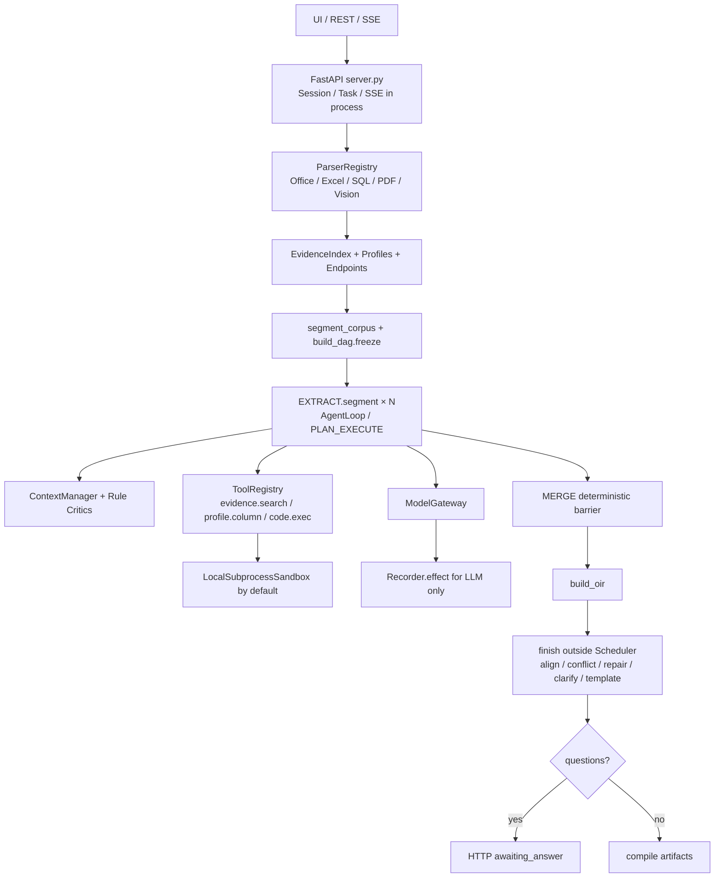
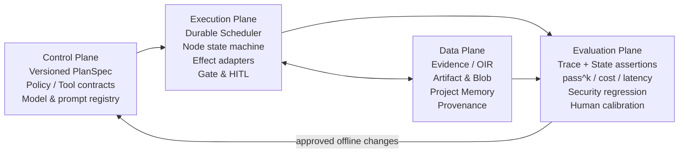

# OntoChat Harness Engineering 架构深度审计与升级建议

**审计日期：** 2026-08-11  
**代码基线：** `c88d351f62b6`（`main`）  
**审计范围：** `src/ontocopilot/`、`tests/`、`migrations/`、部署与架构文档  
**结论类型：** 代码级架构审计 + 2023–2026 学术证据核验  
**文档状态：** 供技术决策与升级规划使用

---

## 1. 执行摘要

### 1.1 一句话判断

OntoChat 已经具备一套方向正确、抽象质量较高的 Harness 内核原型，但生产 HTTP 主链只接入了其中一部分；当前真实形态是“**抽取子系统的 Harness**”，还不是架构文档所描述的“覆盖完整产品生命周期、可恢复、可审计、质量门严格阻断的生产 Harness”。

最值得保留的是：内核/领域分层、冻结 DAG、结构化输出、证据优先的 OIR、确定性下游、LLM effect 记录、规则 critic 与快速测试网。最需要马上补齐的是：**工具最小权限与真实隔离、durable run、Gate fail-closed、预算硬约束、租户隔离和端到端 EvalOps**。

### 1.2 五个核心结论

1. **架构方向正确，但“实现、接线、验证”成熟度不对称。** `Gate`、长期记忆、生产沙箱、Run/Event Store、多维预算等能力在代码中有抽象，却没有在 Server 主路径形成闭环。
2. **最高风险来自工具执行面。** EXTRACT 节点当前能看到全局 `code.exec`；生产默认沙箱实际是宿主机本地子进程，且工具调用未进入 `Recorder.effect()`。上传材料中的间接提示注入因此可能从“错误输出”升级为“宿主权限内的代码执行”。
3. **durable execution 目前是原语，不是产品保证。** LLM effect 和节点 checkpoint 已有基础，但 Server 固定复用 `run_<session_id>`、关闭 resume，进程重启后直接把运行标记失败；工具副作用也不可重放、不可幂等去重。
4. **质量门与预算目前偏“声明式”。** critic 最终未通过仍可返回结果；Scheduler 不执行 `GateSpec`；wall-clock、tool-call 和节点级预算没有完整记账与阻断。
5. **评估能力落后于功能能力。** 530 项测试全部通过，证明模块基础扎实；但没有覆盖真实 `/build` 全链、进程崩溃恢复、提示注入、模型质量回归、`pass^k`、终态正确性与 collateral damage 的版本化评估集。

### 1.3 建议的技术决策

- **立即暂停把更多 Agent/抽象接入生产主链**，先关闭 P0 控制面断点。
- 用一个统一的 Run 状态机收口 HTTP、CLI、Recorder、Store、SSE 和 HITL；数据库 Run/Event 成为唯一事实源。
- 把工具调用、审批、Gate、artifact commit 都纳入同一条“可追踪、可重放、可阻断”的提交协议。
- 建立 EvalOps 后再做 AFlow/ACE 式自动优化；任何自动演化只离线生成候选，不直接改变生产策略。
- 修改现有架构文档的证据等级：同行评审、预印本、立场论文与工程博客必须分层；删除无法由原文支持的量化结论。

---

## 2. 审计方法与证据边界

本报告同时检查“设计意图”和“真实运行路径”，并把能力拆成三层：

- **已实现（Implemented）**：仓库中存在可运行代码或数据结构。
- **已接线（Wired）**：Server 的真实请求链会调用它，并影响状态或产物。
- **已验证（Verified）**：有自动测试、故障实验或运行指标证明其保证成立。

本次执行了以下验证：

- `.venv/bin/python -m pytest`：**530 passed**。
- `.venv/bin/ruff check src tests --statistics`：**240 个静态检查问题**，其中 172 个可自动修复。
- 检查实际 FastAPI build 链、DAG/Loop/Scheduler、Recorder、Tools、Sandbox、Memory、Store、Critic/Gate、Budget、解析与检索实现。
- 检索并核验 2023–2026 年同行评审论文和最新预印本；最新结论以论文原页/正式 proceedings 为准。

限制：本次没有使用生产数据、真实模型凭据或生产网络，不构成完整渗透测试、容量测试或输出质量基准。风险概率无法由代码审计直接估计，但控制边界是否存在、是否接线可以确定。

---

## 3. 当前真实架构

### 3.1 As-is 运行链

<!-- DOCX_FIGURE:as_is -->



真实链路的关键事实：

- Server 在读取并解析材料后才调用 `segment_corpus()` 与 `build_dag().freeze()`；冻结的是抽取拓扑，而不是“在任何不可信内容被读取之前冻结所有控制流”。证据：`server.py:662–751`、`onto/pipeline.py:100–139`。
- 生产 DAG 只有 `EXTRACT.* → MERGE`。对齐、冲突、自动修复、澄清和模板生成由 `finish()` 在 Scheduler 之外同步执行。证据：`onto/pipeline.py:663–681, 728–743`、`server.py:754–810`。
- HITL 的真实暂停由 HTTP Session 状态与事件实现，不是 `Recorder.ask_human()` 驱动的可恢复节点状态。证据：`server.py:789–809`。
- 七个内置 AgentSpec 中，主抽取链主要使用 `extractor`，并按段形状路由到 `rule_miner` 或确定性问题收集；其他角色尚未形成完整多 Agent DAG。

### 3.2 模块边界

| 层 | 当前职责 | 评价 |
|---|---|---|
| `kernel/` | DAG、Scheduler、AgentLoop、Recorder、Budget、Tools、Sandbox、Critic、Memory、Agent Bus | 抽象边界清晰，适合复用；部分能力仍停留在框架层 |
| `onto/` | 解析、Evidence、OIR、对齐、冲突、澄清、模板 | 领域逻辑结构化程度高，确定性优先是正确选择 |
| `server.py` | API、Session、编排、事件投影、对话动作、产物与部分 UI 逻辑 | 2,500+ 行集中模块，承担过多状态与协调责任 |
| `store/` | Memory/SQLite/PostgreSQL Repo、Run/Event/Blob schema | 数据模型已开始覆盖 durable run，但主链未完整使用 |
| `tests/` | 单元和组件测试 | 数量与速度较好；生产语义、故障与质量评估不足 |

### 3.3 能力成熟度矩阵

| 能力 | 已实现 | 生产主链接线 | 验证状态 |
|---|---|---|---|
| 冻结 DAG / fan-out / barrier | 是 | 是，仅抽取子图 | 单元测试较充分 |
| 六种 NodeMode / NodeHandler | 是 | 部分模式 | 以组件测试为主 |
| LLM effect replay | 是 | LLM 调用接入；resume 关闭 | 仅显式 `resume=True` 的内核测试 |
| Tool effect / 幂等 | 否 | 否 | 无生产保证 |
| Critic Panel | 是 | 规则 coverage/provenance | 不阻断最终失败产物 |
| Gate | 是 | **否** | 仅独立测试 |
| 多维预算 | 是 | token/USD 部分接入 | wall-clock/tool-call/节点硬上限未闭环 |
| 长期记忆 | 是 | **否** | 测试存在，生产未构造 Store |
| 沙箱 | Local/Container/gVisor 等接口 | 默认仅 Local | 无生产隔离验收 |
| Session/Run/Event Store | 是 | Session 部分使用；Run/Event 未收口 | 重启直接失败 |
| 终态/`pass^k` 评估 | 文档中有设计 | **否** | 仅 3 个检索 golden query |
| OTel/指标/分布式追踪 | 文档中有设计 | **否** | 无 |

---

## 4. 当前架构值得保留的部分

1. **Kernel 与 Onto 领域边界清楚。** `NodeHandler` 让调度、记录和预算不依赖 OIR 细节，未来可扩展到其他结构化知识任务。
2. **外层 DAG + 节点内有限 Loop 是合理折中。** 依赖、并发和恢复边界显式，局部仍保留模型处理长尾问题的灵活性。
3. **OIR 与 provenance 是一等对象。** 下游不是直接消费自然语言，而是消费带出处的结构化对象，便于确定性对齐、冲突检测与模板编译。
4. **确定性逻辑优先。** `finish()` 把可由规则完成的对齐、冲突、澄清排序和模板编译留在普通代码中，降低了模型不确定性与成本。
5. **LLM effect 与内容寻址 checkpoint 已有良好原语。** 请求指纹、BlobStore、节点输出恢复构成 durable execution 的正确起点。
6. **上下文已有分层和预算意识。** System、Working、Evidence、Reflection/Long-term 的设计比无限追加完整历史更可控。
7. **测试网运行快。** 530 项测试数秒完成，为大规模收口重构提供了良好的反馈周期。

这些优点说明：不需要推翻重写 Harness 内核；需要的是把已有原语真正接入生产状态机，并减少“文档承诺先于运行时保证”的差距。

---

## 5. P0：上线前必须关闭的风险

### 5.1 P0-1 工具最小权限与沙箱边界失效

**代码证据**

- `ToolRegistry.register()` 默认把工具加入 `"*"` scope，`for_scope()` 会把全局工具授给所有节点：`kernel/tools.py:197–224`。
- `builtin_registry()` 注册内建工具时没有传入细粒度 scope，因此 EXTRACT 也可获得 `code.exec`：`kernel/tools.py:287–364`。
- Server 在抽取主链无条件创建 `default_sandbox()`；其默认返回 `LocalSubprocessSandbox`：`server.py:729–732`、`kernel/sandbox.py:359–365`。
- 本地沙箱只有临时 cwd、部分环境清理和资源限制，没有用户态内核、文件系统 namespace 或 microVM 隔离：`kernel/sandbox.py:203–265`。
- 工具调用只发 `EFFECT_REQUESTED` 后直接 `tool.run()`，不进入 `Recorder.effect()`，也不累计 tool-call 预算：`kernel/tools.py:241–273`。

**失败模式**

不可信材料可把指令伪装成业务内容，诱导模型调用已获授权的 `code.exec`。即使无网络，本地子进程仍运行在服务账号权限边界内；这不是单纯的输出幻觉，而是潜在的宿主文件读取、资源耗尽或子进程逃逸面。静态提示注入过滤不能替代系统级能力控制。

**升级动作**

1. 立即将内建工具改为显式 allowlist；EXTRACT 默认只给 `evidence.search` 与只读 profiler，除非节点策略明确开启，否则不暴露 `code.exec`。
2. 生产环境没有 gVisor/Kata/microVM 时，CodeAct **fail closed**，不得静默回退本地子进程。
3. 所有工具统一走 `Recorder.effect()`，事件必须包含 requested/completed-or-failed、duration、output digest、policy/approval id、idempotency key。
4. `ToolSpec` 增加输出 schema、结果大小、数据分类、egress、可读/可写资源、调用次数和超时；参数与结果双向 JSON Schema 校验。
5. 审批令牌绑定 `tenant + session + run + tool + canonical args + resource scope + expiry + use_count + policy_version`，替代单一布尔 `approved`。
6. MCP 首次接入、描述/schema/端点变化必须进入隔离状态并持久审批；同名工具不得静默覆盖。

**验收门槛**

- 生产无隔离运行时，CodeAct 启动失败率 100%，回落本地次数 0。
- 工具审计事件完整率 100%；重放时外部副作用重复次数 0。
- AgentDojo/InjecAgent 风格注入集同时报告任务效用与 ASR；P0 工具越权 ASR 必须为 0。
- SSRF、路径穿越、schema 混淆、MCP rug-pull 回归集 100% 被策略层拦截。

### 5.2 P0-2 Durable Run、恢复与幂等未闭环

**代码证据**

- Server 每次 build 固定使用 `run_<session_id>`：`server.py:675, 757`。
- 创建 `Recorder` 时未开启 resume：`server.py:228–241`；历史仅在 `resume=True` 时加载：`kernel/recorder.py:37–60`。
- Store 已有独立 Run 分配接口，但生产编排未调用。
- 启动对账明确写着“没有任何 Run 能活过进程重启”，并把 `parsing/extracting` 直接标记为失败：`server.py:1291–1314`。
- Session、SSE 订阅、任务句柄、活 OIR 和 EvidenceIndex 主要在进程内：`server.py:91–141`。
- 同一 effect key 的并发请求在检查历史后、完成写回前没有 single-flight claim；外部副作用成功到日志完成之间仍存在崩溃窗口：`kernel/recorder.py:166–203`。

**失败模式**

进程崩溃会导致重复模型费用、重复工具副作用、同会话事件序号混叠或只能全量重跑。多 worker 时，内存 Session 和 SSE 还会形成状态分叉。这里应承诺“可恢复 + 幂等/明确 at-least-once”，不能笼统承诺 exactly-once。

**升级动作**

1. 所有 build/chat/action 先通过 `Repo.next_run()` 创建唯一 Run；Run 表成为唯一运行事实源。
2. 采用显式状态机：`queued → running → suspended/cancelling → completed/cancelled/failed`，带 `worker_id`、heartbeat、lease expiry、state version/CAS。
3. Recorder 改接数据库 kernel events 与 BlobStore，恢复时按 run id 自动 `resume=True`；Session 仅作缓存。
4. effect 增加原子 claim：`prepared/running/completed/failed`；同 key single-flight。外部 provider 支持时传幂等键，不支持时使用 transactional outbox 或明确记录 at-least-once 风险。
5. SSE 以持久事件 cursor 重放；取消、暂停、人工答复都写同一状态机，不再由 HTTP 侧另造语义。
6. 持久化失败不得吞掉后继续交付；Run 必须进入 degraded/failed 并告知用户。

**验收门槛**

- 在节点、LLM、工具调用前后随机 kill 的 1,000 次故障注入中，恢复成功率 ≥99.9%。
- 同一幂等键 100 路并发，外部副作用严格执行 1 次。
- 同一会话连续 build 100 次，`run_id` 和 `(run_id, seq)` 零冲突。
- 4 worker 下同 session 100 路 build，仅 1 个获得租约，其余稳定返回 409。
- 恢复后最终 OIR 与无故障基线内容哈希一致。

### 5.3 P0-3 Critic、Gate 与预算没有形成阻断闭环

**代码证据**

- `NodeSpec.gate` 已声明，`Gate.evaluate()` 已实现，但 Scheduler/AgentLoop 不调用：`kernel/dag.py:65–97`、`kernel/critic.py:298–327`。
- Scheduler 对任何 `NodeResult` 都直接写 WorkingSet、记录 `NODE_COMPLETED` 并放行：`kernel/scheduler.py:141–144`。
- critic 轮数耗尽后即使 verdict 失败也会返回；最后一次 refine 之后没有再 judge：`kernel/loop.py:353–395`。
- 未知 critic 名被静默跳过；空 verdict 容易形成 vacuous pass。
- `NodeBudget` 声明 token、iteration、wall-clock、tool-call；主链主要约束 iteration，LLM 只累计 token/USD，工具不记账。

**失败模式**

系统可能把未通过、未真正评审或预算已越界的结果标记为完成。这样“没过 Gate 不能出门”和“预算耗尽自动暂停”都只是设计意图，不是可依赖的运行保证。

**升级动作**

1. 节点提交协议固定为：`produce → deterministic validators → evidence-backed critics → Gate → artifact/checkpoint commit`。
2. Gate 输出只允许 `PASS / REVISE / HITL / ABORT`；非 PASS 不得 `complete_node()`。
3. DAG freeze 时验证 critic/gate/tool/sandbox 引用；未知项 fail closed。
4. 最后一次 refine 后必须复审；达到轮数上限仍失败时标记 `quality_failed`。
5. 使用 budget reservation/commit，覆盖 LLM、工具、wall-clock、并发和节点级上限；replay 区分历史逻辑用量与新增 provider cost。
6. ArtifactManifest 固化 review level、执行过的 validator/critic、跳过原因、模型/提示/策略版本与最终 verdict hash。

**验收门槛**

- 人工注入 100 个失败 Gate，下游启动次数必须为 0。
- critic/gate 名拼写错误在 freeze 阶段 100% 拒绝。
- 每个 completed 节点都有与 output digest 绑定的最终 PASS verdict。
- `rules_only` 产物在 API/UI/导出中 100% 标注“未经语义审核”，且不能进入正式交付状态。
- 关键缺失/错误引用的金标集召回率目标 ≥95%，并监控 judge drift。

### 5.4 P0-4 对象级授权、租户与数据治理缺失

**代码证据**

- 建模 `session` 没有 `tenant_id/user_id/owner_id`：`store/schema.py:44–62`。
- schema 注释明确当前建模数据为共享数据、无 owner 外键：`store/schema.py:206–210`。
- 原材料、OIR、journal、blob、聊天与配置分散在本地文件和数据库；密钥治理、保留和删除证明未形成统一边界。

**升级动作**

1. Session/Run/File/Event/Blob/Memory 全部增加 tenant/project/owner，Repo 查询默认强制 tenant scope；PostgreSQL 增加 RLS 作为第二道边界。
2. Blob 即使内容寻址，也必须按 tenant 引用授权；本地 workspace 按 tenant/session 隔离。
3. 密钥迁到 Secret Manager/KMS；材料、日志、备份、外发模型流量按数据分类治理。
4. 外发模型前执行 DLP/脱敏和供应商/地域策略；记录外发字段、字节数、目的模型与区域。
5. 建立可证明的删除链：主库、Blob、检索索引、缓存与备份 tombstone。

**验收门槛**

- 双租户 IDOR 测试 100% 返回 403/404；所有 Repo 查询具备 tenant predicate。
- 每次模型外发都可回答“谁、哪个租户、哪些字段、多少字节、发往哪里”。
- 删除请求在 SLA 内覆盖全部存储层，并可生成审计证明。

---

## 6. P1：下一个版本应完成的升级

### 6.1 收口三套状态平面

当前同时存在进程内 Session、数据库 Session/Run/Event、workspace Journal/Blob。建议把数据库 Run/Event 设为权威状态，workspace 只存不可变大对象，内存只作缓存；所有投影带 cursor 和版本号。HTTP、CLI、后台 worker 必须调用同一 Orchestrator API，避免两套编排继续漂移。

### 6.2 建立生产可观测性

统一 trace 层级：`request → tenant/session → run → node → effect → provider/tool`。至少采集：排队时间、节点时延、重试、恢复、Gate 失败、tool policy decision、token、cache、USD、artifact digest、错误分类。当前 kernel event 只在 Scheduler 前后泵到 SSE，且没有 OTel/Prometheus/结构化日志闭环。

验收：100% Run 可由 run id 还原关键路径；P95/P99 时延、成本、恢复率、Gate 失败率与安全决策有 dashboard 和告警；数据库不可用时 readiness 必须失败。

### 6.3 建立 Harness EvalOps，而不只做单元测试

建议四层评估：

1. **确定性契约层**：DAG、schema、Gate、状态转换、恢复、授权、幂等。
2. **离线能力层**：抽取、引用、冲突、澄清价值、长文档、跨格式和行业长尾。
3. **状态化工具层**：中间里程碑、终态、非目标变更、工具失败、schema 漂移、用户拒绝授权。
4. **安全与线上层**：提示/工具/记忆/计划投毒，ASR 与 benign utility；人工接受、修改、撤销、无依据断言、成本与时延。

同一输入至少报告 `pass^1/pass^3/pass^5`，而非只报告平均分；模型、prompt、tool schema、retrieval 或 DAG 变化都必须跑 paired regression。

### 6.4 上下文与长期记忆治理

生产主链未构造 LongTermStore，`ScopeSpec.recall_long_term` 也未实际控制召回。建议建立 schema 化 Project Memory，将事实、用户决策、推断、经验分型；每条记忆带 `event_time`、`valid_from/to`、`supersedes`、source artifact、confidence、tenant、policy 与撤销状态。

每次模型调用生成 ContextManifest：列出各层条目、来源、版本、trust label、截断、token 与哈希。长期记忆视为持久控制通道，必须通过 relevance + trust + scope gate，而不是只按向量相似度注入。

### 6.5 部署、依赖与供应链

- 默认无 `DATABASE_URL` 时尝试 SQLite，但 `aiosqlite/SQLAlchemy` 仅在 dev/postgres extra；安装基础包后可能静默回退内存。应把本地持久化依赖纳入正式 extra/default，并让降级显式可见。
- Compose 只有 PostgreSQL，缺应用镜像、迁移任务、sandbox image 与 worker；仓库未发现 CI workflow。
- 依赖采用宽松下界、无项目锁文件与镜像 digest。应引入锁文件、SBOM、CVE/许可证扫描、签名和 provenance。
- Session 状态含 `stopped`，数据库约束不接受该值；类似 schema/state drift 应通过单一状态定义自动生成并在 CI 校验。

### 6.6 拆分 `server.py` 与统一编排

建议拆为：API transport、Session/Run service、Orchestrator、Artifact service、Conversation service、Event projection、Policy/Auth。Server 不再持有活 OIR/EvidenceIndex 作为权威数据；CLI 与 HTTP 通过同一 Orchestrator 调用 Harness。

---

## 7. P2：规模化与工程质量优化

- EvidenceIndex 当前批量 add 时可能重复计算全库长度，应改为增量统计，保证十万级 chunk 构建近似线性。
- 同步解析应移到受限 worker，并行化多文件；上传采用流式写入，限制单文件/会话配额、MIME、解压比与解析时间。
- Scheduler 不应为所有 ready 节点一次性创建 Task；使用有界队列，取消兄弟任务后等待回收。
- 共享模型 HTTP client/连接池；关闭临时 backend，避免 FD 与连接泄漏。
- 模型 capability catalog 需要持久探测结果、TTL 和失败证据，不能只按模型名称乐观推断。
- 自定义 schema 校验器需要覆盖 `additionalProperties`、min/max、format 等；优先复用成熟 JSON Schema 实现。
- 将 240 个 Ruff 问题分批清零，补 mypy/pyright、coverage gate、PostgreSQL、multi-worker、kill/restart 与负载测试。
- README 仍写“232 项测试”“FastAPI + SSE 未实现”，与 530 项测试和现有 Server 不一致；文档真值应由 CI 自动生成关键数字。

---

## 8. 目标架构

### 8.1 四平面模型

<!-- DOCX_FIGURE:target -->



**Control Plane**：版本化 `PlanSpec`、AgentSpec、prompt、tool schema、policy、model routing；freeze 时完成引用、类型、权限和预算验证。

**Execution Plane**：数据库租约驱动的 Scheduler；每个 Node/Effect 有显式状态机；LLM、工具、时钟、随机和人工输入均通过 effect adapter；Gate 决定提交、修订、人工或终止。

**Data Plane**：不可变 Evidence/OIR/Artifact、内容寻址 Blob、可撤销 Project Memory；所有对象带 tenant、provenance、schema/version 与 trust label。

**Evaluation Plane**：从持久 trace 构建终态、节点和安全评估；自动优化只能生成候选，经留出集、成本/安全约束和人工批准后提升为新版本。

### 8.2 统一 Run 状态机

```text
QUEUED → RUNNING → NODE_READY → EFFECT_PREPARED → EFFECT_RUNNING
                     ↑                              ↓
                     └──── RETRY / RESUME ← EFFECT_COMPLETED

NODE_OUTPUT → VALIDATED → GATE_PASS → COMMITTED
                    ├→ REVISE → NODE_READY
                    ├→ HITL → SUSPENDED → RESUME
                    └→ ABORT / QUALITY_FAILED

RUNNING → CANCELLING → CANCELLED
RUNNING → FAILED
all terminal states → immutable manifest + event cursor
```

### 8.3 必须固化的七类契约

| 契约 | 最少字段 | 作用 |
|---|---|---|
| `PlanSpec` | version、nodes、deps、guards、tools、budget、gate、sandbox | 冻结并验证控制流 |
| `RunState` | run id、lease、state、attempt、cursor、parent run | 恢复、并发与审计 |
| `EffectEnvelope` | key、request digest、idempotency、policy、status、result digest | 非确定性与副作用重放 |
| `ApprovalToken` | actor、tool、canonical args、scope、expiry、use count | 耐久且最小化授权 |
| `ContextManifest` | layers、source、trust、version、truncation、tokens、hash | 解释模型实际看到什么 |
| `ArtifactManifest` | inputs、code/model/prompt、validators、verdict、review level | 证明产物如何生成和为何可交付 |
| `EvalReport` | dataset/version、state assertions、pass^k、cost、latency、ASR | 版本晋升与回滚依据 |

---

## 9. 分阶段升级路线

### 阶段 0：0–2 周，立即止血

- EXTRACT 工具改为显式 allowlist；默认撤掉 `code.exec`。
- 生产 CodeAct 没有真实隔离时 fail closed。
- 工具调用接入 Recorder，先完成只读工具，再完成可写/外部工具幂等。
- Scheduler 接入 Gate，未知 critic/gate/tool 在 freeze 时失败。
- 每次 build 创建唯一 run id；持久化失败不再静默。
- 修正架构文档中 TDP、CodeAct、τ-bench 等过度表述。

**退出条件：** 四个 P0 回归套件能在 CI 中阻断；生产主链不存在全局工具和宿主 CodeAct 回落。

### 阶段 1：3–6 周，Durable Execution MVP

- Run/Event/Effect 表成为事实源，加入 lease、heartbeat、CAS、single-flight effect。
- Recorder 支持生产 resume；SSE 使用持久 cursor；HITL/stop 进入统一状态机。
- HTTP/CLI 统一 Orchestrator；拆出 Run Service 与 Artifact Service。
- 建立 kill/restart、并发 build、重复副作用和恢复哈希测试。

**退出条件：** 1,000 次故障注入恢复 ≥99.9%；4 worker 无状态分叉；同幂等键副作用严格一次。

### 阶段 2：7–12 周，Eval/Security/Telemetry

- 建立版本化 OntoChat golden corpus：跨格式、长文档、冲突、澄清、恶意材料。
- 引入终态断言、collateral damage、`pass^1/3/5`、ASR/utility、成本与时延。
- 增加 tenant/RLS、DLP、Secret/KMS、删除链与外发审计。
- 接入 OTel 与 dashboard；完成 Postgres、multi-worker、sandbox、上传隔离测试。

**退出条件：** 任一模型/prompt/tool/DAG 变更都能给出 paired regression 和可回滚版本；两租户 IDOR 集全绿。

### 阶段 3：3–6 个月，受治理的自优化

- 接入 Project Memory 与 ContextManifest，完成时间、替代、争议和撤销语义。
- 在离线评估上试点 MIPRO/AFlow/ACE：优化 prompt、DAG 或 playbook 候选。
- 使用风险/成本约束的 champion–challenger，上线必须人工批准并支持即时回滚。
- 在高并行度确有收益的节点试点 typed plan compiler；副作用分支默认串行。

**退出条件：** 自动优化在独立留出集上同时改善质量、`pass^k` 或成本，且安全/租户/恢复指标不退化。

### 9.1 建议的 90 天负责人分工

| 工作流 | 主责角色 | 核心产物 |
|---|---|---|
| Durable Run | 平台/后端 | Run 状态机、lease、effect claim、cursor SSE |
| Tool Security | 安全/平台 | capability policy、真实 sandbox、MCP admission |
| Quality Gate | Applied AI + 领域 | validator/critic/gate 协议、ArtifactManifest |
| EvalOps | Applied AI + QA | golden corpus、state assertions、pass^k、ASR |
| Tenant/Data | 后端 + 安全 | tenant/RLS、DLP、KMS、删除证明 |
| Observability | SRE/平台 | trace schema、dashboard、SLO、告警 |

---

## 10. 学术技术依据与落地映射

### 10.1 证据等级

- **A 级：** 同行评审论文/正式 proceedings，且结论可直接映射到本系统问题。
- **B 级：** 高相关预印本，方法和实验可参考，但不得当作生产收益承诺。
- **C 级：** 立场论文、综述在审或工程博客，只用于 taxonomy/设计启发。

### 10.2 重点论文

| 论文与状态 | 关键发现 | 对 OntoChat 的直接支持 | 证据边界 |
|---|---|---|---|
| [StateFlow](https://arxiv.org/abs/2403.11322)，COLM 2024，A | 显式状态驱动工作流把控制流与状态内推理解耦；特定环境中相对 ReAct 提升成功率并降成本 | Run/Node 使用显式状态与 transition guard，不靠日志推断阶段 | 结果来自 SQL/ALFWorld，需在本体任务复验 |
| [An LLM Compiler for Parallel Function Calling](https://proceedings.mlr.press/v235/kim24y.html)，ICML 2024，A | 将工具计划编译为依赖 DAG，可并行无依赖调用 | 引入 typed plan compiler；只并行只读或有幂等键分支 | 收益依赖真实可并行度，错误依赖图会放大失败 |
| [CodeAct](https://proceedings.mlr.press/v235/wang24h.html)，ICML 2024，A | 可执行代码动作在其 benchmark 中最高约 +20% 成功率 | 保留 CodeAct 处理长尾数据变换，但置于强隔离与 schema 输出下 | 不支持“所有动作都应代码化”或“CodeAct 天然安全” |
| [SWE-agent / ACI](https://proceedings.neurips.cc/paper_files/paper/2024/hash/5a7c947568c1b1328ccc5230172e1e7c-Abstract-Conference.html)，NeurIPS 2024，A | Agent-Computer Interface 设计显著影响 Agent 行为与性能 | 将工具目录、反馈、错误、资源边界设计成 Agent 专用接口 | 软件工程任务结果不能直接外推到文档本体任务 |
| [τ-bench](https://openreview.net/pdf?id=roNSXZpUDN)，ICLR 2025，A | 用数据库终态和 `pass^k` 评估工具 Agent；当时测试中成功率 <50%、零售 `pass^8<25%` | OIR/Artifact 终态断言 + `pass^1/3/5`；评估一致性而非单次最好结果 | 数字只适用于论文模型和航空/零售域 |
| [ToolSandbox](https://aclanthology.org/2025.findings-naacl.65/)，NAACL Findings 2025，A | 状态依赖、参数规范化、信息不足和中间里程碑是核心难点 | 加入用户拒绝、缺信息、schema 漂移、工具失败和里程碑测试 | 模拟工具与企业真实系统仍有差异 |
| [AppWorld](https://aclanthology.org/2024.acl-long.850/)，ACL 2024，A | 以状态单测检查多种合法完成路径及 collateral damage | 除目标终态外，检查未授权/非目标字段是否变化 | 多应用环境与本体产物需重新定义状态 oracle |
| [AgentDojo](https://proceedings.neurips.cc/paper_files/paper/2024/hash/97091a5177d8dc64b1da8bf3e1f6fb54-Abstract-Datasets_and_Benchmarks_Track.html)，NeurIPS 2024，A | 97 个任务、629 个安全案例；动态评估提示注入及效用/安全权衡 | 上传材料、检索、MCP 描述和工具结果统一标为不可信；CI 同报 utility/ASR | 不是完整现实攻击面 |
| [DRIFT](https://proceedings.neurips.cc/paper_files/paper/2025/hash/77f3b26c7907aa27b207df9b9d43f29a-Abstract-Conference.html)，NeurIPS 2025，A | Secure Planner、动态偏差验证与 memory isolation 结合控制流/数据流约束 | 最小工具轨迹、参数 checklist、执行偏差验证、注入内容隔离 | 仍需针对本系统威胁模型与适应性攻击复验 |
| [Defeating Prompt Injections by Design / CaMeL](https://arxiv.org/abs/2503.18813)，2025 v2，B | 显式控制/数据流与 capability；在 AgentDojo 最新版本报告 77% 任务具可证明安全 | capability-tagged data、工具调用时强制信息流与资源策略 | 预印本；token/系统复杂度开销显著，不能只复制表面结构 |
| [ACE](https://iclr.cc/virtual/2026/poster/10008343)，ICLR 2026，A | 用 generation/reflection/curation 增量演进 playbook，避免 context collapse；报告 agent +10.6% | Project Memory 采用结构化增量更新、版本和回滚；离线候选晋升 | 结果依赖任务与反馈质量，错误经验也会被固化 |
| [LongMemEval](https://proceedings.iclr.cc/paper_files/paper/2025/hash/d813d324dbf0598bbdc9c8e79740ed01-Abstract-Conference.html)，ICLR 2025，A | 长期记忆需处理跨会话、时间、更新与拒答 | 记忆加入时间、supersedes、来源；分开评估检索与正确使用 | 对话记忆不等于项目事实库 |
| [MIPRO](https://aclanthology.org/2024.emnlp-main.525/)，EMNLP 2024，A | 可在多阶段 LM program 上联合优化指令与示例，部分任务最高 +13% | 有 EvalOps 后，离线优化各节点 prompt/demo | 不能无留出集自动改生产 prompt |
| [AFlow](https://proceedings.iclr.cc/paper_files/paper/2025/hash/5492ecbce4439401798dcd2c90be94cd-Abstract-Conference.html)，ICLR 2025，A | 将代码化工作流视为搜索空间，六数据集平均约 +5.7% | 离线搜索 DAG 候选，带成本、安全与回滚约束 | 自动结构可解释性和稳定性不足，不应在线自改 |
| [CRITIC](https://proceedings.iclr.cc/paper_files/paper/2024/hash/fef126561bbf9d4467dbb8d27334b8fe-Abstract-Conference.html) + [LLMs Cannot Self-Correct Reasoning Yet](https://proceedings.iclr.cc/paper_files/paper/2024/hash/8b4add8b0aa8749d80a34ca5d941c355-Abstract-Conference.html)，ICLR 2024，A | 外部工具/证据反馈能帮助修正；无外部反馈的纯自省常无效或退化 | Gate 以解析器、schema、证据定位、规则和可执行测试为主；“另一个 LLM 同意”不能独立放行 | LLM judge 仍可作为有校准集的补充信号 |
| [Proxy State-Based Evaluation](https://aclanthology.org/2026.acl-industry.87/)，ACL Industry 2026，A | 用结构化 proxy state 扩展终态评估，论文报告人类–LLM judge 一致率 >90% | 确定性 oracle 昂贵时，用受约束 proxy state 扩展评估，并保留人工校准 | 不应替代所有确定性断言；需监控 simulator/judge drift |
| [AgentEval](https://arxiv.org/abs/2604.23581)，2026，B | DAG 节点级评估与错误传播归因；论文报告相较端到端评估更高故障召回 | 从 Run trace 生成节点指标、failure taxonomy 和 upstream attribution | 新预印本，生产 pilot 结果需要独立复现 |
| [SafeHarness](https://arxiv.org/abs/2604.13630)，2026，B | 输入过滤、因果验证、权限分离工具、回滚/降级贯穿 lifecycle | 安全不做单点过滤，而是跨 Context→Decision→Action→State 协同 | 新预印本，只作架构参考 |
| [AutoDojo](https://arxiv.org/abs/2606.15057)，2026，B | 自适应攻击能突破对静态注入有效的过滤；某过滤静态 ASR 0%，自适应恢复到总体 28% | 安全 CI 必须包含 defense-aware/adaptive attack，不能只跑固定字符串 | 新预印本，数字依赖其模型和任务设置 |

### 10.3 对现有架构文档的证据修正

1. `OntoCopilot-Backend-Architecture.md:59,187` 把 [From Agent Loops to Structured Graphs](https://arxiv.org/abs/2604.11378) 写成“证明 token 最多降低 82%”。论文摘要明确说明它是 **position paper/design proposal，没有生产实现或实证结果**；该数字应删除。论文可支持“静态 DAG 提升可控性/可验证性”的设计动机，不能支持性能收益。
2. CodeAct 论文支持代码动作空间在特定 benchmark 的组合能力，不支持“数据处理一律 CodeAct”“碾压 JSON”“唯一现实路径”。高频稳定操作、强权限动作和简单 API 更适合 typed tool。
3. τ-bench 的 `<50%` 与 `pass^8<25%` 必须限定为论文当时测试模型及航空/零售环境，不是所有 function-calling Agent 的普遍上限。
4. 冻结 DAG 能减少内容劫持控制流的空间，但不能解决工具输出注入、参数污染、记忆投毒或已授权工具滥用；应与 capability、information-flow 和动态偏差验证共同表述。
5. Self-Refine/Reflexion 不能单独证明多轮自省会提高生产可靠性；必须同时引用“无外部反馈自纠错可能退化”的反向证据，并将确定性 validator 放在 Gate 前。
6. gVisor/Firecracker 的工程博客可用于选型，不应被描述为学术共识；最终隔离等级必须由本系统威胁模型和攻防验收决定。
7. 建议所有 ADR 标注证据等级：A=同行评审且全文核验，B=预印本全文核验，C=摘要/博客/立场。核心安全与可靠性 ADR 至少需要 A，或多个独立 B + 内部实验。

---

## 11. 建议的 SLO 与版本晋升门槛

| 维度 | 建议门槛 |
|---|---|
| 安全 | 工具越权 ASR=0；跨租户 IDOR=0；生产 CodeAct 本地回落=0 |
| 恢复 | 1,000 次故障注入恢复 ≥99.9%；恢复后 artifact hash 与基线一致 |
| 幂等 | 相同 effect/idempotency key 在并发与重放中副作用严格 1 次 |
| 质量 | completed artifact 100% 有 final PASS verdict；关键引用错误召回 ≥95% |
| 稳定性 | 报告 `pass^1/3/5`；生产版本不得在 pass^3 上相对基线显著退化 |
| 成本 | 并发下实际 provider USD 不超过硬上限 1%；恢复新增 provider cost=0 |
| 可观测 | 100% Run 可追溯到 node/effect/model/prompt/tool/policy/artifact |
| 数据 | 100% 模型外发有 tenant、字段、字节、供应商、区域审计 |
| 工程 | CI 强制 lint/type/unit/integration/Postgres/security/recovery；关键分支覆盖 ≥85% |

---

## 12. 最终建议

OntoChat 不需要用更多“智能角色”证明 Harness Engineering；它已经有足够多的抽象。接下来最有价值的工作，是把抽象变成可以被测试和运维依赖的保证：

> **让每一次运行有唯一身份，让每一次非确定性动作可追踪，让每一次权限有边界，让每一个产物经过真实 Gate，让每一次架构优化都能由状态化评估证明。**

按本报告的顺序实施，90 天内可以把系统从“有成熟设计语言的 Harness 原型”推进到“安全边界、恢复语义、质量与评估开始闭环的生产候选”。在此之前，不建议把“可恢复执行”“生产隔离”“Gate 严格阻断”“长期记忆闭环”写成已经兑现的产品能力。

---

## 附录 A：关键代码证据索引

| 主题 | 代码位置 |
|---|---|
| NodeSpec / Scope / Budget / Gate | `src/ontocopilot/kernel/dag.py:24–99` |
| DAG expand/freeze/topology | `src/ontocopilot/kernel/dag.py:115–224` |
| Scheduler run/resume/commit | `src/ontocopilot/kernel/scheduler.py:81–154` |
| Node retry 与预算降级 | `src/ontocopilot/kernel/scheduler.py:157–198` |
| AgentLoop 与 critic | `src/ontocopilot/kernel/loop.py:205–395` |
| Context assembly | `src/ontocopilot/kernel/loop.py:398–415`; `kernel/memory/context.py:64–199` |
| Recorder replay/checkpoint/effect | `src/ontocopilot/kernel/recorder.py:34–204` |
| Tool scope/call | `src/ontocopilot/kernel/tools.py:183–273` |
| Built-in tools / code.exec | `src/ontocopilot/kernel/tools.py:287–364` |
| Local/production sandbox selection | `src/ontocopilot/kernel/sandbox.py:203–365` |
| 实际 EXTRACT DAG | `src/ontocopilot/onto/pipeline.py:663–681` |
| 确定性 finish | `src/ontocopilot/onto/pipeline.py:728–743` |
| Server build 主链 | `src/ontocopilot/server.py:662–810` |
| 固定 run id / Recorder 构造 | `src/ontocopilot/server.py:228–241, 675, 757` |
| 重启标失败 | `src/ontocopilot/server.py:1291–1314` |
| Session schema / 无 tenant | `src/ontocopilot/store/schema.py:44–62, 206–210` |
| 默认 SQLite 回退内存 | `src/ontocopilot/store/deps.py:80–106` |
| 测试/依赖配置 | `pyproject.toml:6–50` |

## 附录 B：验证结果

- 单元/组件测试：`530 passed`。
- Ruff（`src tests`）：240 findings；172 可自动修复。
- 检索 golden：3 个查询，不能代表端到端本体质量。
- 未发现 CI workflow、生产 Dockerfile、应用/迁移 worker 编排、版本化离线 eval dataset 或 pass^k runner。
- README 关键状态与当前代码存在漂移，应由 CI 自动更新或生成。
