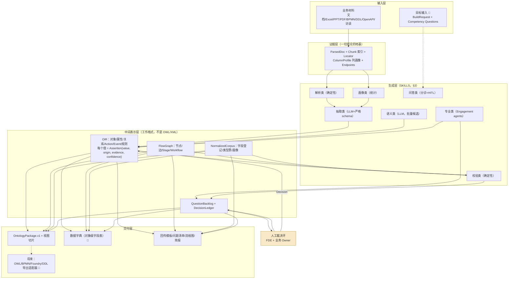
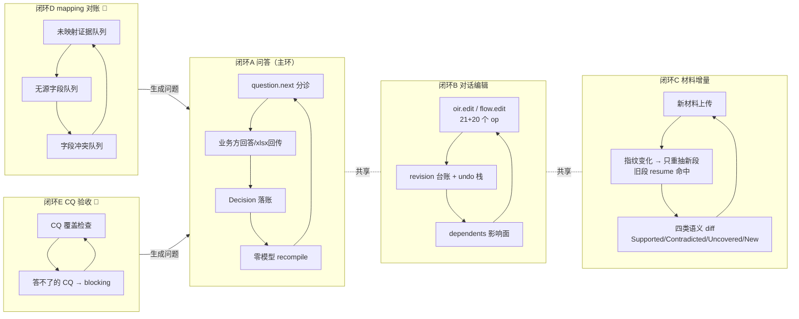
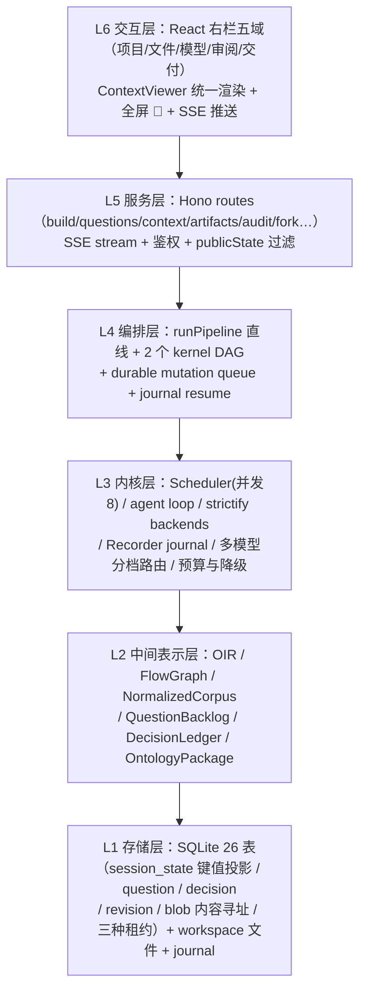

# AI 生成与迭代 Ontology：流程 · SKILLS · 技术架构

**日期：** 2026-08-25
**性质：** 技术蓝图（配套《开始梳理：数据字典与材料映射》分析文档；那份讲「现状与缺口」，这份讲「目标架构与怎么建」）
**表示法：** 每个组件标注 ✅已有（带代码落点）/ 🔧要补 / ✏️要改。方案整体可泛化到任何「材料→企业本体」系统，但全部锚定 OntoCopilot 现有代码，不是绿地设计。

---

## 0. 总览：一张图 + 六条设计公理

### 0.1 总架构



横切两条：**编排/调度 harness**（kernel Scheduler + 直线管线 + 租约 + resume + 预算）和**质量门禁**（REVIEW/EXPORT 硬门 + 发布门槛矩阵），见 §4、§5。

### 0.2 六条设计公理（每条都有代码兑现或明确缺口）

| # | 公理 | 依据与落点 |
|---|---|---|
| 1 | **中间表示优先**：模型的工作格式是受约束 JSON IR（OIR/FlowGraph），OWL/BPMN 只是导入源和导出目标 | 文献一致结论（POWL/BREX）；✅ [oir.ts](../ts/src/onto/oir.ts)、[flow.ts](../ts/src/onto/flow.ts)，strictify 强制 schema |
| 2 | **LLM 只产候选，确定性代码做合并/校验/编译**：每层只在下一层失效时才升级（L1 结构直映射 → L2 统计画像 → L3 LLM 候选 → L4 确定性校验 → L5 人工裁决） | ✅ MERGE/FINISH/compile 全零模型；✅ critic 是规则档 findings 驱动重试而非模型自评 |
| 3 | **证据门槛**：没有 locator 不得标 extracted；通识必须标 generic_assumption；AI 不得把假设自己设 confirmed | ✅ `Assertion{origin, evidence}` 贯穿；✅ 信任规则六条（08-17 §5.4） |
| 4 | **冻结拓扑 + 阶段投影**：材料内容不改执行 DAG 的拓扑；FDE 看到的领域阶段是投影，不是第二套数据源 | ✅ `fde_engagement_v2` 冻结；✅ engagementView 投影 |
| 5 | **一切可恢复、可追账**：内容寻址 resume（材料+决策指纹）、三账本（undo 栈/补丁日志/revision 台账）、租约并发、durable mutation queue | ✅ [run.ts:324-340](../ts/src/server/pipeline/run.ts)、[persist.ts](../ts/src/server/pipeline/persist.ts) |
| 6 | **降级必须披露**：视觉解析降级、评审降到 RULES_ONLY（仍保 1 轮规则档）、步数用尽——都要进产物或明说，不静默 | ✅ 降级标记进产物（近期已落地）；✅ 空回答兜底 |

---

## 1. 生成流程（第一轮）：12 站技术流程

对现有 11 站管线（[run.ts:246-1012](../ts/src/server/pipeline/run.ts)）的目标版扩展。**新增/修改只有 3 处**（⓪ 目标输入、⑥′ 语义增强、⑧′ CQ 覆盖），其余是既有站点：

| 站 | 名称 | 输入 → 输出 | 用到的 SKILL（§3 编号） | 成本 | 状态 |
|---|---|---|---|---|---|
| ⓪ | **INTAKE / BuildRequest** | 用户意图 + 材料清单 + 可选 CQ 清单 → 结构化 BuildRequest | K-701 意图分类 ✅、K-702 CQ 生成 🔧 | 零/小额 | 🔧 意图分类已有，BuildRequest+CQ 未实现 |
| ① | PARSE | 材料文件 → ParsedDoc + chunk/locator 索引 + endpoints + 流程图预览 | K-101~105 | 零（扫描件走视觉 K-301） | ✅ |
| ② | NORMALIZE | ParsedDoc → NormalizedCorpus（字段登记/类型票/冲突）→ 数据字典雏形 | K-201 | 零 | ✅（✏️ 补 locator 贯通） |
| ③ | SEGMENT | 证据索引 → 冻结分段计划（按 sheet/章节，rowUnit 判形） | K-202 | 零 | ✅ |
| ④ | EXTRACT | 每段 chunks → 六桶候选（objects/properties/links/actions/events/rules），段级 fan-out | K-302 抽取 + K-601 critic 两轮 | **付费主段** | ✅（A1 后六桶齐） |
| ⑤ | MERGE → OIR | 段级候选 → 全局 OIR（证据并集、dropped 统计、人工补丁重放） | K-602 | 零 | ✅ |
| ⑥ | LINK/ALIGN | OIR + FlowGraph + endpoints → 对象↔环节↔API 绑定、gap 挖掘 | K-603/604 | 零 | ✅ |
| ⑥′ | **语义增强** | OIR + NormalizedCorpus + 画像 → 列↔属性键打通、画像回灌（主键/必填/枚举候选）、口径批量起草、别名聚类 | K-401~404 | 小额（仅口径/别名两个批量调用） | 🔧 本方案核心新增 |
| ⑦ | FINISH | OIR → align/conflict/clarify/模板 spec | K-605 | 零 | ✅ |
| ⑧ | Engagement DAG | 全量 IR → 六专业 agent 分析 + GAP 汇总 | K-501~506 | **付费** | ✅（v2，首轮真跑模型） |
| ⑧′ | **CQ 覆盖检查** | CQ 清单 × OIR/Flow → 每条 CQ 可答/不可答 + 缺口问题 | K-606 | 零 | 🔧 |
| ⑨ | QUESTION + 分诊 | 全部 unknown/conflict/gap → 去重分诊后的 QuestionBacklog | K-703 | 零 | ✅（4044→161 实测） |
| ⑩ | HITL 挂起 | blocking 问题 → `awaiting_answer`，回答落 Decision 后 resume | K-704 | 零 | ✅ |
| ⑪ | CANONICALIZE→REVIEW→EXPORT | IR → OntologyPackage.v1 + 双硬门 | K-607/608 | 零 | ✅ |
| ⑫ | 交付编译 | → 模板/问题清单/流程图/**数据字典表格 🔧**/bundle | K-609 | 零 | ✅（字典进交付 🔧） |

**⑥′ 是本方案在生成侧唯一的结构性新增**，四件事全部有现成数据，**顺序不可换**（依据 EDC 的 Define→Canonicalize：有口径才好判同义）：
1. **键打通**：`source_column`（A1 已进抽取 schema）→ `表名.列名` ↔ property rid 映射落库。**一个属性可有多个来源列，一个源列可以不对应任何属性——一对一是特例不是默认**（见 ⚠️ 纠偏）；
2. **画像回灌**：`unique=true`→主键候选、`null_rate`→必填候选、`distinct_ratio` 低→枚举候选，全部以 `inferred` 写入对应 Assertion（声明的胜过猜的：已有 extracted 值不覆盖）；
3. **口径起草**（LLM）：对 definition 为空的字段，批量输入「字段名+各处叫法+样例值+所在表上下文」→ 草稿口径，origin=inferred、status=candidate；
4. **别名聚类**（LLM）：跨表同名异义/异名同义判定，产出 merge 候选进问题清单，不自动合并。

> ⚠️ **定位纠偏（Foundry 官方反模式）**：「Ontology 建模的是真实世界，不是源数据……抵制把列 1:1 映射成属性就算完事的冲动。」因此 ⑥′ 产出的映射是**可追溯性产物**（用于验证覆盖、发现缺口、支撑将来 hydration），**不是建模驱动力**。对象边界仍由业务概念决定（rowUnit 判形 + 业务方确认），口径仍来自 OIR `definition` 与人工拍板——源列只是溯源信息。

---

## 2. 迭代流程（第二轮+）：五个闭环 + 重算粒度矩阵

迭代不是「重跑一遍」，而是五个各自独立、共享同一套账本的闭环：



| 闭环 | 触发 | 重算范围 | 成本 | 状态 |
|---|---|---|---|---|
| A 问答 | `question.answer` / xlsx 回传 audit | recompile（align/conflict/模板）+ engagement resume | **零模型** | ✅ |
| B 编辑 | 41 个对话工具 | 增量 + revision 行；跑中自动入 durable mutation queue | 零模型 | ✅ |
| C 材料增量 | 新文件 → runId 指纹变 | 只有新段进 EXTRACT，旧段 journal 读回不重付费；diff 分四类处置（人工确认的不被静默覆盖） | 增量付费 | ✅ resume；✏️ 四类 diff 的显式披露（08-17 §9.4）未完整 |
| D mapping 对账 | 每轮跑完自动对账 | 三个零模型反向 join：chunks 里没被任何 Assertion 引用的切片→「材料读了没进模型」；origin=inferred 且无 occurrences→「模型有材料无」；类型票冲突→question | 零模型 | 🔧 |
| E CQ 验收 | 每轮跑完 + 每次 Decision 后 | CQ × 模型可答性检查 | 零模型 | 🔧 |
| 分叉 | `POST /fork` 按决策 ordinal | 新会话全量重算（决策参与指纹，天然失效旧缓存） | 全量付费 | ✅ |

**迭代的验收指标**（沿用分析文档 §5.3 推论）：可追溯率、candidate→confirmed 转化率、每轮信息增益（informationGain 已在算）、增量重算比例、人工编辑被重跑覆盖数（目标恒 0，靠补丁重放 + stale_edits 显式化保障 ✅）。

---

## 3. SKILLS 目录：七组二十六项能力模块

「SKILL」定义：一个有**明确输入/输出契约、明确实现形态（规则｜统计｜LLM+严格schema｜agent loop）、明确防线**的能力单元。接入形态三种（§4.4）：管线站点、DAG 节点、对话工具。

### 3.1 解析类（确定性，零模型）

| 编号 | SKILL | 输入 → 输出 | 落点 | 状态 |
|---|---|---|---|---|
| K-101 | 表格解析 | XLSX/CSV → SheetSummary + 行/schema 切片（带 range locator） | [parse/tabular.ts](../ts/src/onto/parse/tabular.ts) | ✅ |
| K-102 | 文本解析 | DOCX/MD/TXT → 段落/表格/标题 chunk | [parse/text.ts](../ts/src/onto/parse/text.ts) | ✅ |
| K-103 | 演示稿解析 | PPTX → 页/形状切片 | [parse/presentation.ts](../ts/src/onto/parse/presentation.ts) | ✅ |
| K-104 | 结构规格解析 | OpenAPI/DDL/JSON → endpoints、表列约束（DDL locator） | parse 层 + `_endpoints` | ✅ |
| K-105 | BPMN 直映射 | BPMN XML → 高置信 FlowGraph（lane/task/gateway/sequenceFlow） | [glue/flow.ts:183-198](../ts/src/server/glue/flow.ts) | ✅ |

### 3.2 画像类（统计，零模型）

| 编号 | SKILL | 输入 → 输出 | 落点 | 状态 |
|---|---|---|---|---|
| K-201 | 字段归一登记 | 全部表列 → NormalizedCorpus（归一字段/各处叫法/类型票/逐条冲突） | [normalize.ts](../ts/src/onto/normalize.ts) | ✅（✏️ locator 贯通） |
| K-202 | 段形判定 | 段落/表 → rowUnit ∈ question/property/link/action/object/rule（结构性特征，不用业务词表） | [shape.ts:606-680](../ts/src/onto/shape.ts) | ✅ |
| K-203 | 列画像 | 列值 → `{inferred_type, null_rate, distinct_ratio, unique, samples[5]}` | [tabular.ts:202-232](../ts/src/onto/parse/tabular.ts) | ✅（🔧 回灌 OIR，§1-⑥′） |

### 3.3 抽取类（LLM + strictify 严格 schema）

| 编号 | SKILL | 输入 → 输出 | 防线 | 状态 |
|---|---|---|---|---|
| K-301 | 视觉识别 | 无文本层页面 → 页面证据/流程候选 | 降级披露进产物 | ✅ |
| K-302 | 六桶抽取 | 段 chunks → objects/properties/links/actions/events/rules 候选（含 primary_key/value_domain/semantic_type/example/**source_column**） | strictify `additionalProperties:false`；每条带 evidence 引用；critic 不过重试 | ✅（A1 后） |
| K-303 | 规则挖掘 | rule 形段 → 规则候选（statement/kind/actor/condition） | 同上 | ✅ rule_miner |
| K-304 | 问题搬运 | question 形段（客户问卷）→ 直接入问题清单 | 规则搬运，不经模型 | ✅ HarvestQuestions |

### 3.4 语义类（LLM，批量、只产候选）——本方案主要新增

| 编号 | SKILL | 输入 → 输出 | 防线 | 状态 |
|---|---|---|---|---|
| K-401 | 列↔属性对齐 | `表名.列名` × property（名称/类型/画像）→ 映射候选 + 置信度 | **多阶段**（Magneto/Schemora 形态）：零模型召回（精确名/归一名/结构命中）→ LLM 只判余量，输入必带画像+样例值；映射进数据字典可审 | 🔧 |
| K-402 | 口径批量起草 | definition 为空的字段（名+叫法+样例+表上下文）→ 草稿口径 | origin=inferred、candidate、绝不自动 confirmed | 🔧 |
| K-403 | 别名/同义聚类 | 跨表对象与字段名 → merge/alias 候选 | 只产候选进问题清单，合并走 `merge_objects`（证据并集已有） | 🔧（merge op ✅） |
| K-404 | 通用参考图 | 场景名 → 行业通识流程/对象草案（sketch） | 永远 generic_assumption + DRAFT；与实证图 diff（sketch.diff ✅） | ✅ |

### 3.5 专业类（Engagement agent loop，`fde_engagement_v2`）

| 编号 | SKILL | 角色 | 产出契约 | 状态 |
|---|---|---|---|---|
| K-501 | 访谈官 | fde_interviewer | Intake 投影（objective/scope/stakeholders/criteria） | ✅ |
| K-502 | 流程建模师 | process_modeler | 流程语义分析、UNKNOWN 槽位 | ✅ |
| K-503 | ERP 映射师 | erp_mapper | 系统/接口映射 | ✅ |
| K-504 | 规则工程师 | rule_engineer | **condition/effect/exceptions/test_cases（四类测试用例）** | ✅ 在算 / ✏️ **交付契约丢弃中（A3，P1 兑现）** |
| K-505 | 数据管家 | data_steward | business_keys/SoR/lifecycle/classification | ✅ 在算 / ✏️ 分析结果不回写 OIR（只活一个 revision） |
| K-506 | 交付评审官 | delivery_reviewer | verdict/blocker_count/findings | ✅（降级最低保 1 轮规则档） |

### 3.6 校验类（确定性，零模型）

| 编号 | SKILL | 检查什么 | 状态 |
|---|---|---|---|
| K-601 | 抽取 critic | coverage/provenance 两轮规则档 findings 驱动重试 | ✅ |
| K-602 | 合并去重 | 证据并集、同名收敛、dropped 统计 | ✅ |
| K-603 | 流程结构体检 | dangling/dead end/无标签分支/Action 无 Event/SCC 入口 | ✅ |
| K-604 | 图↔模型绑定 | autoBindObjects（只补空、长名优先、每节点≤3） | ✅ |
| K-605 | 冲突检测 | 8 类 ConflictKind（TYPE_MISMATCH 等） | ✅ |
| K-606 | **CQ 覆盖检查** | 每条 CQ：涉及对象在不在/关系通不通/规则有没有 → 可答性 | 🔧 |
| K-607 | 包校验 | ID 唯一、引用完整、Action↔Event 双向一致 | ✅ |
| K-608 | 发布双硬门 | REVIEW（verdict/blocker/high findings）+ EXPORT（review_passed/schema_valid/downloadable） | ✅ |
| K-609 | 交付编译 | 模板（锚点对号）/问题清单三格式/canonical 视图切片 | ✅ |

### 3.7 问答类（分诊 + HITL）

| 编号 | SKILL | 输入 → 输出 | 状态 |
|---|---|---|---|
| K-701 | 意图分类 | 用户话语 → material_build / material_read / generic_draft / advice 四类 | ✅ |
| K-702 | **CQ 生成** | 材料 + 目标 → CQ 草稿清单（供 FDE 勾选，不自动生效） | 🔧 |
| K-703 | 问题分诊 | 原始 conflict/gap/lint → 模式折叠 + informationGain/blastRadius 排序（4044→161） | ✅（✏️ 补置信度分歧信号：文献证实混合方案最优的前提是把人力投在模型自己拿不准处） |
| K-704 | 决策落账 | 回答 → Decision（authority/supersedes/幂等键）→ 局部重算 | ✅ |

**SKILL 通用契约**（新增 SKILL 一律遵守）：输入带证据引用；LLM 类输出过 strictify schema；产出一律 `origin=inferred` 起步；失败降级显式披露；新字段可选发射（老会话字节原样）；上线前拿 workspace 真实会话跑（合成 fixture 测不出比例/截断/优先级）。

---

## 4. 技术架构：六层 + 三个横切机制

### 4.1 分层



各层职责与关键落点：

| 层 | 职责 | 关键代码 | 本方案改动 |
|---|---|---|---|
| L1 存储 | 单机 SQLite + 文件 + journal；`session_state` 是产物投影的键值表（公开/私有白名单） | [schema.ts](../ts/src/store/schema.ts)、[persist.ts](../ts/src/server/pipeline/persist.ts) | 🔧 `列↔属性` 映射投影落库 |
| L2 IR | **架构的心脏**。所有 SKILL 读写同一套 IR；每个值是 `Assertion{value, origin, evidence, confidence}` | [oir.ts](../ts/src/onto/oir.ts)、[flow.ts](../ts/src/onto/flow.ts) | 🔧 CQ 清单入 IR（挂 engagement 投影）|
| L3 内核 | DAG 调度、agent loop、schema 强制、账本、按档多模型路由（`gateway.model.<tier>` 候选串，顺序即优先序）、预算耗尽不重试 | [kernel/](../ts/src/kernel/) | 无（能力足够） |
| L4 编排 | 12 站直线 + EXTRACT/Engagement 两 DAG；跑中编辑入队、收尾统一应用 | [run.ts](../ts/src/server/pipeline/run.ts)、[mutations.ts](../ts/src/server/glue/mutations.ts) | 🔧 插 ⑥′/⑧′ 两站（直线代码，不动 DAG 拓扑，符合公理 4） |
| L5 服务 | REST + SSE；`/context` 统一 read model | [routes/](../ts/src/server/routes/) | 🔧 `/context` 加 dictionary/mapping/cq 三段 |
| L6 交互 | 五域导航 + ContextViewer + 画布 | [context-sidebar.tsx](../ts/src/ui/react/context-sidebar.tsx) | 🔧 字典表格视图、产物/面板全屏、过程可见性（配套文档 §4） |

### 4.2 横切机制一：证据与账本（迭代的物理基础）

```
Provenance{fileId, locator, snippet}          ← 解析时生成，不可再造
  └→ Assertion.evidence[]                     ← 抽取时引用
       └→ OntologyPackage.evidenceIds[]       ← 编译时去重成 ev.<hash>
三账本：
  undo 栈（深20） —— 会话内撤销
  补丁日志       —— 重跑时重放人工编辑，重放不上显式报 stale_edits
  revision 台账  —— append-only，问答与对话编辑都记行，幂等键防重
```

### 4.3 横切机制二：并发与恢复

- 三种租约（build/chat/mutation）互斥 + 心跳续租，CAS 乐观锁 + 无损合并重试；
- `runId = run_{sid}_{sha256(材料+决策)前8}`：resume 复用已付费节点；fork 改决策 → 指纹变 → 自动全量重算——**缓存失效不需要任何手工管理**。

### 4.4 横切机制三：SKILL 的三种接入形态（扩展点）

| 形态 | 适用 | 接入点 | 例 |
|---|---|---|---|
| 管线站点 | 每轮必跑、确定性或批量 LLM | `runPipeline` 直线插站 | K-201 归一、⑥′ 语义增强 |
| DAG 节点 | 需要调度/重试/checkpoint/HITL 的 agent | NodeSpec 注册进 DAG（拓扑冻结，发版才改） | K-302 抽取、K-501~506 |
| 对话工具 | 按需触发、FDE 交互 | [dialogue/tools.ts](../ts/src/server/dialogue/tools.ts) 注册（41 个现存） | K-702 CQ 生成、flow.walk |

新 SKILL 选型判据：**要不要 checkpoint？→ DAG 节点；每轮都跑？→ 管线站点；人主动调？→ 对话工具。** 一个能力可以有两个形态（如 CQ 生成既是 INTAKE 站点又是对话工具）。

---

## 5. 质量门禁与评估体系（六格闭合）

| 评估格 | 机制 | 状态 |
|---|---|---|
| 语法 | Package JSON Schema 校验（`schema_valid` 硬门） | ✅ |
| 逻辑 | 冲突 8 类 + 流程结构体检 + Action↔Event 双向一致 | ✅ |
| **需求覆盖** | **CQ 覆盖检查（K-606）：每条 CQ 可答性，答不了 → blocking** | 🔧 唯一缺格 |
| 结构 | lint（缺主键/孤儿/命名/零属性）→ 分诊折叠成批次 | ✅ |
| 业务语义 | HITL：分诊问题 → 业务 Owner 回答 → Decision（authority 分离） | ✅ |
| 可追溯 | locator 点回原文；包内 evidenceIds 引用完整性校验 | ✅ |

发布门槛矩阵沿用 08-17 §5.3（草案宽、REVIEW 要证据、RELEASED 要 Owner 确认），不重复。

**运行指标看板**（都能从真实库直接量出来）：grounded 覆盖率、generic 比率、candidate→confirmed 转化率、每轮信息增益、增量重算比例、人工编辑被覆盖数（恒 0）、Gate 绕过数（恒 0）。

---

## 6. 落地映射：本方案新增件 → 路线归属

与分析文档的 P0/P1/P2 对齐，本方案引入的全部 🔧 件归位：

| 新增件 | SKILL/站点 | 路线 | 依赖 |
|---|---|---|---|
| 列↔属性键打通 + 画像回灌 | K-401（零模型半场）+ K-203 回灌 | **P0** | source_column（已有） |
| 数据字典投影 + 表格视图 + 全屏 | L5 `/context` + L6 | **P0** | 键打通 |
| 过程可见性（阶段/轨迹/回执） | L6 接线 | **P0** | 事件已在发 |
| 三个 mapping 对账队列（闭环 D） | 零模型反向 join | **P1** | 无 |
| 口径批量起草 / 别名聚类 | K-402/403 | **P1** | 键打通 |
| A3：交付契约接住规则结构 | K-504 ✏️ | **P1** | 无（数据在算） |
| data_steward 结果回写 OIR | K-505 ✏️ | **P1** | 无 |
| BuildRequest + CQ 生成 + CQ 覆盖（闭环 E） | ⓪/K-702/K-606 | **P2** | 无硬依赖 |
| 四类语义 diff 完整披露（闭环 C） | ✏️ | **P2** | 无 |
| OWL/BPMN/Foundry 导出适配器 | L7 交付扩展 | **P2+** | 字段层成熟 |

**一句话总结这份蓝图：** 生成侧只加一站（⑥′ 语义增强）和一个目标输入（CQ）；迭代侧把已有账本编织成五个闭环、新增两个零模型对账环（D/E）；SKILL 层 26 项里 19 项已存在、4 项要补、3 项要改——**这是一次「接线与编织」的架构演进，不是重写。**
