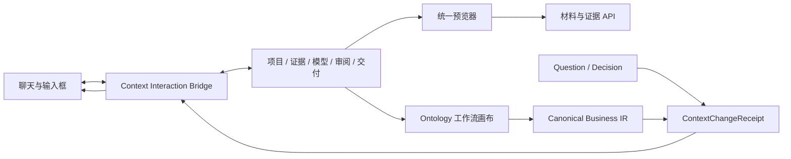

# OntoCopilot FDE：聊天 × 项目上下文 × 统一预览 × 工作流画布设计

日期：2026-08-17  
状态：实现基线

## 1. 产品结论

右侧栏不是聊天的附件面板，而是当前项目的「可审阅工作记忆」。聊天负责提出意图、解释和驱动动作；右侧栏负责展示当前事实、证据、模型、决策与交付状态。二者必须共用同一份 revision，并通过可见回执告诉 FDE：什么刚被补充、它影响了什么、下一轮聊天会看到什么。

统一原则：

1. **同一份 Canonical Business IR**：DataObject、Link、Action、Event、Rule、Workflow、Evidence、Question、Decision 与 Artifact 不为不同视图重复建模。
2. **写入有回执**：审阅答案、分派、草案生成、模型修改、产物更新均形成 `ContextChangeReceipt`。
3. **引用不等于写入**：选择对象、节点或材料只形成下一轮聊天的引用，不静默修改 Ontology。
4. **证据等级可见**：材料提取为 `grounded`；无材料生成的通用草案为 `generic_assumption`；模型推断为 `inferred`；人工确认后为 `confirmed`。
5. **先预览后下载**：材料与产物先在侧栏统一查看；下载是同一预览头部的次级动作。

## 2. 聊天与五区侧栏的双向协作

| 侧栏区域 | FDE 在侧栏做什么 | 聊天如何感知 | 聊天如何反向驱动 |
|---|---|---|---|
| 项目 | 查看阶段、revision、最近变更；无材料时创建通用草案 | 显示「项目上下文已更新」回执和 revision | 让 AI 规划下一步、从通用场景起草、解释变更 |
| 证据 | 预览材料、定位片段、引用出处 | 下一轮带上材料/locator 引用；不自动把引用当结论 | 上传/讨论材料后刷新证据；聊天回答可跳回出处 |
| 模型 | 搜索/选择对象、规则、Action、Workflow；在画布选节点 | 选择项成为 composer 上方的上下文引用 | “询问此对象/节点”“按描述修改草案”进入聊天 |
| 审阅 | 回答问题、分派、延期、恢复 | 成功后出现写入回执；服务端的 context brief 读取新 Decision | 聊天可解释问题、生成追问，或把答案带回审阅 |
| 交付 | 预览产物、检查门禁、下载/打包 | 产物 revision 与阻塞项进入回执 | 聊天可解释、比较或要求重新生成指定格式 |

### 2.1 聊天主区的两种反馈

**A. 上下文引用条（未写入）**

- 位置：输入框上方。
- 内容：`正在引用：采购订单 · Action「提交订单」 · 材料 R18`。
- 行为：发送时把引用写进用户可见文本提示；可逐项移除；发送后清空。

**B. 上下文变更回执（已写入）**

- 位置：消息流底部、推荐问题之前。
- 内容：`已补充到项目上下文 · 回答 Q-018 · 影响审批流程与规则清单 · revision r13`。
- 行为：`查看变更` 回到对应侧栏；`引用到下一轮` 将变更摘要挂到输入框。
- 回执不是聊天消息，不冒充人与 AI 的发言。

## 3. 统一预览器

统一预览对象 `PreviewTarget`：

```ts
type PreviewTarget = {
  id: string;
  source: "material" | "artifact" | "evidence" | "live-model";
  name: string;
  format: string;
  previewKind: "image" | "svg" | "document" | "table" | "text" | "json" | "graph" | "download-only";
  previewUrl?: string;
  sourceUrl?: string;
  downloadUrl?: string;
  locator?: string;
  capabilities: Array<"preview" | "download" | "open" | "cite" | "ask" | "canvas">;
};
```

支持策略：

| 输入 | 侧栏呈现 | 说明 |
|---|---|---|
| PNG/JPG/WebP | 等比图片、缩放、适配宽度 | 原文件只读内嵌 |
| SVG | 安全同源图片预览、缩放 | 不把不可信 SVG 注入 DOM |
| PDF | 同源内嵌或已有 PDF.js | 可定位页码时保留 locator |
| MD/TXT/JSON/Mermaid | 文本/Markdown/JSON 视图 | 原文与渲染视图可切换 |
| XLSX/CSV | 工作表/行列切片 | 复用解析缓存，不在浏览器重新解析整个工作簿 |
| DOCX/DOC | 解析后的段落、表格与页/段引用 | 原文件仍可下载；不伪造版式还原 |
| Ontology/Flow JSON | 结构详情 + 工作流画布 | 与模型详情、证据、审阅联动 |
| 不支持格式 | 元数据与下载 | 明确说明原因，不显示空白 iframe |

### 3.1 紧凑与宽屏

- 紧凑：列表 → 点击后 drill-in 到预览；头部提供返回。
- 宽屏：左侧目录/队列，右侧预览/详情；选择保持不丢。
- 预览头：类型、文件名、revision、来源；动作只保留「引用到聊天」「新开」「下载」。

## 4. Dify 类 Ontology 工作流画布

画布是 `live-model` 的一个视图，而不是新存一份流程图。

### 4.1 图层

1. **Workflow**：按 `flow.workflows/stages/nodes/edges` 展示主流程。
2. **Action / Event**：强调动作与事件交替、触发与结果。
3. **Object Links**：按 OIR `objects/links/actions.appliesTo` 展示对象关系。
4. **Evidence / Review overlay**：节点角标显示有无证据、待确认问题和阻塞状态。

### 4.2 最小交互

- 平移、滚轮缩放、适配画布、重置。
- Action、Event、Gateway、Object 使用稳定的语义样式，不依赖装饰性图标。
- 点击节点：打开模型详情；双击或动作按钮：引用到聊天。
- 点击证据角标：打开统一预览并定位来源。
- 点击待确认角标：切到审阅并选中关联问题。
- 推断边使用虚线；无材料通用假设使用琥珀状态；已确认使用绿色状态。

## 5. 无材料起步：通用 Ontology 草案

这是一级产品路径，不是上传失败后的兜底。

### 5.1 入口

项目区无材料状态提供：

- `从通用场景起草`
- `生成业务流程草图`
- `生成 Ontology Package 骨架`

点击后只预填聊天，不直接静默生成；FDE 可补充行业、范围、角色、边界和输出类型后发送。

### 5.2 默认生成契约

用户未提供材料时，系统应：

1. 生成 `draft`，不得标记为 confirmed。
2. 每个节点/实体标记 `provenance = generic_assumption`。
3. 同时生成最小验证清单：角色、系统边界、关键字段、异常路径、审批规则、SLA。
4. 输出 DataObject、Action、Event、Workflow、Rule、Link；必要时再输出字段。
5. 在画布展示，并允许 FDE 继续通过聊天修改。
6. 后续上传材料时做 diff：`通用假设 / 材料支持 / 材料冲突 / 尚未覆盖`，不得直接覆盖人工修改。

建议预填提示：

> 我没有现成业务材料。请基于「[场景]」生成一份仅供讨论的通用 Ontology 与流程草案，包含 DataObject、Action、Event、Workflow、Rule 和 Link。所有非用户提供的信息标记为“通用假设/待验证”，同时给出关键澄清问题，并生成可在工作流画布查看的结构。

## 6. 组件与事件边界



事件最小集合：

- `oc:context-reference`：选择对象/节点/证据/产物，挂到下一轮聊天。
- `oc:context-changed`：写入成功，产生回执。
- `oc:context-open`：聊天回执跳回侧栏的 section/target。
- `oc:preview-open`：任何区域打开统一预览器。
- `oc:canvas-select`：画布节点与模型详情同步。

## 7. 本轮实现优先级

P0：

- 统一预览器入口与安全预览 API。
- PNG/SVG、解析后的 Excel/Markdown/DOCX、Ontology/Flow JSON 预览。
- Workflow/Action/Event 画布的 pan/zoom/fit、节点选择和模型联动。
- 审阅提交后的聊天回执；对象/证据/产物引用到 composer。
- 无材料通用草案的可编辑预填入口。

P1：

- 草案与后续材料的语义 diff。
- 多 revision 对比、节点级影响范围和局部回滚。
- Canvas 布局持久化、多人 presence、评论锚点。

