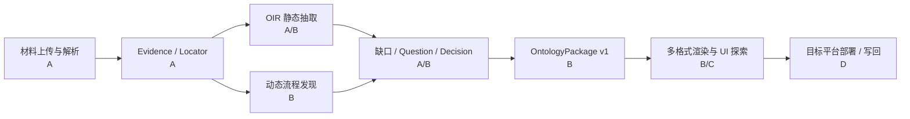
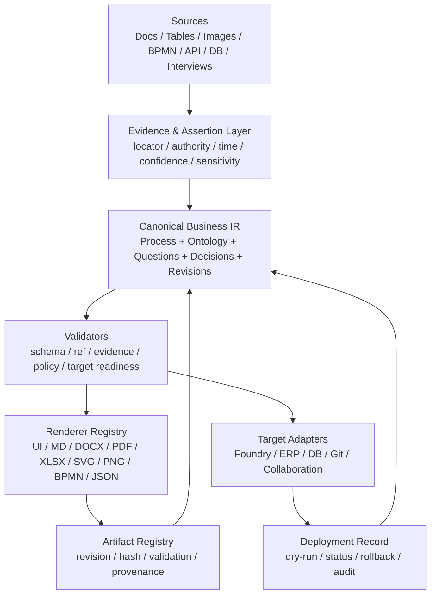

# OntoCopilot 面向 FDE 的当前能力覆盖与缺口分析

**审计日期：** 2026-08-17

**代码基线：** `40f4fa3e4ac1` 加当前工作区未提交修改

**审计范围：** TypeScript 主实现、Web/API、Parser、Evidence、OIR、Flow、Question/Decision/Revision、OntologyPackage、Artifact/Export、Engagement DAG、测试与既有产品文档

**本次交付：** 仅分析与产品/架构建议，不修改业务代码

**目标读者：** 产品负责人、FDE 负责人、Ontology/ERP 顾问、架构师、研发与测试团队

> 工作区审计时已有其他未提交修改和新增文件。本报告只新增本 Markdown 文件，没有改动或清理这些用户工作。

---

## 0. 执行结论

### 0.1 一句话判断

当前 OntoCopilot 已经具备一条真实的、可用于受控试点的 **“材料 → 证据 → OIR/流程草图 → 缺口问题 → 人工决定 → Canonical JSON/模板/交付包”** 主链。它最强的定位是：

> **有证据约束的 FDE 业务发现与 Ontology 初稿工作台。**

它还不是完整的：

> **FDE 项目操作系统、任意材料的动态流程发现引擎、全语义 Ontology 编排器，或可直接部署到 Foundry/ERP 的交付平台。**

核心判断如下：

| 结论 | 当前状态 |
|---|---|
| 材料解析、证据定位、静态业务语义初稿 | **已覆盖，边界清楚** |
| BPMN 与严格结构化流程说明生成流程图 | **已覆盖** |
| 从访谈、邮件、散文档中动态还原复杂 As-Is/To-Be | **部分覆盖，仍依赖结构化输入** |
| 问题、决定、修订、发布门禁 | **主闭环已接通** |
| OntologyPackage JSON | **自有 canonical 包已覆盖；目标平台部署包未覆盖** |
| Markdown/CSV/XLSX/DOCX 导出 | **真实实现** |
| PDF 导出 | **接口已声明，但生产 Renderer 未接线** |
| SVG/Mermaid/流程 JSON | **真实实现** |
| PNG | **仅对话 `flow.sketch` 局部覆盖，不是通用图形导出能力** |
| UI 中的完整流程/本体/血缘可视化工作台 | **明显缺失** |
| ERP、Foundry、数据库、协作平台连接与写回 | **缺失** |
| 六个专业 FDE Agent 的独立二次分析 | **DAG 与契约真实，专业节点目前主要是确定性投影** |

### 0.2 当前主链成熟度

本文使用四档，避免把“存在类/接口”误写成“用户可用”：

- **A｜端到端可用：** 已接入真实主链，有持久状态、产物或测试证据。
- **B｜有边界可用：** 主链可用，但只覆盖特定输入、视图或格式。
- **C｜脚手架/契约：** 数据结构或接口存在，尚未形成完整用户能力。
- **D｜缺失：** 当前代码没有形成该能力。



### 0.3 最重要的产品决策

下一步不宜继续零散增加下载按钮或再堆几个 Agent 名称。应优先建设同一个核心：

> **Canonical Business IR + 类型化 Artifact Registry + Renderer/Exporter 插件层。**

同一份 Process、DataObject、Link、Action、Event、Rule、Role、System、Evidence、Decision 语义，应能在 UI 中渲染成不同视图，并从同一个 revision 确定性导出 MD、PDF、DOCX、XLSX、SVG、PNG、JSON、BPMN 等格式。否则每种图和文件都会形成新的旁路，版本、证据和修改会逐渐失配。

---

## 1. 本报告如何理解 FDE

这里的 FDE 指直接进入客户现场或业务一线、同时承担业务发现、数据/流程建模、方案实施与交付闭环的工程师，不只是完成既定需求的开发者。

这一角色定义与公开的 Forward Deployed Engineer / Software Engineer 职责相近：需要直接与客户工作、快速理解最重要的问题、处理开放式问题，并在架构、数据、应用和业务策略之间完成端到端交付。可参考 [Palantir FDSE 公开岗位说明](https://jobs.lever.co/palantir/289ad049-7b4e-41e3-8a39-146fbeb6fb64) 与 [Palantir Careers 对工作流导向交付的说明](https://www.palantir.com/careers/index.html)。

Ontology 也不应被理解为静态实体字典。官方 Ontology 文档把它描述为同时承载对象/属性/关系等语义层，以及 Action、Function、动态安全等行为层；Action 是对对象、属性和关系执行事务性修改的入口。参考 [Ontology Overview](https://www.palantir.com/docs/foundry/ontology/overview)、[Ontology System](https://www.palantir.com/docs/foundry/architecture-center/ontology-system) 与 [Actions Overview](https://www.palantir.com/docs/foundry/object-edits/overview)。

因此，OntoCopilot 的北极星不是“文档转 JSON”，而是帮助 FDE 持续维护以下项目事实：

1. 客户真正要改善的业务结果与边界；
2. 原始材料、访谈、数据和系统事实；
3. As-Is / To-Be 流程及其异常路径；
4. DataObject、Link、Action、Event、Rule、Role、System；
5. 未知项、冲突、问题、权威回答和决定；
6. 每一版可验证、可回滚、可下载、可部署的交付物。

---

## 2. FDE 在真实项目中会面对什么

| 场景 | 常见表现 | 如果工具处理不好会怎样 | OntoCopilot 应提供什么 |
|---|---|---|---|
| 目标模糊 | 客户说“提升效率”“做一个 AI 平台”，没有成功指标 | 先做技术、后找价值，范围持续漂移 | Mission、Outcome、KPI、In/Out Scope、验收条件 |
| 材料碎片化 | Word、Excel、PDF、PPT、截图、接口文档、会议纪要分散 | 结论不可复核，遗漏关键材料 | 材料清单、解析状态、哈希、定位、覆盖率和缺件清单 |
| 同名不同义 | “客户”“订单”“有效金额”在部门间口径不同 | 对象合并错误、规则与报表互相冲突 | 术语对照、别名、定义、数据源、冲突和决策记录 |
| 版本互相冲突 | 制度、SOP、系统配置、现场口述不一致 | 把过时文档当成现状 | 生效时间、权威级别、冲突证据、待确认 Owner |
| 流程只存在于人脑 | 文档只有主路径，例外和手工补救靠经验 | 生成“漂亮但假的”流程图 | 主路径、异常、补偿、离线步骤、系统切换和置信度 |
| 跨部门交接 | 每个团队只知道自己的一段 | 边界事件、责任人与 SLA 丢失 | Swimlane、RACI、交接条件、输入/输出、SLA |
| 系统与业务脱节 | SOP 讲业务，API/ERP 讲字段和状态 | 无法从业务步骤落到实现 | Step ↔ System/API ↔ Action/Event/DataObject 映射 |
| 数据质量不明 | 主键不稳、枚举漂移、单位/币种混用 | Ontology 看似完整但无法运行 | Profiling、键候选、口径、质量规则、样例与异常值 |
| 行为语义缺失 | 只有对象和字段，没有谁能做什么 | 无法支撑运营闭环 | Action 的权限、参数、前置条件、Effects、Events、补偿 |
| 规则隐含在流程里 | 审批阈值、税率、时间窗散落在文字和表格 | 流程与系统规则不一致 | 可执行/可测试 Rule、Decision Table、例外与依据 |
| 权威人不明确 | 多位干系人给出不同答案 | 问题不断重开，没有正式结论 | Audience、Owner、Authority、Decision、Supersedes |
| 时间极紧 | FDE 需要第二天就开 Workshop 或做汇报 | 产物来不及，或只有未经验证的长文 | 自动议程、缺口优先级、可编辑图、Workshop-ready 导出 |
| 持续变化 | 新材料、访谈和范围每天增加 | 全量重做、人工修改丢失 | 增量重算、语义 diff、revision、分支/合并、影响分析 |
| 敏感数据 | 客户材料含个人、财务、商业机密 | Bundle 或模型调用泄露数据 | 分类、脱敏、最小权限、选择性打包、审计与保留策略 |
| 交付落地 | 最终要进入 Foundry、ERP、数据库或工程仓库 | JSON 只能展示，不能运行 | Target adapter、部署前校验、dry-run、回滚与写回状态 |
| 上线后验证 | 设计流程与实际事件日志可能不同 | To-Be 没有业务效果证据 | 流程挖掘、指标、偏差检测、运营反馈闭环 |

---

## 3. FDE 会问什么，以及期待什么样的答案

FDE 需要的不是单段自然语言回答，而是“结论 + 证据 + 不确定性 + 可操作产物”。下面是高频问题清单。

### 3.1 项目目标与范围

| FDE 的问题 | 期待答案 |
|---|---|
| 客户真正要解决什么问题？ | 一句话 Mission、业务结果、当前基线、目标 KPI、验收方式、证据和未确认假设 |
| 这次到底做什么、不做什么？ | In Scope / Out of Scope、依赖、约束、阶段、决策人和范围变更记录 |
| 谁是业务 Owner、流程 Owner、数据 Owner、技术 Owner？ | Stakeholder/RACI 表、权威范围、联系方式或角色、尚未确认项 |
| 这周 Workshop 应先问什么？ | 按阻塞度、信息增益、影响范围排序的问题议程；说明问谁、为何问、答案格式 |

### 3.2 材料、事实与证据

| FDE 的问题 | 期待答案 |
|---|---|
| 现在有哪些材料，哪些读成功了？ | 文件清单、格式、版本/时间、哈希、解析状态、页/表/段数量、失败原因 |
| 哪些重要材料还缺？ | 缺件清单、对应阻塞产物、建议 Owner、优先级 |
| 这个结论来自哪里？ | 精确到文件、页、Sheet、行、段或 BPMN XML 元素的 locator，可点回原文 |
| 哪些是事实、哪些是系统推断？ | Extracted / Inferred / Human Decision 分层，分别给置信度、证据和待确认项 |
| 两份材料为什么矛盾？ | 并排引用、时间/权威/适用范围比较、影响对象、建议选择与待决问题 |

### 3.3 业务流程

| FDE 的问题 | 期待答案 |
|---|---|
| 从需求到结果，实际流程到底怎么走？ | 可交互 Swimlane；Action、Event、Gateway、角色、系统、输入输出、证据和推断样式 |
| 主流程之外有哪些例外？ | 异常条件、人工绕行、重试、退回、取消、补偿、升级路径和频率 |
| 哪些步骤是手工、线下或重复录入？ | 痛点列表、所在步骤、耗时/错误风险、涉及系统、改进候选 |
| 流程为什么停在这里？ | 前置条件、缺失数据、审批/权限、依赖系统、SLA 和证据 |
| As-Is 与 To-Be 差在哪里？ | 节点/边/角色/系统/规则差异图，新增、删除、替换和影响说明 |
| 如果改这个规则，会影响哪些步骤？ | Rule → Gateway/Action → DataObject/Event → Artifact 的可追踪影响图 |

### 3.4 Ontology 与系统实现

| FDE 的问题 | 期待答案 |
|---|---|
| 应该有哪些 DataObject？ | 业务定义、主键、标题字段、属性、枚举、生命周期、Owner、SoR、敏感度和证据 |
| 这两个对象/字段是不是一回事？ | 定义、键、粒度、时间语义、单位、来源、样例和关系比较；给合并/分离建议 |
| 对象之间是什么关系？ | Link 类型、方向、基数、join key、有效期、约束、证据与质量风险 |
| 这个 Action 到底做什么？ | 适用对象、Actor/权限、参数、前置条件、Effects、事件、API、幂等和补偿 |
| Event 什么时候发生，谁消费？ | 触发者、时机、payload、关联对象、消费者、顺序、投递保证与重放策略 |
| 这个 Rule 如何计算？ | 标准化表达式、输入、单位/币种、时间窗、优先级、例外、样例、测试和来源 |
| 业务步骤由哪个系统/API 支撑？ | Process Step ↔ System ↔ Endpoint ↔ Action ↔ DataObject 映射矩阵与空白项 |
| 哪个系统是权威数据源？ | 字段级/对象级 SoR、同步方向、延迟、冲突策略和 Owner |
| 当前模型有什么孤儿或断链？ | 无来源对象、无消费者事件、无 Action 的流程步骤、无对象的规则等质量报告 |

### 3.5 决策、变更与交付

| FDE 的问题 | 期待答案 |
|---|---|
| 还有什么必须问客户？ | 去重后的 Question Backlog、依赖、Owner、阻塞产物、优先级和建议答案 schema |
| 谁决定了这个口径？ | Decision、回答人/角色、时间、证据、替代了哪个旧决定、影响哪些 revision |
| 我刚改了审批阈值，哪里变了？ | 原值/新值、语义 diff、受影响流程/规则/API/文档、重新验证结果、撤销入口 |
| 现在能交付了吗？ | Release Gate：blocking 问题、schema/ref 校验、证据覆盖、敏感信息、测试与状态 |
| 给我下载流程图 / 汇报 / Excel / JSON。 | 明确 artifact kind、format、revision、hash、生成时间、验证状态和下载链接 |
| 这个 JSON 能直接导入 Foundry 吗？ | 明确回答“能/不能”；列出目标版本、映射、缺失语义、校验结果和部署步骤，绝不把内部 JSON 冒充部署包 |

### 3.6 理想的 FDE Answer Card

每个重要回答至少应包含八层：

1. **直接结论：** 先回答问题，不先复述材料；
2. **证据：** 文件/页/表/行/元素定位；
3. **事实分层：** 材料事实、人工决定、系统推断、一般经验分开；
4. **结构化结果：** 表、图、对象、规则或 diff，而不只是长文；
5. **冲突与未知：** 不隐藏缺口，说明置信度；
6. **影响：** 对流程、Ontology、系统和下游产物的影响；
7. **建议与待决定项：** 下一步、应问谁、需要什么答案；
8. **Artifact 信息：** revision、hash、validation、provenance 与下载格式。

当前对话层已有 `answer + citations + confidence + followup + nextQuestions` 的基础，但还没有把上述八层固化为所有核心回答的统一产品协议；最终回复还会截取有限数量的 citation。证据见 [`onto/converse.ts`](../ts/src/onto/converse.ts) 与 [`server/dialogue.ts`](../ts/src/server/dialogue.ts)。

---

## 4. 当前代码已经覆盖什么

### 4.1 端到端能力矩阵

| 能力 | 档位 | 当前真实覆盖 | 主要边界 | 代码证据 |
|---|:---:|---|---|---|
| 多格式材料上传与解析 | A/B | XLSX/XLSM/XLTX、CSV/TSV、DDL/SQL、JSON/YAML/OpenAPI、BPMN、PPTX/PPTM/PPSX、DOCX、PDF/常见图片、MD/TXT/RST | 不支持旧 Office `.xls/.doc/.ppt`、通用 XML、ODF、Parquet、VSDX、DMN 等 | [`parse/index.ts`](../ts/src/onto/parse/index.ts#L99) 及各 parser |
| 扫描件/PDF OCR | B | 文本层优先，空页走视觉/OCR，可生成定位和 finding | 大文档成本/质量依赖模型；复杂表格和版面仍需金标评测 | [`parse/vision.ts`](../ts/src/onto/parse/vision.ts) |
| Evidence Index | A | chunk、文件哈希、locator、搜索、行读取、来源预览，OIR assertion 要求证据 | 尚无完整 UI 血缘图和证据覆盖热力图 | [`parse/base.ts`](../ts/src/onto/parse/base.ts)、[`oir.ts`](../ts/src/onto/oir.ts) |
| OIR 抽取 | A/B | Object、Property、Link、Action、Rule、Question，带 origin/evidence/confidence/conflict | Event/Workflow 分散在 Flow；治理和可执行行为语义偏薄 | [`onto/oir.ts`](../ts/src/onto/oir.ts) |
| BPMN 导入 | A | task/event/gateway/lane/sequenceFlow/condition/XML locator 确定性桥接 | 只有导入，无 BPMN XML 导出和 round-trip | [`onto/flow_bpmn.ts`](../ts/src/onto/flow_bpmn.ts) |
| 文本流程发现 | B | 能从编号步骤和“触发/输入/输出/角色”等结构字段构建 Action/Event/边；缺边以推断标识 | 至少两步、至少两个结构字段；非结构化访谈和散文流程召回有限 | [`flow_extract.ts`](../ts/src/onto/flow_extract.ts#L224) |
| 流程异常/网关 | B/C | 能识别部分“如…则/否则”规则并挂 Gateway | 语言/版式启发式；缺 Timer、Message、Subprocess、SLA、复杂补偿语义 | [`flow_extract.ts`](../ts/src/onto/flow_extract.ts) |
| 流程图产物 | A/B | 全图 SVG、主干 SVG、Mermaid、`flow.json`；图中区分推断边 | UI 主要展示阶段/节点 chip，完整 SVG 多为另行打开；非通用图渲染器 | [`server/glue/flow.ts`](../ts/src/server/glue/flow.ts#L86) |
| 缺口与冲突 | A/B | 语义分歧、缺字段、命名、重复、孤儿、类型、Action 缺失等检查，并形成建议/问题 | 缺跨项目基准、领域完整性规则和可量化风险图 | [`onto/conflict.ts`](../ts/src/onto/conflict.ts) |
| Question Backlog | A | 状态、Owner、Audience、答案 schema、依赖、阻塞产物、优先级、信息增益、延期/重开/导出 | Stakeholder/authority 仍不是完整一等模型 | [`onto/questions.ts`](../ts/src/onto/questions.ts)、[`routes/questions.ts`](../ts/src/server/routes/questions.ts) |
| Decision / Revision | A/B | 幂等回答、Decision Ledger、supersedes、revision、回答后恢复 Engagement | 跨 OIR/Flow/Template 的统一语义事务和分支合并仍不足 | 同上及 [`server/pipeline/run.ts`](../ts/src/server/pipeline/run.ts) |
| 对话式读取与修改 | A/B | 查材料/证据/OIR/流程/问题，编辑与撤销 OIR、Flow、Template，修改前确认 | 复杂跨产物命令不完全原子；理想 Answer Card 未固化 | [`server/dialogue/tools.ts`](../ts/src/server/dialogue/tools.ts) |
| 冻结 FDE Engagement DAG | A/C | INTAKE→PROCESS→ERP/RULES/DATA→GAP→INTERVIEW→CANONICALIZE→REVIEW→EXPORT；真实 checkpoint/HITL/Gate | 专业 Agent 节点当前主要把成熟抽取结果做确定性 schema 投影，并非独立专业分析 | [`onto/engagement.ts`](../ts/src/onto/engagement.ts)、[`engagement_runtime.ts`](../ts/src/onto/engagement_runtime.ts) |
| OntologyPackage v1 | A/B | Process/DataObject/Action/Event/Rule/Role/System/Question/Decision/Evidence 同包，稳定 ID 与引用校验 | 自有 schema；不是 Foundry/其他平台的可部署包；顶层没有 Links 集合 | [`onto/canonical.ts`](../ts/src/onto/canonical.ts#L70) |
| Package 编译 | A/B | `ontology.package.json`、schema、DataObjects/Actions/Events/Rules/Questions 分视图、OIR、模板 | 未拆出 `links.json`、`workflows.json`、roles/systems/decisions/evidence 等分视图 | [`server/glue/compile.ts`](../ts/src/server/glue/compile.ts#L88) |
| 模板与业务回传 | A | XLSX 模板、隐藏锚点、验证、回传 preview diff、确认后 merge/revision/recompile | UI diff 仍是列表，不是高密度表格/单元格级审阅器 | [`routes/artifacts.ts`](../ts/src/server/routes/artifacts.ts)、相关模板代码 |
| Bundle | A/B | ZIP、manifest、hash、README、DRAFT/RELEASED、blocking question 门禁 | 不是平台部署包；缺选择性材料、脱敏、签名、加密、SBOM/策略证明 | [`onto/bundle.ts`](../ts/src/onto/bundle.ts)、[`routes/artifacts.ts`](../ts/src/server/routes/artifacts.ts) |
| 持久执行底座 | A/B | SQLite、journal/checkpoint、lease/fencing、Recorder、Budget、Critic、恢复 | 企业多租户、灾备、容量、安全与真实多 worker 仍需专项验收 | `kernel/`、`store/`、`server/pipeline/` |
| EvalOps | B | 有语义门槛、pass^k、成本/延迟报告底座 | 仍缺真实 FDE 项目金标、流程/Ontology 质量和“无依据断言率”体系 | `ts/src/eval/` 与相关测试 |

### 4.2 当前最扎实的部分

1. **证据优先。** 抽取结果不是纯聊天文本，而是带 origin、locator、confidence 的 assertion；UI 能从材料表、流程或引用点回来源。
2. **确定性优先。** BPMN 走结构化桥接；XLSX、DDL、OpenAPI 等尽量不让模型重新猜结构；缺失流程边会显式标为 inferred。
3. **人在环状态真实存在。** Question、Decision、Revision、HITL suspend/resume 和发布门禁不只是文档设计。
4. **已有可交付骨架。** Canonical 包、分视图、XLSX 模板、流程图、问题清单和 ZIP Bundle 能形成试点交付。
5. **修改不再完全漂浮在聊天中。** OIR/Flow/Template 有结构化工具、确认、undo/replay 的基础。

---

## 5. Ontology 模型覆盖与缺口

### 5.1 当前覆盖矩阵

| 语义类型 | 当前覆盖 | 关键缺口 |
|---|---|---|
| DataObject | 名称、描述、主键、属性、关系、别名、状态；Canonical 还有 owner/SoR/lifecycle/sensitivity 槽位 | 多数治理字段由编译器填空值/默认值；生命周期、质量契约、lineage、访问策略不完整 |
| Property | 类型、定义、semantic type、单位、必填、值域、Owner、冲突 | 时间语义、精度、PII 分类、质量阈值、转换 lineage、字段级 SoR 不完整 |
| Link | OIR 有 source/target/cardinality/joinKey/status/conflict | Canonical 中嵌入 `DataObject.relations`，无顶层 `links`；有效期、约束、link properties 不完整 |
| Action | appliesTo、parameters、effects、sourceEndpoint、status | Actor/授权、输入输出、前置条件、事务边界、幂等、补偿、失败语义和事件映射大多为空或偏薄 |
| Event | Flow/Canonical 中存在并能与节点关联 | Producer/consumer、payload schema、时序、投递保证、重放、correlation key 不完整 |
| Rule | Validation/Process/Authority/Calculation/Other、statement、appliesTo、actor | `normalizedExpression`、trigger、exceptions 多为 null/empty，compileStatus 常为 uncompiled；不可直接执行/测试 |
| Workflow/Process | Stage、Action/Event/Gateway、edge、actor、evidence | As-Is/To-Be 版本、Timer/Message/Subprocess/SLA/异常/补偿/编排状态不完整；无 BPMN 导出 |
| Role | Canonical 集合存在，流程节点可带 actor | 权限、职责范围、组织结构、RACI、delegation/segregation-of-duties 不完整 |
| System | Canonical 集合存在，可关联 endpoint/source | 系统 landscape、环境、接口、ownership、数据流、同步 SLA 不完整 |
| Evidence | Canonical 集合、locator、hash/来源链基础 | 缺图形化 lineage、覆盖率、证据权威/时效策略 |
| Question/Decision | 状态机、Owner、答案 schema、依赖、幂等、supersedes、revision | Authority 与审批签署语义、跨分支合并和外部任务系统同步缺失 |

### 5.2 `OntologyPackage v1` 必须如实命名

当前 [`canonical.ts`](../ts/src/onto/canonical.ts#L70) 定义的是 **OntoCopilot 自有的 OntologyPackage v1**：

- 顶层集合是 `processes / dataObjects / actions / events / rules / roles / systems / questions / decisions / evidence`；
- `Link` 被嵌入 DataObject 的 `relations`，没有顶层 `links`；
- JSON Schema 对集合元素只约束到 `items: {type: object}`，深层字段并没有完整 schema；
- 运行时 validator 做了大量 ID 和引用完整性检查，这是优点，但不能替代深层 schema 与目标平台校验；
- 它没有 Foundry Object Type、Link Type、Action Type、Function、Permission、OSDK/deployment 等目标平台映射和部署流程。

因此产品文案应使用：

> “OntoCopilot Canonical Ontology Package”

而不是：

> “可直接导入/部署的 Foundry Ontology Package”

除非后续增加明确的 target adapter、版本兼容矩阵、dry-run validator 和真实平台集成测试。

### 5.3 建议的 Canonical vNext

建议把以下类型全部升为一等实体并有独立稳定 ID：

```text
Engagement / Mission / Outcome / Scope / Stakeholder
Evidence / Assertion / Conflict / Question / Decision / Revision
Process / Stage / Step / Gateway / Exception / SLA
DataObject / Property / Link / Lifecycle / DataQualityRule
Action / Event / Rule / Role / Permission / System / Interface
Artifact / ValidationReport / TargetMapping / Deployment
```

`Links` 和 `Workflows` 可以选择顶层集合，或保留嵌套，但必须有唯一、明确、深层 schema 的 canonical 约定；不能只在不同视图里隐式存在。

### 5.4 已确认或高可信的模型正确性风险

这些问题会直接影响 FDE 对“版本和事实是否可靠”的信任，优先级应高于增加新图：

| 风险 | 代码事实 | 可能后果 | 建议等级 |
|---|---|---|:---:|
| `ObjectType.titleProperty` 往返丢失 | `objectToDict()` 不写该字段，`oirFromDict()` 固定恢复为 `inferred(null)`；代码注释也明确说明 | 重启、重编译或回放后标题字段选择消失 | P0 |
| `FlowNode.status` 往返丢失 | `toDict()` 写 status，但 `flowFromDict()` 不读取，统一恢复成 CANDIDATE | 人工确认/状态语义在恢复后退化 | P0 |
| `oir.query` 可能在有实体时报错 | 工具对 Map 中的普通 interface 数据调用 `e.toDict()`；OIR 实体实际通过 `objectToDict()` 等自由函数序列化 | Agent 查已有对象/关系时出现运行时 TypeError；现有测试主要覆盖工具注册 | P0，先加回归测试确认 |
| 新 canonical 产物在 Bundle 中被归为 `other` | Bundle 分类器只识别 OIR、Flow、SVG/MMD、Template 等旧文件名 | manifest 对 OntologyPackage、Actions、Events、Rules 的类型和溯源语义不准确 | P1 |

证据见 [`onto/oir.ts`](../ts/src/onto/oir.ts#L458)、[`onto/flow.ts`](../ts/src/onto/flow.ts#L727)、[`server/glue/tools.ts`](../ts/src/server/glue/tools.ts#L368) 与 [`onto/bundle.ts`](../ts/src/onto/bundle.ts#L151)。

---

## 6. 格式、可视化与下载能力

### 6.1 当前格式能力：声明不等于可用

| 格式 | 当前状态 | 可用于什么 | 关键说明 |
|---|:---:|---|---|
| Markdown (`.md`) | A | 聊天回答、表格/文档、问题清单 | 通用导出真实实现 |
| CSV (`.csv`) | A | 表格数据 | 通用导出真实实现 |
| Excel (`.xlsx`) | A | 表格、问题清单、业务模板 | 通用导出与专业模板均有真实实现 |
| Word (`.docx`) | A/B | 聊天回答、表格/文档 | 真实 OOXML 实现；尚未形成完整 FDE 报告模板体系 |
| PDF (`.pdf`) | C | 目标是正式报告/图 | `SPECS` 有 PDF，但 `toPdf()` 在未注入 Renderer 时直接报错；当前生产代码未发现接线 |
| SVG (`.svg`) | A/B | 流程全图/主干图、对话流程草图 | 流程专用，不是任意视图的统一 Renderer |
| PNG (`.png`) | B/C | `flow.sketch` 可选输出 | 常规自动流程图、Ontology 图、文档没有统一 PNG 下载 |
| Mermaid (`.mmd`) | A | 流程图与草图源码 | 真实实现，便于工程协作 |
| JSON (`.json`) | A/B | Flow、OIR、OntologyPackage 与分视图 | 通用 `export.file` 不负责 JSON；Canonical/Artifact 路径负责 |
| ZIP | A/B | Bundle | 有 manifest/hash/release state，但不是部署包 |
| BPMN XML | 仅输入 | 导入客户 BPMN | 无导出/round-trip |
| PPTX | 仅输入 | 解析客户演示文稿 | 无演示文稿生成 |
| GraphML / DOT / PlantUML / DMN | D | 图工具互操作、规则交付 | 当前缺失 |

PDF 证据位于 [`onto/export.ts`](../ts/src/onto/export.ts#L1194)：`registerPdfRenderer()` 只是注入点；未接线时抛 `ExportDependencyMissing`。产品 UI/API 不应在能力协商时把 PDF 显示为“已支持”，除非启动时已注册成功并通过健康检查。

### 6.2 当前 UI 真正展示了什么

右侧预览目前有七个 Tab：材料、实体、冲突、问题、产物、流程图、推理，见 [`ui/index.template.html`](../ui/index.template.html#L842)。

已覆盖：

- 材料解析状态、finding、Sheet/行预览与来源点回；
- 实体及部分属性列表；
- 冲突卡；
- Question 工作台，支持分派、回答、延期、重开和下载；
- Artifact 列表、Bundle 和业务回传；
- 流程阶段/节点 chip、证据和 SVG/MMD 下载；
- Engagement 进度与推理轨迹；
- 聊天内表格、流程草图图片和下载卡。

明显缺失：

- 可缩放、筛选、搜索、折叠、编辑的完整流程画布；
- Ontology/ERD/Link 关系图；
- Evidence/Data Lineage 图；
- System Landscape 与集成图；
- Rule Decision Table / DMN 视图；
- Action–Event 因果图、Sequence Diagram；
- Object Lifecycle / State Machine；
- As-Is/To-Be 和 revision 语义差异图；
- Data Quality/Profile 图表；
- Traceability Matrix、RACI、缺口/风险热力图；
- Dashboard、项目范围、目标、Stakeholder 与交付检查面板。

另有两项 UI/文档真实性风险：

1. 上传路由明确是“只登记、不解析”，但中栏空态会显示“`N 份材料已读完`”，会让 FDE 误以为材料已被分析。应改为“已登记，尚未解析”或展示逐文件解析状态。证据见 [`routes/files.ts`](../ts/src/server/routes/files.ts#L220) 与 [`ui/react/stream.tsx`](../ts/src/ui/react/stream.tsx#L117)。
2. [`ui/OntoCopilot.html`](../ui/OntoCopilot.html) 是带固定“23 个 ObjectType、187 个 PropertyType”等数字的剧本式旧 Demo，不是生产服务 UI。产品截图、README 和验收不能把其中数据当作真实能力；生产服务返回的是 `ui/index.html`。

### 6.3 推荐的 UI 可视化与下载矩阵

| 优先级 | 视图 | UI 价值 | 推荐下载格式 |
|:---:|---|---|---|
| P0 | Process Explorer / Swimlane | 发现主流程、异常、角色、系统、证据 | SVG、PNG、PDF、MMD、JSON、BPMN XML |
| P0 | Ontology Graph / ERD | 浏览 Object、Property、Link、Action、Event、Rule | SVG、PNG、PDF、JSON、GraphML、DOT |
| P0 | Traceability Matrix | Evidence ↔ Assertion ↔ Process/Ontology ↔ Artifact | XLSX、CSV、MD、JSON、PDF |
| P0 | Question/Gap Workbench | Workshop 议程、阻塞项和责任人 | XLSX、CSV、MD、JSON、PDF |
| P0 | Artifact/Revision Diff | 审查修改与回滚 | HTML/UI、MD、PDF、JSON Patch、XLSX |
| P1 | System Landscape / Integration Map | 业务步骤与系统/API/数据流对齐 | SVG、PNG、PDF、MMD、JSON |
| P1 | Action–Event Causal / Sequence View | 看清触发、调用、状态变化与消费者 | SVG、PNG、PDF、MMD、PlantUML |
| P1 | Object Lifecycle / State Machine | 看清允许状态和 Action | SVG、PNG、PDF、MMD、SCXML |
| P1 | Rule Catalog / Decision Table | 审批、计算、权限、例外可审查 | XLSX、CSV、MD、PDF、DMN XML |
| P1 | Evidence / Data Lineage Graph | 追溯来源、转换和下游影响 | SVG、PNG、PDF、JSON、GraphML |
| P1 | Data Quality Dashboard | 键、空值、枚举、异常和趋势 | UI 图表、PNG、SVG、PDF、XLSX |
| P1 | RACI / Stakeholder Map | 找对提问人和批准人 | XLSX、CSV、PDF、SVG |
| P1 | As-Is / To-Be Delta Map | 对齐改造范围和价值 | SVG、PNG、PDF、MD、JSON |
| P2 | Process Mining / Variant / Bottleneck | 有事件日志后验证真实运行 | UI、SVG/PNG/PDF、CSV/XLSX |

实现原则：**先有同一份语义模型，再有多种 Renderer；UI 展示与下载必须来自同一 revision。**

---

## 7. 当前缺乏搭建的部分

### 7.1 P0：先补产品可信度和统一交付层

#### P0-1 类型化 Artifact Registry

当前单次导出会写入 `exports/`，但与正式 Artifact/Bundle/Revision lineage 不是完全统一的权威模型。应新增统一协议：

```text
ArtifactRef
  id / kind / format / mimeType
  revision / sourceRevision / hash
  generatedAt / generatorVersion
  validationStatus / warnings
  evidenceCoverage / sensitivity
  downloadUrl / previewUrl
```

验收：任何下载卡都能回答“是什么、哪个版本、从什么生成、是否验证、hash 是什么、能否重现”。

#### P0-2 Renderer/Exporter 能力注册

- 接通真实 PDF Renderer；
- 所有图支持 SVG 与 PNG，正式报告支持 PDF/DOCX；
- 运行时返回能力矩阵，不显示假支持格式；
- 导出失败不能退化成没有版本信息的临时文件；
- Renderer 只消费 Canonical IR，不各自重新理解业务文本。

#### P0-3 Canonical Ontology vNext 深化

- 完整深层 JSON Schema，而不是集合元素只验证为 object；
- Link、Workflow/Process、Lifecycle、Permission、Interface、Artifact 一等化；
- Action 补齐 actor/authorization/input/output/precondition/effect/event/idempotency/compensation；
- Event 补齐 payload/producer/consumer/timing/delivery/correlation；
- Rule 补齐 normalized expression、trigger、priority、exception、test cases、compile state；
- 字段级 lineage、SoR、sensitivity、quality contract；
- 明确 internal schema 与各 target schema 的版本映射。

#### P0-4 真正的 Process IR 与动态发现

当前文本流程抽取依赖编号步骤和结构字段。下一版要支持：

- 会议纪要、访谈、制度、邮件、表格和 BPMN 的多源合并；
- 同一步骤多证据聚类与去重；
- 主路径、异常、补偿、Timer、Message、Subprocess、SLA；
- As-Is / To-Be / 假设方案独立版本；
- FDE 在画布上修改，改动回写 Process IR 而不是只改 SVG；
- BPMN 导出与 round-trip 校验。

#### P0-5 修复已知数据往返与核心工具缺陷

- 持久化/恢复 `ObjectType.titleProperty`；
- 恢复 `FlowNode.status`；
- 为“非空 OIR 上调用 `oir.query`”增加真实回归测试并改用统一序列化函数；
- 更新 Bundle artifact classifier；
- 修正“材料已登记”与“材料已读完”的 UI 状态语义；
- 用迁移/兼容测试保护旧 session，而不是继续为了旧 Python 字节 parity 保留数据丢失。

### 7.2 P1：从“初稿工作台”到“FDE Engagement 系统”

#### P1-1 Engagement 首页与项目事实

把 Mission、Outcome/KPI、Scope、Stakeholder/RACI、System Landscape、Deliverable、Risk 和时间线变成 UI 一等对象。目前它们更多存在于 Agent schema 或文本中，不是 FDE 的持续工作面板。

#### P1-2 专业 Agent 从投影升级为选择性分析

现有 DAG、HITL、Gate 和专业角色契约是好底座，但 PROCESS、ERP_MAP、RULES、DATA_OBJECTS 等节点主要确定性投影已有 OIR/Flow。建议：

- 仍保留“一次基础抽取”，避免重复付费；
- 只对缺口、高风险或低置信部分触发专业 Agent；
- 每个专业结论必须写 Assertion/Evidence/Question，而非直接覆盖 canonical；
- Reviewer 做跨视图一致性、无依据断言、可部署性和敏感信息检查。

#### P1-3 可视化工作台

优先实现本体图、全流程画布、Traceability Matrix、Revision Diff 与 System Map。它们比继续增加静态卡片更能提升 FDE 的现场效率。

#### P1-4 Target Adapter 与连接器

至少分三层：

1. **Import Adapter：** 数据库 schema、API、ERP 元数据、文件仓库、任务/会议系统；
2. **Target Mapping：** Internal Canonical → Foundry/其他 Ontology/工程 schema；
3. **Deployment/Write-back：** dry-run、权限确认、幂等、outbox、回滚、审计。

没有这三层之前，产品应把自身定位为 discovery/modeling/export 工具，而不是 deployment platform。

#### P1-5 企业治理

- 文件/字段敏感度与脱敏；
- 选择性 Bundle，不默认把所有原材料交付；
- 模型出网策略与数据驻留；
- Artifact 签名、加密、保留期与删除；
- 多租户、RBAC、审批与审计；
- 分支、比较、合并、发布和多人冲突处理。

### 7.3 P2：上线后的闭环

- 事件日志驱动的 process mining、流程偏差与瓶颈分析；
- 线上 Action/Event/Rule 的 telemetry 与业务 KPI；
- 设计 Ontology 与运行数据的 drift 检测；
- 行业包：采购、供应链、制造、财务、客服等术语/规则/流程模板；
- 反馈数据驱动的持续质量评测，而不是只看单元测试通过率。

---

## 8. 推荐目标架构



这套结构能保证：

- UI 与下载不是两套真相；
- 新增格式只需新增 Renderer；
- 新增目标平台只需新增 Adapter；
- 每次修改、回答、回传和部署都能形成 revision/diff；
- 所有结论都能追溯证据、人工决定或系统推断。

---

## 9. 建议实施顺序与验收门槛

### 阶段 0：能力诚实化与交付底座

- ArtifactRef/Registry；
- Runtime format capability；
- 接通 PDF，统一 SVG/PNG；
- 完整流程 SVG 内嵌预览；
- `links/workflows/roles/systems/decisions/evidence` 的明确下载视图；
- 修复 lint 工具链。

**验收门槛：** UI 显示的每种格式都能在干净环境真实生成、打开、验证；所有下载都有 revision/hash。

### 阶段 1：Canonical vNext 与可编辑 Process IR

- 深层 schema；
- 完整 Action/Event/Rule/Link/Lifecycle；
- 非结构化多源流程发现；
- BPMN 导出；
- Process/Ontology/Traceability/Diff 四个核心视图。

**验收门槛：** 同一个修改会在流程、Ontology、问题、文档中一致更新；BPMN round-trip 不丢失受支持语义。

### 阶段 2：完整 FDE Engagement

- Mission/Scope/Stakeholder/System/Deliverable UI；
- 专业 Agent 选择性分析；
- Workshop 议程与 RACI；
- target readiness report；
- 多人 revision/branch/merge。

**验收门槛：** FDE 能在一个真实客户样例中从材料盘点持续工作到正式发布，无需在外部表格维护第二套问题和决定。

### 阶段 3：连接、部署与运营

- 数据/API/ERP/协作连接器；
- Foundry 或其他目标平台 adapter；
- dry-run/deploy/rollback；
- process mining 和运行监控；
- 企业安全与治理。

**验收门槛：** 有目标平台 sandbox 的双向集成测试、权限审查、幂等、失败恢复和部署审计。

---

## 10. 质量与测试现状

本次在当前受限执行环境中做了以下只读/验证性检查：

| 检查 | 结果 | 解读 |
|---|---|---|
| `npm exec tsc -- --noEmit` | **通过** | 当前 TypeScript 类型检查通过 |
| 全量 Vitest | **98 个 test files；5,884/5,925 tests 通过，17 skipped** | 24 个失败集中在当前环境禁止 `127.0.0.1` listen/connect、以及沙箱默认临时目录无写权限；另有 1 个 suite hook timeout |
| PostgreSQL 集成 | **未在真实 PostgreSQL 上验收** | 当前环境没有测试数据库，不能据此宣称生产 PG 已验证 |
| `npm run check` | **失败** | `tsc` 先通过，但脚本随后找不到 `eslint`；`package.json` 调用了 ESLint，却未声明/安装该依赖 |
| `npm start` | **失败** | 脚本调用 `tsx src/main.ts`，但项目未声明/安装 `tsx`，干净依赖环境无法按该入口启动 |

全量 Vitest 的 24 个失败中，大多数与本次受限环境有关：不能监听/连接 `127.0.0.1`，且默认 `~/.ontocopilot/sandbox` 不在允许写入范围；另有一个 `sandboxForTools` 断言失败，需要在正常容器运行时环境复核。报告没有把这次运行写成“全量通过”。

测试数量很大，说明工程底座有较强回归保护；但当前仓库未发现自身的 CI workflow，且干净安装后的 `start/check` 不可复现。FDE 产品质量也不能只用单测数量衡量。建议新增真实金标项目指标：

- Process node/edge/gateway precision、recall、F1；
- Object/Property/Link/Action/Event/Rule precision、recall；
- Evidence coverage 与 unsupported assertion rate；
- Conflict 命中率、Question 接受率/关闭率、重复问题率；
- 回答后跨产物一致性；
- BPMN/JSON/文档/图之间的 round-trip 与引用一致性；
- 每个已声明导出格式的可打开性、视觉回归与可访问性；
- 单项目成本、延迟、失败恢复、pass^k；
- FDE 完成 Workshop 准备与交付所需时间。

另外，根 README 仍保留 Python 时代的部分结构和测试描述，而当前主实现已是 TypeScript，存在文档漂移，应纳入交付卫生修复。

---

## 11. 最终产品定位建议

### 当前可以对客户说

> OntoCopilot 能把多格式业务材料组织成可追溯的证据索引，生成 Ontology 和结构化流程初稿，识别冲突与待确认问题，通过人在环决定持续修订，并交付可下载的 canonical JSON、Excel 模板、流程 SVG/Mermaid 和审计 Bundle。

### 当前不应对客户说

- 任意非结构化材料都能自动、完整还原真实业务流程；
- 已完整支持 PDF/PNG 等所有格式的通用导出；
- 当前 OntologyPackage 可直接部署到 Foundry；
- 六个专业 Agent 已分别完成独立的专业级分析；
- 已支持 ERP/数据库/协作系统的实时连接和写回；
- 已具备生产级多租户、安全、部署和运营闭环。

### 建议北极星

> **让 FDE 在任何时刻都能回答：我们知道什么、依据是什么、还不知道什么、该问谁、改动影响什么、当前哪一版可以以什么格式交付或部署。**

如果下一轮只做一件大事，应做：

> **统一 Canonical Business IR、Artifact Registry 和多 Renderer。**

这会同时解决 UI 可视化、格式下载、版本一致性、深层 Ontology、目标平台适配和 FDE 现场可信度，是后续所有能力的共同底座。

---

## 附录 A：关键代码证据索引

| 领域 | 路径 |
|---|---|
| Parser 注册表 | [`ts/src/onto/parse/index.ts`](../ts/src/onto/parse/index.ts) |
| PDF/图片解析 | [`ts/src/onto/parse/vision.ts`](../ts/src/onto/parse/vision.ts) |
| OIR | [`ts/src/onto/oir.ts`](../ts/src/onto/oir.ts) |
| 文本流程抽取 | [`ts/src/onto/flow_extract.ts`](../ts/src/onto/flow_extract.ts) |
| BPMN 桥接 | [`ts/src/onto/flow_bpmn.ts`](../ts/src/onto/flow_bpmn.ts) |
| Flow 模型/渲染 | [`ts/src/onto/flow.ts`](../ts/src/onto/flow.ts)、[`ts/src/onto/diagram.ts`](../ts/src/onto/diagram.ts) |
| Question/Decision/Revision | [`ts/src/onto/questions.ts`](../ts/src/onto/questions.ts) |
| Canonical Package | [`ts/src/onto/canonical.ts`](../ts/src/onto/canonical.ts) |
| FDE DAG / Runtime | [`ts/src/onto/engagement.ts`](../ts/src/onto/engagement.ts)、[`ts/src/onto/engagement_runtime.ts`](../ts/src/onto/engagement_runtime.ts) |
| 编译产物 | [`ts/src/server/glue/compile.ts`](../ts/src/server/glue/compile.ts) |
| 流程产物 | [`ts/src/server/glue/flow.ts`](../ts/src/server/glue/flow.ts) |
| 对话工具 | [`ts/src/server/dialogue/tools.ts`](../ts/src/server/dialogue/tools.ts) |
| 通用导出 | [`ts/src/onto/export.ts`](../ts/src/onto/export.ts) |
| Artifact/Bundle 路由 | [`ts/src/server/routes/artifacts.ts`](../ts/src/server/routes/artifacts.ts) |
| UI 预览 | [`ts/src/ui/react/preview.tsx`](../ts/src/ui/react/preview.tsx)、[`ts/src/ui/react/workbench.tsx`](../ts/src/ui/react/workbench.tsx) |

## 附录 B：与既有文档的关系

- [`OntoCopilot-FDE-Use-Cases-and-Upgrade-Plan-2026-08.md`](./OntoCopilot-FDE-Use-Cases-and-Upgrade-Plan-2026-08.md) 是升级前基线、Use Case 与长期方案；
- [`OntoCopilot-FDE-Upgrade-Implementation-2026-08.md`](./OntoCopilot-FDE-Upgrade-Implementation-2026-08.md) 记录 2026-08-12 的实现结果；
- **本文按 2026-08-17 当前 TypeScript 代码重新区分“真实主链、边界能力、脚手架与缺失”，作为当前产品规划基线。**
