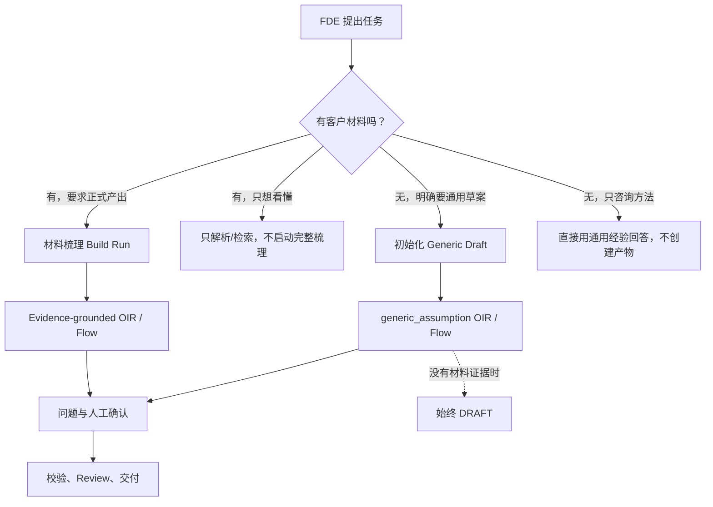
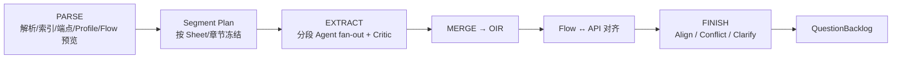
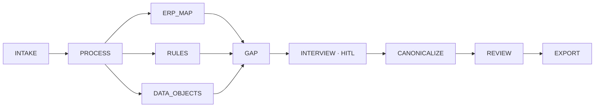
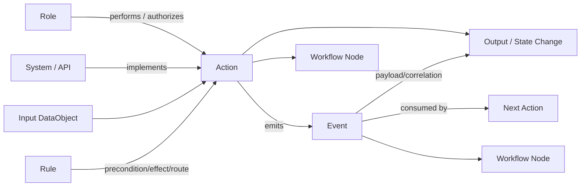

# OntoCopilot 面向 FDE 的 Ontology Schema 与“开始梳理”推理流水线

**日期：** 2026-08-17  
**状态：** 代码审计后的目标设计  
**范围：** “开始梳理”入口、材料理解、Ontology/Flow 建模、证据门槛、问题与人工确认、交付门禁  
**本次变更：** 仅新增设计文档；不修改 Context Sidebar，也不修改 OntologyPackage 编译器

---

## 0. 执行结论

### 0.1 当前不是从零开始

现有代码已经打通一条可运行的主链：

> 上传材料 → 解析与证据索引 → 分段并行抽取 → OIR/Flow → 对齐、冲突与缺口 → QuestionBacklog → FDE 人工决定 → OntologyPackage 校验 → Review/Export 门禁 → 交付件

其中，材料解析、Evidence/Locator、OIR、FlowGraph、Question/Decision、断点恢复、预算、发布门禁都是真实实现，不只是 UI 演示。相关实现主要位于：

- [`server/pipeline/run.ts`](../ts/src/server/pipeline/run.ts)
- [`onto/oir.ts`](../ts/src/onto/oir.ts)
- [`onto/flow.ts`](../ts/src/onto/flow.ts)
- [`onto/engagement.ts`](../ts/src/onto/engagement.ts)
- [`onto/engagement_runtime.ts`](../ts/src/onto/engagement_runtime.ts)
- [`onto/canonical.ts`](../ts/src/onto/canonical.ts)
- [`server/dialogue/tools.ts`](../ts/src/server/dialogue/tools.ts)

### 0.2 真正缺少的是“阶段语义显式化”

当前运行时对外主要暴露 `PARSE / EXTRACT / FINISH`，专业 Engagement 又使用：

`INTAKE → PROCESS → ERP_MAP / RULES / DATA_OBJECTS → GAP → INTERVIEW → CANONICALIZE → REVIEW → EXPORT`

但 FDE 真正在意的中间问题——对象是否找齐、字段是否挂对、API/数据库是否映射、Action/Event 是否闭环、Link 是否有 join key、Workflow 是否存在断点——大多被包在 `EXTRACT`、Merge 或确定性投影内部。系统能产出结果，却还不能以一致的阶段契约告诉 FDE：

1. 这一阶段读了什么；
2. 形成了什么；
3. 哪些来自材料，哪些是推断；
4. 哪些失败或降级；
5. 哪些问题阻塞下一阶段；
6. 哪个角色需要确认；
7. 哪些 Artifact 和 revision 因此变化。

### 0.3 建议的核心决策

不另造第二套业务真相，也不让材料内容动态改写执行拓扑。保留现有冻结 DAG 与成熟抽取主链，在其上增加一层稳定的 **FDE Stage Manifest（阶段契约投影）**：

```text
来源盘点 → 对象 → 字段 → 系统/API/DB → Action → Event → Link → Workflow
        → 校验 → 问题 → 人工确认 → 交付
```

每一阶段都投影到同一份 OIR / FlowGraph / QuestionBacklog / DecisionLedger / Artifact revision；阶段状态只是可审计视图，不是新的数据源。

### 0.4 两条合法起步路径



材料路径与无材料通用路径必须共享 Schema、画布和审阅体验，但不得共享证据含义：**通用经验永远不能伪装成材料事实。**

---

## 1. “开始梳理”的产品语义

### 1.1 四类意图必须分开

| 用户意图 | 示例 | 当前正确入口 | 是否创建/修改 Ontology | 是否可能花费较高 |
|---|---|---|---:|---:|
| 看懂材料 | “分析一下这份 Excel”“这张图讲什么” | `material.parse` + Evidence 查询 | 否 | 仅扫描件/OCR 可能花费 |
| 正式梳理材料 | “开始梳理”“从这些材料生成本体和流程图” | `build.start` | 是 | 是 |
| 无材料通用草案 | “按一般采购流程先给一版 Ontology” | `draft.initialize` 后增量编辑 | 是，固定 DRAFT | 模型推理成本 |
| 方法咨询 | “Action 和 Event 应怎么划分” | 直接回答 | 否 | 低 |

现有对话 System Prompt 已明确区分这四种情况；`build.start` 只接受已有材料，`draft.initialize` 只允许工作模式、无材料且无既有产物的会话。见 [`onto/converse.ts`](../ts/src/onto/converse.ts) 与 [`server/dialogue/tools.ts`](../ts/src/server/dialogue/tools.ts)。

### 1.2 当前 `build.start` 的真实行为

- 只在工作模式可用；
- 用户明确要求正式梳理时直接启动，不再增加一次冗余确认；
- 以 build lease 保证同一会话不会重复启动付费 Run；
- 无材料返回 `no_files`，不会自行编造产物；
- 会话处于 `awaiting_answer` 时拒绝重复开跑；
- 状态使用 `queued / parsing / extracting / awaiting_answer / done / failed / stopped`；
- 正在运行时拒绝 OIR/Flow 修改，避免 Run 完成后覆盖人工编辑；
- 支持 journal resume、预算上限、低余额提醒、停止和 owner-fenced 持久化。

### 1.3 建议补强的 Build Request

当前 `build.start` 参数为空对象。短期可以保持向后兼容，但长期应形成一个可见、可复现的 `BuildRequest`：

```json
{
  "mode": "material_build",
  "materialIds": ["file-..."],
  "perspective": "AS_IS",
  "scope": ["process", "data", "behavior", "systems"],
  "targetArtifacts": ["ontology_package", "workflow_canvas", "question_backlog"],
  "acceptanceProfile": "fde_discovery_v1",
  "locale": "zh-CN",
  "requestedBy": "fde",
  "baseRevision": 12
}
```

它不是让 FDE 每次填表，而是让 UI、聊天和自动重跑共用同一个已解析的任务意图。用户只说“开始梳理”时采用安全默认值；用户指定“只做 As-Is 流程”“先不要做 ERP 映射”时，才覆盖相应字段。

---

## 2. 当前实现的两层执行结构

### 2.1 成熟材料流水线

[`server/pipeline/run.ts`](../ts/src/server/pipeline/run.ts) 当前执行：



这一层的优势是能处理真实大材料：不是把整份文档一次塞给模型，而是按结构分段并行抽取，再经过 Merge、critic 和确定性收尾。

### 2.2 冻结的 FDE Engagement 控制面

[`onto/engagement.ts`](../ts/src/onto/engagement.ts) 定义的 `fde_engagement_v1`：



当前专业节点主要把成熟抽取结果确定性投影到稳定输出契约；它们已经是真实 Scheduler 节点、checkpoint、HITL 和 release gate，但不是六次独立的专业 LLM 重分析。这一选择避免对相同材料重复付费，也意味着“对象/字段/Action/Event 等阶段进度”不能简单等同于 Agent 名称。

### 2.3 应如何统一

建议使用三层概念，避免再产生第三套流程：

| 层 | 作用 | 是否可因材料变化而改拓扑 |
|---|---|---:|
| Run DAG | 调度、预算、恢复、最小权限、HITL、Gate | 否，发布版本内冻结 |
| Stage Manifest | 对 FDE 展示领域阶段、输入输出、覆盖与阻塞 | 否，阶段集合稳定；状态可变化 |
| Artifact/IR | 真正的 Object、Action、Event、Workflow 等事实 | 是，随 evidence/decision/revision 增量变化 |

Stage Manifest 可以把一个 Run 节点投影成多个领域阶段，也可以把一个领域阶段的结果汇总自多个 Run 节点。它只引用 Artifact ID，不复制实体内容。

---

## 3. FDE 需要的统一 Schema 分层

### 3.1 五层 IR

| 层 | 一等类型 | 解决的问题 |
|---|---|---|
| 项目与范围 | Engagement、Objective、Scope、AcceptanceCriterion、Stakeholder | 为什么做、做多大、谁拍板、何时算完成 |
| 来源与证据 | SourceDocument、SourceVersion、Evidence、Locator、ExtractionFinding | 结论从哪里来、是否过时、能否点回原文 |
| 业务语义 | DataObject、Property、Link、Rule、Role | 业务里有什么、口径是什么、如何关联、谁负责 |
| 行为与实现 | Action、Event、Workflow、ProcessNode、System、API Endpoint、Database Asset、External Platform | 谁在什么系统做什么、产生什么结果、如何落地 |
| 协作与交付 | Question、Decision、Revision、ValidationFinding、Artifact、Release | 还缺什么、谁确认、改了什么、是否可交付 |

### 3.2 当前 OIR/Flow 已覆盖的核心

现有 [`onto/oir.ts`](../ts/src/onto/oir.ts) 已有：

- `ObjectType`
- `PropertyType`
- `LinkType`
- `ActionType`
- `BusinessRule`
- `OpenQuestion`
- 每个关键值上的 `Assertion(origin, evidence, confidence)`

现有 [`onto/flow.ts`](../ts/src/onto/flow.ts) 已有：

- `Action / Event / Gateway / Terminal / External` 节点；
- `Flow / Conditional / Compensate / External / Inferred` 边；
- `Stage` 与 `Workflow`；
- actor、对象引用、endpoint、稳定 code、证据和状态；
- dangling、dead end、无标签网关分支、Action 无 Event 等体检。

现有 OntologyPackage 已把 Process、DataObject、Action、Event、Rule、Role、System、Question、Decision、Evidence 放入同一 revision，并校验 ID 与引用完整性。Event 的 producer/consumer 只从**显式流程邻接**推导，不凭常识猜测，这一安全原则应保留。

### 3.3 当前 Schema 的关键薄弱处

| 类型 | 已有基础 | 对 FDE 仍缺少的语义 |
|---|---|---|
| Engagement | Intake 投影含 objective/scope/stakeholders/systems/criteria | 目标 KPI、约束、里程碑、业务 Owner、Target/As-Is 选择尚未成为完整项目对象 |
| DataObject | 名称、描述、主键、属性、状态 | SoR、生命周期、敏感性、质量规则、Owner 在生产路径中经常为空或默认 |
| Property | 类型、定义、单位、值域、必填 | 时间语义、精度、字段级 SoR、PII、转换 lineage、质量阈值 |
| Link | 两端、基数、join key | 有效期、约束、关系属性、来源系统、同步方向 |
| Action | appliesTo、参数、effects、source endpoint | actor/权限、输入输出、前置条件、事务、幂等、补偿、失败语义、事件契约 |
| Event | 流程节点、producer/consumer、payload 基础 | 发生时机、topic、correlation key、schema version、投递/重放/顺序、SLA |
| Rule | 原文、类型、作用对象、actor | 标准化表达式、触发 Event、优先级、例外、测试用例、生效期、可执行状态 |
| Workflow | Stage/Node/Edge/Entry/Exit | As-Is/To-Be 配对、子流程、Timer/Message、SLA、升级、业务指标、版本 diff |
| Role | 从 actor 自动登记 | RACI、decision right、权限、组织范围、职责分离、代理规则 |
| System | 从 endpoint 自动登记 | product/version/module/environment、Owner、信任边界、认证、数据流、可用性 |
| API/DB/平台 | Parser 能抽结构 | 还不是一等可运营资产；没有 live discovery、连接健康、凭据引用、部署状态 |

这些是后续 IR/Schema 的建设方向；本设计不要求本轮修改 OntologyPackage 编译器。

---

## 4. FDE 完整阶段模型

建议固定以下 13 个领域阶段：

1. 项目目标与来源盘点；
2. 来源解析与证据标准化；
3. DataObject 发现与身份对齐；
4. Property/字段与业务口径；
5. System / API / Database / External Platform；
6. Action；
7. Event；
8. Link；
9. Workflow；
10. 跨模型校验与冲突；
11. 问题生成与路由；
12. 人工确认与 Revision；
13. Canonicalize / Review / Delivery。

### 4.1 每阶段输入、输出、推理与证据门槛

| 阶段 | 主要输入 | 必须输出 | 推理/确定性方法 | 最低证据门槛 |
|---|---|---|---|---|
| 1. 目标与来源盘点 | 用户目标、已上传文件、项目记忆、既有 revision | BuildRequest、SourceManifest、范围、验收条件、干系人/系统初表 | 意图分类、文件去重/哈希、版本与适用范围识别 | 项目目标可来自用户；材料存在性必须来自文件登记，不能由模型猜 |
| 2. 解析与证据 | SourceManifest、parser 配置、OCR 能力 | ParsedDoc、Chunk/Evidence Index、locator、finding、结构化 endpoints/tables/profiles | 格式路由；XLSX/SQL/OpenAPI/BPMN 确定性优先；PDF 文本层优先、空页视觉识别 | 所有 `extracted` 断言必须有 file + locator；解析失败不可伪装为空材料 |
| 3. 对象 | chunks、schema/table、BPMN/文档术语、既有 OIR | Object candidates、定义、别名、粒度、主键候选、状态 | 名称归一、语义聚类、跨来源实体对齐、对象/表分离 | 对象候选可由单条证据提出；确认合并、主键或正式对象边界需多源支持或人工决定 |
| 4. 字段 | 对象、表列、表头、JSON Schema、文档字段定义、profile | Property、parent、type、definition、unit、value domain、required、key 候选 | 结构映射、类型归一、列 profile、单位/枚举识别、父对象解析 | 字段必须能挂到已知对象；类型/必填/枚举要引用结构证据；口径缺失保持 unknown |
| 5. 系统/API/DB/平台 | OpenAPI、DDL、BPMN endpoint、SOP、配置说明 | SystemLandscape、Endpoint、DatabaseAsset、ExternalPlatform、实现映射、缺口 | endpoint 聚类、读写分类、表/对象映射、业务步骤/接口对齐 | product/version/module/环境/SoR 不明确时不得补常识；写 API 只生成待确认 Action 草稿 |
| 6. Action | 对象/字段、流程 Action 节点、写 endpoint、规则、角色 | Action、actor、system、inputs/outputs、parameters、preconditions、effects、idempotency/compensation 候选 | 动词-对象识别；写端点反推；步骤与对象、角色、系统对齐 | 来自 API 的 Action 标 `draft_from_api`；effects、权限、事务语义若无证据必须提问 |
| 7. Event | Action 结果、流程 Event 节点、状态变更、消息/API/日志说明 | Event、producer、consumer、payload、resulting state、correlation/delivery 候选 | “完成后的可观测事实”识别；只按显式邻接建立生产/消费关系 | 不得把 Action 名换词后冒充 Event；producer/consumer 需流程/接口/用户明确支持 |
| 8. Link | 对象、属性、FK、BPMN/文档关系、Action scopes | Link、方向、基数、join key、有效期/约束候选 | FK/键推导、关系短语抽取、对象粒度检查、join 可行性验证 | 两端必须存在；join key 必须解析到属性；无证据关系只能 inferred/DRAFT |
| 9. Workflow | Action/Event/Gateway、角色、系统、阶段、BPMN、SOP | Stage、Workflow、Node、Edge、entry/exit、异常/补偿/条件、As-Is/To-Be 标记 | BPMN 确定性导入；文本流程抽取；缺边推断但显式标虚线 | 显式顺序才是 grounded edge；推断边不能静默升级；网关分支需要条件或问题 |
| 10. 校验与冲突 | OIR、Flow、系统映射、Evidence、Decision | ValidationFinding、Conflict、coverage、impact、自动修复记录 | schema/ref 校验、孤儿/断链、同义对齐、跨来源冲突、Action/Event/Rule 闭环检查 | 自动修复只能改机械问题并标 `auto_repaired`；业务语义冲突必须保留双方证据 |
| 11. 问题 | 所有 unknown/conflict/finding、项目目标、artifact gate | 去重 QuestionBacklog、priority、audience、owner、answer schema、blocked artifacts | 按阻塞度、影响半径、不可逆性、证据缺口和信息增益排序 | 每个问题必须说明为何问、阻塞什么、谁能答；不能生成无法改变任何决策的问题 |
| 12. 人工确认 | Question、候选答案、Evidence、影响分析 | DecisionLedger、supersedes、affected IDs、revision、已解决/重开问题 | 权威校验、答案 schema、幂等写入、影响重算、DAG resume | “用户明确说过”与“模型建议”分离；通用假设不能由 AI 自己设为 confirmed |
| 13. 交付 | 已确认 IR、剩余问题、validation、artifact target | OntologyPackage、分视图、模板/图/报告、manifest、release state | canonicalize、引用校验、跨产物追溯、renderer/exporter、hash | Review/Export 硬门通过才能发布；非阻塞未知可 DRAFT 交付但必须披露 |

### 4.2 每阶段失败、降级与责任角色

| 阶段 | 阻断条件 | 可降级但必须披露 | 主要生产者 | 主要消费者 |
|---|---|---|---|---|
| 1 | 正式材料 Build 但无文件；目标与任务完全不匹配 | 部分材料缺失，先做盘点 | FDE / Interviewer | 全部后续阶段 |
| 2 | 文件不可读、危险 XML、OCR 必需但无视觉模型、零有效 chunk | 个别文件失败，其余继续；保留 finding | Parser / Evidence service | 所有抽取角色 |
| 3 | 对象引用不稳定、候选无法区分粒度 | 保留多个候选并提同义/粒度问题 | Data Steward / Extractor | 字段、Link、Action、Workflow |
| 4 | parent 不存在导致字段无法挂载；主键引用不存在 | 类型/口径 unknown；不得丢失原证据 | Data Steward | Link、Action、API/DB、规则 |
| 5 | 目标系统/端点引用悬空；错误把只读端点当写操作 | 版本、模块、环境 unknown，转问题 | ERP Mapper / Integration role | Action、Event、Workflow、交付适配器 |
| 6 | appliesTo 引用不存在；高风险 Action 无权限/效果定义 | 保持 candidate/proposed，不发布 | Process Modeler / ERP Mapper | Event、Rule、Workflow、应用实现 |
| 7 | Event 无可识别生产者且不是外部事件；payload 引用悬空 | delivery/topic unknown，可先保留业务 Event | Process Modeler / Integration role | 下游 Action、监听器、指标 |
| 8 | 两端不存在；join key 不可解析；基数自相矛盾 | 无 join key 的业务关联保留 proposed | Data Steward / DB specialist | 对象查询、Action、流程、目标平台映射 |
| 9 | 悬空边、无入口、关键节点死路、网关条件缺失 | 推断边、未建模异常路径显式标注 | Process Modeler | FDE Workshop、Action/Event、审阅 |
| 10 | schema/ref 错误；blocking finding；错误的自动修复 | warning 与 coverage 下降 | Deterministic validators / Critics | GAP、Review、FDE |
| 11 | blocking 问题没有 audience/owner/answer schema | 非阻塞问题可暂不分派 | Gap engine / Interviewer | FDE、业务 Owner、顾问 |
| 12 | 关键答案无权限/权威，或与现有 Decision 冲突未处理 | 记录临时答案但不升级发布状态 | FDE / 业务 Owner / 顾问 | Canonicalize、Review |
| 13 | Package 校验失败、Review BLOCKED、目标不可写 | unresolved 非阻塞问题导致 DRAFT + warning | Reviewer / Exporter | 客户、开发、目标平台 |

### 4.3 建议的阶段事件契约

不要让 UI 分别猜 `node.entered`、`flow.step`、`gaps.mined`、`clarify.request` 的含义。建议由服务端把现有事件投影为稳定阶段回执：

```ts
type FdeStageReceipt = {
  runId: string;
  stageId: string;
  status: "pending" | "running" | "degraded" | "blocked" | "completed" | "skipped";
  title: string;
  inputRefs: string[];
  outputRefs: string[];
  evidence: {
    grounded: number;
    inferred: number;
    genericAssumption: number;
    coverage?: number;
  };
  metrics: Record<string, number | string | boolean>;
  blockerQuestionIds: string[];
  findings: Array<{ code: string; severity: string; ref?: string }>;
  revision: number | null;
  startedAt?: string;
  completedAt?: string;
};
```

建议的事件只有五类：

- `fde.stage.started`
- `fde.stage.progress`
- `fde.stage.completed`
- `fde.stage.degraded`
- `fde.stage.blocked`

这些事件由当前 Run 事件投影生成，不代替 journal/checkpoint，也不改变 Scheduler。

---

## 5. 来源、证据与发布门槛

### 5.1 当前已有的来源模型

当前 `Assertion` 使用：

- `extracted`：来自材料，必须带 Evidence；
- `inferred`：系统推断，可以没有 Evidence；
- `user`：人工输入/拍板；
- `auto_repaired`：确定性自动修复；
- 无材料草案通过 session-level `generic / generic_assumption` 标记，并以 inferred、零 Evidence 写入。

`Status` 使用 `candidate / proposed / confirmed / rejected / draft_from_api`。这套基础应继续保留。

### 5.2 证据、置信度与权威不是一回事

建议 UI 与 Review 同时展示三个正交维度：

| 维度 | 回答的问题 | 示例 |
|---|---|---|
| Provenance | 这句话来自哪里？ | Excel 第 32 行、BPMN element、用户回答、通用假设 |
| Confidence | 系统对抽取/对齐有多大把握？ | 0.42 / 0.91 |
| Authority | 谁有权确认它？ | 流程 Owner、数据 Owner、ERP 顾问、技术 Owner |

两份材料都明确写着不代表没有冲突；模型置信度高也不代表有业务授权；用户说过也不一定代表他对该领域有确认权。

### 5.3 建议的门槛矩阵

以下是产品策略，不是新增代码枚举：

| 内容 | 草案允许 | REVIEW 前最低要求 | RELEASED 前最低要求 |
|---|---|---|---|
| 对象名称/定义 | 单条材料或 generic assumption | 至少一个可定位来源，或用户明确提出 | 关键对象边界由 Owner 确认 |
| 主键/业务键 | inferred 候选 | 结构证据或 profile 支持 | 数据 Owner 确认；引用完整 |
| 字段类型/枚举/单位 | 结构推断 | 表/API/DDL 证据 | 冲突清零；关键口径 Owner 确认 |
| System of Record | unknown | 系统或数据材料支持 | 数据/技术 Owner 确认 |
| Link 基数/join key | inferred/proposed | FK/键/材料证据 | 两端与属性引用有效；Owner 确认高影响关系 |
| Action effects/权限 | candidate 或 API 草稿 | 流程/API/规则证据 | 高风险动作的 actor、precondition、effect、失败/补偿明确 |
| Event 生产/消费 | 邻接推导候选 | 显式流程或接口事实 | producer/consumer/payload 对关键集成闭环 |
| Rule | 原文候选 | 精确证据、适用对象、actor | 可判定、冲突清零、关键规则有测试与 Owner 确认 |
| Workflow 主路径 | 推断边可存在 | 入口/出口/分支可走通，推断边披露 | 关键路径与异常/补偿经流程 Owner 确认 |
| 通用草案 | 全部可创建 | 只能 DRAFT | 不能直接 RELEASED；逐条由材料或人工验证后升级 |

### 5.4 不可违反的信任规则

1. 没有 locator 的内容不能标 `extracted`；
2. 通用假设不能编造文件名、客户系统名、Owner 或 cite；
3. 跨来源矛盾不能用“较高置信度”自动覆盖；
4. 用户确认一条事实，只升级该事实及明确受影响的断言，不整包变 confirmed；
5. 自动修复只能处理稳定 ID、格式、可证明引用等机械问题；
6. 发布状态由 Gate 决定，不由模型在自然语言里宣称。

---

## 6. API、配置、数据库与外部平台

### 6.1 当前真实覆盖

| 来源 | 当前能力 | 能形成什么 | 当前不能做什么 |
|---|---|---|---|
| OpenAPI / JSON / YAML | 解析 schema、endpoint、description、JSON Pointer；普通 JSON 按顶层切片 | endpoint 清单、对象/字段候选、写端点 Action 草稿、证据 | 不调用真实 API，不验证认证/环境/返回，不做 live discovery |
| DDL / SQL | 解析表、列、类型、注释、约束并保留 DDL locator | 对象/字段/Link/键候选、数据库结构证据 | 不连接数据库，不查询 catalog/sample，不验证实际数据与性能 |
| BPMN | 解析 process、lane、task、event、gateway、sequenceFlow、条件与 XML locator | 高可信 Workflow/Action/Event/Edge | 没有目标平台执行验证；复杂 BPMN 语义与 round-trip 有边界 |
| XLSX / CSV | Sheet、行列、表头、profile、规则/字段线索 | 对象、字段、枚举、规则、问题 | 公式业务语义、复杂宏和外部链接不等于已执行验证 |
| DOCX / PPTX / MD / TXT | 段落、表格、标题、结构化 chunk | 流程、术语、规则、问题证据 | 散文流程的完整召回仍依赖材料表达质量 |
| PDF / 图片 | 文本层优先、无文本页 OCR/视觉 | 页面/片段证据、流程和规则候选 | 复杂图表、手写、低清扫描可能降级；成本和模型能力相关 |

### 6.2 应新增的运行时资产模型

业务 `DataObject` 不应等同数据库表，`Action` 也不应等同 API endpoint。建议在 IR 的实现层显式建模：

```text
System
 ├─ product / version / module / owner / environment
 ├─ API Endpoint
 │   ├─ method / path / operation / request / response
 │   ├─ authRef / rateLimit / timeout / idempotency
 │   └─ implements Action / emits or observes Event
 ├─ Database Asset
 │   ├─ platform / database / schema / table / column
 │   ├─ key / FK / classification / freshness
 │   └─ realizes DataObject / Property / Link
 └─ External Platform
     ├─ provider / tenant / capability / trust boundary
     └─ connectorRef / read-write scope / health / lastObservedAt
```

其中凭据只保存 Secret Reference，不得写入 Evidence、OIR、日志、Prompt 或下载包。

### 6.3 项目级配置建议

| 配置 | 用途 | 安全默认 |
|---|---|---|
| SQL dialect | 正确解析 DDL | 未知时多方言只读尝试并披露，不静默当某一数据库 |
| Environment map | 区分 dev/test/prod endpoint 与表 | 默认 unknown，不从 hostname 猜生产环境 |
| System aliases | 把 ERP 域名、产品名、简称对齐 | 只做候选，人工确认后成为项目权威映射 |
| Source authority | 制度/SOP/配置/口述的优先级与适用期 | 冲突默认保留，不自动覆盖 |
| Connector policy | 可访问的外部平台、scope、超时 | 首次仅 metadata/read-only；写操作另行确认 |
| Data classification | 敏感材料、字段和导出限制 | unknown 按更严格策略处理 |
| Target adapter | Foundry/ERP/数据库/代码仓库目标版本 | 无适配器时只导出 OntoCopilot 自有包，不宣称可部署 |

### 6.4 外部平台接入的阶段顺序

1. **离线材料解析**：当前已覆盖；
2. **只读元数据发现**：catalog/schema/API spec/平台对象清单；
3. **只读样例与健康检查**：带采样、脱敏、审计和预算；
4. **目标映射 dry-run**：生成变更计划、diff 和校验结果；
5. **人工批准后写入**：最小 scope、幂等、可回滚；
6. **部署后验证**：真实事件、对象与流程的偏差监控。

任何阶段都不应因“已经连接平台”而降低业务证据和人工确认门槛。

---

## 7. Action、Event、Role、System 与 Workflow 对齐

### 7.1 为什么必须分开 Action 与 Event

- **Action**：某个角色或系统要执行的一件事，例如“审批采购申请”；
- **Event**：执行后可被其他参与者或系统观察的事实，例如“采购申请已批准”。

把两者合成一个“步骤”，就无法回答谁生产了事件、谁消费、何时触发规则、失败如何补偿，也无法从业务流程走到集成实现。

### 7.2 最小闭环



### 7.3 对齐校验规则

| 规则 | 不满足时的处理 |
|---|---|
| 每个 Action 至少关联对象或明确标记“无业务对象的系统动作” | warning/question；关键 Action 阻断发布 |
| 每个 Action 有 actorRole 或明确 system actor | 形成权限/责任问题 |
| 写操作 endpoint 只能形成 `draft_from_api` Action | 等业务方确认目的、权限和 effects |
| 每个关键 Action 有显式 Event，或记录“无事件/同步完成”的例外理由 | Action-without-Event finding |
| 每个 Event 有 producerAction/producerSystem/外部来源之一 | producer gap |
| 关键 Event 至少有 consumer，或明确为 terminal/audit-only | consumer gap |
| Event payload 引用存在的 DataObject/Property schema | dangling ref 阻断 |
| Event resultingState 属于关联对象生命周期 | 状态冲突问题 |
| producer/consumer 只按显式流程、接口或人工决定建立 | 禁止根据常识自动连线 |
| Action precondition、Rule trigger、Workflow gateway 使用同一稳定 ID | 跨产物引用校验 |
| API method/path、DB asset、System、environment 与 Action 映射可追踪 | 不明确时保持 unknown，不能写成已实现 |
| Role 的 performer、approver、owner、consumer 不混为同一权限 | 对高风险动作执行职责分离检查 |

### 7.4 生产者/消费者矩阵

每条关键 Event 应能生成如下表，而不是只存在一张图：

| Event | Producer Action | Producer System | Payload / Object | Consumers | Triggered Rules | Delivery | Evidence | Status |
|---|---|---|---|---|---|---|---|---|
| `evt.purchase_request_approved` | `act.approve_purchase_request` | `sys.erp` | `PurchaseRequest{id,status}` | `act.create_purchase_order` | `rule.approval_threshold` | 待确认 | BPMN/XML + API | proposed |

此表是流程、Ontology、集成设计和测试之间最有价值的交叉产物之一。

---

## 8. 校验、问题与人工确认

### 8.1 当前已有校验

现有代码已经覆盖一部分确定性体检：

- OIR assertion provenance；
- Object 主键、Property parent、Link 两端与 join key 引用；
- orphan objects、objects without actions；
- Flow dangling nodes、dead ends、unlabeled branches、actions without events；
- Canonical 全局 ID 唯一与集合引用完整性；
- Review blocking finding、未解决阻塞问题、下载目标可写；
- Export 的 `review_passed / schema_valid / downloadable` 硬门。

### 8.2 建议补齐的跨模型校验包

| 校验包 | 示例 |
|---|---|
| Identity | 对象粒度、主键稳定性、同名异义、别名冲突 |
| Data contract | 类型、枚举、单位、空值、精度、时间语义、SoR、敏感性 |
| Relationship | 两端、方向、基数、join 可行性、循环依赖、有效期 |
| Behavior | Action actor/precondition/effect/idempotency/compensation、Event producer/consumer/payload |
| Workflow soundness | entry/exit、可达性、死路、网关条件、异常/取消/超时/补偿路径 |
| Rule consistency | 原子性、触发、作用域、优先级、例外、互斥/覆盖冲突、测试 |
| Implementation | Process Step ↔ System ↔ Endpoint/DB ↔ Action/Event/DataObject 空白映射 |
| Governance | Owner、Authority、敏感性、职责分离、发布审批 |
| Traceability | 每个关键字段/边/规则/决定能否追到 Evidence 或 User Decision |
| Artifact consistency | 同 revision 的 JSON、图、表、报告是否引用同一稳定 ID |

### 8.3 好问题的最小契约

每个 Question 应包含：

```text
question_id
text
why
source_kind / source_ref
audience_role
owner_user_id
authority_required
answer_schema
options（如适用）
blocked_artifacts
affected_ids
dependencies
priority
evidence_ids
status
```

问题优先级不是“模型觉得重要”，而应由以下可解释因素计算：

1. 是否阻塞下一产物；
2. 影响多少对象、Action、Rule、Workflow 和 Artifact；
3. 决策是否难以回滚；
4. 证据缺口有多大；
5. 回答的信息增益；
6. 回答角色当前是否可用。

### 8.4 人工确认不是一句“好的”

Decision 至少需要：

- 问题与选项/自由答案；
- actor、actorRole、authority；
- sourceTurn 或外部任务引用；
- effectiveAt；
- supersedes；
- affected IDs；
- revision；
- 幂等键；
- 必要时的用户原话或材料 Evidence。

确认后应只重算受影响的校验、问题和 Artifact；不相关断言保留原 provenance 与 revision lineage。

---

## 9. 无材料通用 Ontology / 流程草案

### 9.1 何时进入

只有同时满足以下条件才进入：

1. 工作模式；
2. 没有客户材料；
3. 没有现有 OIR/Flow；
4. 用户明确要求基于一般经验生成某个具体场景的草案；
5. 用户确认会创建可编辑产物。

普通方法咨询不应初始化草案；已有材料时不应以通用草案绕过材料梳理。

### 9.2 当前已实现的安全基线

`draft.initialize` 当前会：

- 创建空 `OIR` 与可编辑 `FlowGraph` 骨架；
- 建立“通用流程草案（待验证）”Stage；
- 写入 `draft_provenance.kind = generic`；
- 写入 `assertion_origin = generic_assumption`、`grounded = false`；
- 固定 `release_state = DRAFT`；
- 后续 `oir.add / oir.edit / flow.edit` 必须使用 `basis=generic_assumption`；
- 生成内容以 inferred、零材料 Evidence 保存；
- 禁止 AI 把通用假设自己设为 confirmed；
- 已有材料或产物时拒绝覆盖；
- 写操作维持现有 EXTERNAL 确认门槛。

这条路径的正确产品文案是“通用经验草案、未结合客户材料”，不是“已梳理客户业务”。

### 9.3 通用草案也要走完整建模顺序


至少应同步生成这些验证问题：

- 业务边界和成功结果是否正确；
- 参与角色与最终决策人；
- 权威系统与外部系统；
- 关键对象、业务键和状态；
- Action 的权限、前置条件与效果；
- Event 的生产者、消费者和 payload；
- 审批/阈值/时限/异常/补偿规则；
- As-Is 还是建议的 To-Be；
- 哪些部分需要客户材料才能验证。

### 9.4 后续补入材料时的合并规则

这是下一阶段必须强化的边界。不得简单用材料重跑结果覆盖草案，也不得让旧通用补丁盖过新材料事实。应做四类语义 diff：

| 分类 | 含义 | 默认动作 |
|---|---|---|
| Supported | 材料支持原通用假设 | 保留两条 provenance，候选可升级到 proposed |
| Contradicted | 材料与假设冲突 | 保留双方，生成 blocking/高优问题；不自动覆盖 |
| Uncovered | 假设在材料里找不到 | 保持 generic_assumption/DRAFT |
| New from material | 材料出现草案没有的事实 | 以 extracted 新增，显示增量 |

人工已经确认的内容不能被材料静默覆盖；材料只是新的证据或冲突来源。真正升级为 confirmed 仍要经过 Decision/Authority 规则。

---

## 10. “开始梳理”期间聊天应如何工作

### 10.1 启动回执

聊天只有在本轮确实成功调用启动边界后才能说“已开始”。回执至少显示：

- Run ID；
- 材料数与范围；
- 目标视图/产物；
- 当前阶段；
- 是否有 OCR/视觉任务；
- 预算/预计耗时只给区间，不编造精确值；
- 停止入口。

### 10.2 运行中的答案

FDE 问“现在到哪了”时，答案应来自 stage receipt，而不是模型猜测：

> 已完成来源解析：8 份材料中 7 份成功，1 份 PDF 的 3 个页面需要视觉识别。当前在对象与字段抽取阶段，已形成 23 个对象候选、146 个字段候选；其中 9 个字段还未找到父对象，暂未进入正式 OIR。

这比“正在分析材料，请稍候”更有工程价值。

### 10.3 运行中补充信息

当前代码正确地拒绝运行中直接修改 OIR/Flow，因为主 Run 完成会覆盖内存对象。产品上应区分：

- **补充为下一轮上下文**：可以记录用户说明/Decision，后续节点或重跑使用；
- **直接改当前 revision**：Run 完成前禁止，或进入显式 pending patch queue；
- **停止并按新信息重跑**：用于范围、权威口径等根本变化。

不能表现为“聊天已经记住并修改”，实际却在 Run 收尾时丢失。

### 10.4 阶段完成回执

每阶段完成后，聊天可展示一句摘要与三个动作：

> Action/Event 阶段完成：识别 18 个 Action、21 个 Event；3 个 Action 尚无可观测结果，2 个 Event 缺少消费者。`查看模型` · `查看证据` · `处理 5 个问题`

摘要使用结构化 stats 生成，不让模型重数列表。

### 10.5 HITL 恢复

进入 `awaiting_answer` 后：

1. 聊天说明 Run 已安全挂起，不是失败；
2. `question.next` 提供按价值排序的问题；
3. FDE 可在聊天或审阅区解释、分派、回答；
4. `question.answer` 写入 DecisionLedger，保持幂等；
5. 阻塞项清零后恢复同一 content-addressed engagement run；
6. Canonicalize/Review/Export 使用确认后的 revision，而不是重开无关抽取。

---

## 11. 当前覆盖与缺口总表

| 能力 | 当前状态 | 结论 |
|---|:---:|---|
| 多格式来源解析与 locator | 已覆盖 | 可作为试点主链基础 |
| Material list / parse / build 意图区分 | 已覆盖 | 对话规则清楚，需 UI 继续一致表达 |
| 分段、并行 Agent、Critic、Merge | 已覆盖 | 适合真实大材料 |
| OIR 的 Object/Property/Link/Action/Rule/Question | 已覆盖 | 行为和治理字段仍偏薄 |
| Flow 的 Action/Event/Gateway/Stage/Workflow | 已覆盖 | 复杂事件、SLA、子流程、异常语义仍需增强 |
| OpenAPI 写端点反推 Action 草稿 | 已覆盖 | 正确标为待确认；不可当业务事实 |
| Action/Event 显式邻接映射 | 已覆盖 | 应扩展闭环校验与交叉表 |
| Question/Decision/HITL/revision | 已覆盖 | Authority、局部影响重算和外部任务同步待增强 |
| Canonical ID/ref validation 与 Review/Export Gate | 已覆盖 | 深层业务完整性和目标平台校验待增强 |
| Run lease、resume、budget、cancel | 已覆盖 | 企业容量/多租户仍需专项验证 |
| 无材料 generic draft 安全起步 | 后端起步已覆盖 | 需要模板化生成质量、后续材料四类 diff 与 UI 引导 |
| 领域阶段的输入/输出/证据/失败可视化 | 缺失 | 本文建议的 P0 核心 |
| System/API/DB/External Platform 一等资产 | 部分 | 当前以解析结果和 endpoint 映射为主 |
| Live connector / DB catalog / API health | 缺失 | 必须从只读元数据开始建设 |
| Action 权限/事务/幂等/补偿 | 部分 | 关键发布门槛尚未系统化 |
| Event topic/schema/correlation/delivery/replay | 部分 | 业务 Event 可用，集成 Event 不完整 |
| 语义增量 diff、分支/合并、影响重算 | 部分 | patch/replay 有基础，尚非完整模型 |
| 目标平台可部署包和写回 | 缺失 | 自有 OntologyPackage 不能冒充部署包 |

---

## 12. 分期落地路线

### P0：让现有主链“可见、可解释、不会误报”（1–2 个迭代）

不改 Canonical compiler，优先利用现有数据：

1. 定义固定 `FdeStageManifest` 与 `FdeStageReceipt`；
2. 把现有 Run 事件投影到 13 个领域阶段；
3. 为每阶段输出 input/output refs、grounded/inferred 数量、finding、blocker；
4. “开始梳理”启动回执、运行中进度、HITL 挂起/恢复文案统一；
5. 将 `extract.dropped`、flow gaps、API gaps、stale edits 变成可见阶段 finding；
6. 固化 material build / material read / generic draft / advice 四类意图；
7. 为 Action/Event/Link/Workflow 增加现有数据可计算的确定性覆盖指标。

**验收：** FDE 能在任何时刻回答“读了什么、做到哪、出了什么、缺什么、谁要回答、哪个 revision”。

### P1：补齐 FDE Schema 与跨模型质量门（2–4 个迭代）

1. 将 Role、System、Endpoint、DatabaseAsset、ExternalPlatform 变为可审阅资产；
2. 补 Action 的 actor/input/output/precondition/idempotency/compensation/failed outcome；
3. 补 Event 的 producer/consumer/payload/resultingState/correlation/delivery；
4. 建 producer-consumer matrix 与 Process-Step-to-Implementation matrix；
5. 建跨模型校验包与证据门槛 profile；
6. Generic draft 生成固定验证问题，并支持补入材料后的四类 diff；
7. Decision 支持 authority 和局部影响重算。

**验收：** 关键 Action/Event/Workflow 可用于一次客户 Workshop 和一次实现设计评审，而不只是看图。

### P2：从离线材料走向只读现场发现（3–6 个迭代）

1. Connector/SecretRef/Scope/Audit 基础；
2. API catalog、DB catalog、平台 metadata 只读发现；
3. environment、health、schema version、last observed 状态；
4. 采样与 profiling 的脱敏、预算和审批；
5. 材料模型与 live reality 的差异报告；
6. 外部任务系统的问题分派与状态同步。

**验收：** 能明确区分“文档声称”“系统配置显示”“真实数据观察到”“业务 Owner 确认”。

### P3：可执行设计与目标适配（后续）

1. Rule 标准化、测试与 simulation；
2. Workflow token simulation、异常/超时/补偿路径；
3. Action/Event contract tests；
4. Target adapter dry-run、语义 diff、部署计划；
5. 人工批准后的幂等写入、回滚和部署验证；
6. 上线事件与设计 Workflow 的偏差监控。

**验收：** OntoCopilot 能如实回答“这份包是否可部署、将改什么、如何验证和回滚”，而不是只导出一个 JSON。

---

## 13. 建议的质量指标

### 13.1 可信度与覆盖

- Grounded assertion coverage；
- Generic assumption ratio；
- Inferred edge ratio；
- 可点回 locator 成功率；
- 跨来源冲突发现率；
- 无证据却被标 confirmed 的数量，目标必须为 0。

### 13.2 模型完整性

- Object 有定义/业务键/Owner/SoR 的比例；
- Property parent/type/definition/unit 完整率；
- Link 两端/基数/join key 可验证率；
- Action actor/object/effect/Event 闭环率；
- Event producer/consumer/payload 闭环率；
- Workflow 可达率、dead end、unlabeled branch、异常路径覆盖；
- Rule 可判定/有 trigger/有测试比例。

### 13.3 FDE 效率

- 从上传到第一版可审阅模型时间；
- 每个 blocking Decision 清除的下游阻塞数；
- Workshop 前人工整理时间；
- 新材料加入后的增量重算比例；
- 人工编辑被重跑覆盖的数量，目标为 0；
- 交付前问题重开率和客户驳回率。

### 13.4 运行可靠性

- resume 命中率与避免重复模型花费；
- Run 重复启动率；
- OCR/Parser 降级率；
- Budget cap 与错误分类准确率；
- Gate 绕过次数，目标为 0；
- Artifact revision/hash 一致率。

---

## 14. 审阅工作台：从“问题堆”变成 FDE 决策队列

原始 Question Ledger 仍然是唯一权威来源，但不应把所有机器检查结果都当成需要逐条采访业务方的问题。右侧“审阅”采用一个只读 FDE 投影层，把问题分成四个处理级别：

1. **阻塞**：没有答案就无法确定流程边界、关键对象或实现契约；
2. **重要**：应在当前 Workshop / 设计评审中确认的角色、状态、Action、Event、集成责任、异常补偿和规则；
3. **完整性**：影响 Ontology 闭合度、但可在模型整理阶段集中补齐的缺口；
4. **诊断批次**：缺主键、孤立对象、命名和字段 Schema 等同型 lint，按批次修复、映射或豁免，不逐实体重复访谈。

主题队列固定覆盖：流程边界、Workflow 编排（gateway/并发/汇合/timer/SLA）、角色与权限、状态迁移、DataObject 数据语义、Link 关系契约（方向/基数/join key/有效期）、Action 契约、Event 发布与消费、系统/API/数据责任、异常与补偿、规则与阈值、Ontology 完整性、Schema 质量。每个业务问题同时展示：为什么要问、不回答的影响、期待答案结构和可追溯原问题。

该投影严格遵守以下边界：

- 不修改 `Question.status`、`priority`、owner、Decision 或 Release Gate；
- lint 合批只改变展示和排序，批次内仍可进入每一个原始 Question；
- 聊天引用和回答仍使用稳定原始 Question ID；
- “已处理”只来自权威 Ledger，不由 UI 猜测；
- 诊断批次即使不适合业务访谈，仍保留对发布门禁的真实影响。

真实样本的回归结果：当前 UI 项目的 572 个原始问题被投影为 203 个可见审阅项；372 条结构 lint 收敛成 3 个诊断批次，200 个业务/建模问题仍逐条保留。另一份真实 session 的 548 个原始问题则收敛为 196 个可见项。这样既不会用上百个“缺主键”淹没 FDE，也不会为了界面清爽而隐藏风险。

## 15. 已落地的 Canonical Ontology DRAFT 契约

当前实现已增加 `ontocopilot.ontology-package/1` 的只读 DRAFT 编译与 11 类 JSON 视图：Package、JSON Schema、DataObjects、Links、Actions、Events、Workflows、Rules、Integrations、Gaps、Questions。读取接口为：

- `GET /api/sessions/:sid/ontology/draft`
- `GET /api/sessions/:sid/ontology/draft/artifacts/:name`
- 下载同一资源时追加 `?download=1`

它显式表达 Action 的对象、前置条件、effects、API/DB binding 和 emitted Events；Event 的全部 producers、消费者、payload/投递缺口；Workflow 对应的 ProcessNode/ProcessEdge；以及 Role、System、平台、owner、认证、SLA 等尚未获得的信息。未知值不会被虚构成“已配置”，而是保留为 `unknown` / `partial` 和稳定 Gap/Question。

所有这些 JSON 均为 `releaseState: DRAFT`、`publishable: false` 的虚拟交付件：读取不会写 session、不推进 revision、不改变 Release Gate，也不会混入正式 bundle。Action 与 Event 进行双向一致性校验；Event 可保留多个 producer；相对 API path 不再伪装为已识别 System；Workflow 下载包含自有节点和边，并校验成员、入口、出口和可达性。

真实样本当前编译出 175 个 DataObject、127 个 Action、17 个 Event、48 个 ProcessNode、41 个 ProcessEdge、28 个 Rule 和 127 个 Integration；仍为 0 Link、0 Workflow，并公开 1,586 个未关闭 Gap。校验状态为 `valid_with_gaps`、0 个结构错误。这一结果不是“已经完成”，而是准确说明：具体 Schema 已形成，但客户材料尚不足以闭合可发布 Ontology。

仍需补齐的关键工程闭环：编译器生成的 Gap Question 目前只存在于虚拟 Package，尚未持久化投影到 `QuestionBacklog`。下一阶段应把稳定 question ID 同步进现有 Question repo，继续复用受鉴权的 `/questions/:qid/answer` 和 Decision Ledger；不能另建无鉴权写入旁路。只有这样，FDE 在审阅中给出的 `confirmed_none`、`not_applicable` 或 `{status: "resolved", value}` 才能被下一次编译消费并关闭对应 Gap。

## 16. 最终产品定义

优化后的“开始梳理”不应只是一个触发长任务的按钮。它应代表一份 FDE 可依赖的工程契约：

> OntoCopilot 在冻结、可恢复、受预算和权限约束的 Run 中，把材料或明确标注的通用假设，逐步转成可追溯的业务对象、字段、系统映射、Action、Event、Link、Rule 与 Workflow；每一步都披露输入、证据、推断、失败和阻塞，并通过 Question/Decision 把未知项交给正确的人确认，最终只在验证与发布门禁通过后形成同 revision 的可审阅、可下载、可继续落地的交付件。

对 FDE 来说，这才是真正的 AI 助手：它不是替工程师“猜一份看起来合理的流程”，而是持续维护一份**事实、假设、证据、决定、实现映射和交付状态彼此一致的项目模型**。
