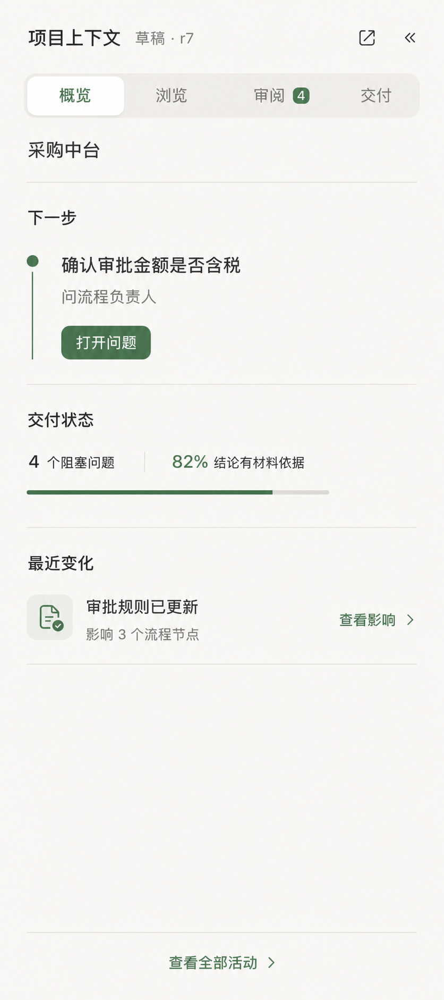
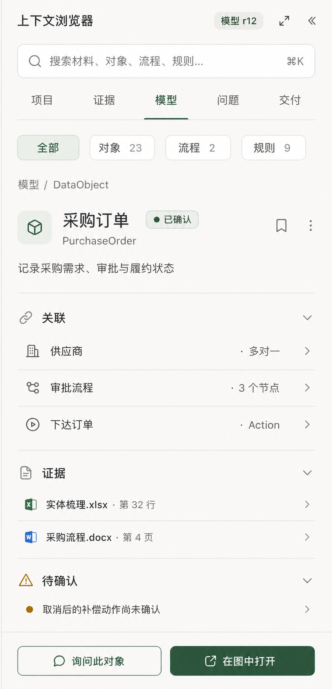
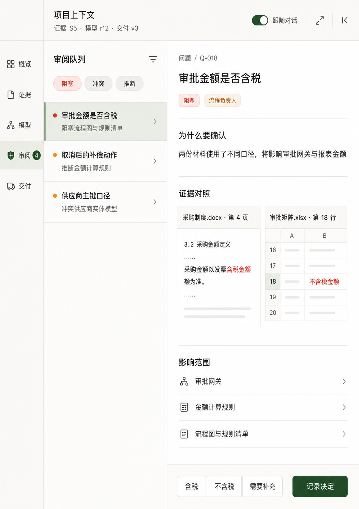

# OntoCopilot FDE 右侧上下文面板设计方案

**设计日期：** 2026-08-17

**设计范围：** 桌面端右侧 Sidebar 的信息架构、导航、预览、审阅、版本与下载体验

**本轮边界：** 只做产品与交互设计，不修改业务代码

---

## 1. 设计结论

右栏不应继续被定义为“预览”，而应升级为：

> **项目上下文（Project Context）——FDE 在当前对话旁边持续浏览证据、业务模型、待决事项和交付版本的工作面板。**

它需要同时回答五个问题：

1. 项目现在进行到哪里，下一步是什么？
2. 这条结论来自哪里？
3. 当前流程与 Ontology 到底是什么？
4. 还有什么需要向客户确认？
5. 现在能交付什么，是哪个版本？

推荐的一级信息架构为：

```text
项目 / 证据 / 模型 / 审阅 / 交付
```

当前七个平级 Tab：

```text
材料 / 实体 / 冲突 / 问题 / 产物 / 流程图 / 推理
```

混合了输入、语义对象、工作状态、输出和系统运行信息。新的五个入口按 FDE 的工作目的划分，而不是按已有代码模块划分。

---

## 2. 三张视觉方向

### 方向一：项目概览



适合作为 400–480px 默认 Sidebar：

- 当前项目、revision 和发布状态；
- 唯一的“下一步”主操作；
- 阻塞问题与证据覆盖；
- 最近变化与影响；
- 不把首页做成指标卡片墙。

优点：进入项目后立即知道该做什么。

边界：不适合作为深度浏览 Ontology 的唯一界面。

### 方向二：上下文浏览器



适合作为 480–720px 标准工作状态：

- 全局搜索与类型筛选；
- DataObject、Process、Link、Action、Event、Rule 的统一浏览；
- 选中对象后展示定义、关系、证据和待确认项；
- 提供“询问此对象”和“在图中打开”。

优点：最接近 OntoCopilot 的长期核心，能成为统一 Inspector。

边界：必须有统一只读模型与跨引用索引，不能继续直接消费散落的 OIR/Flow/文件数组。

### 方向三：展开式审阅工作台



适合作为 720–900px 展开状态：

- 左侧为一级工作域；
- 中间为问题、冲突、推断或变更队列；
- 右侧并排查看证据、影响范围和答案；
- 回答前直接预览会影响的流程、规则与产物。

优点：最适合客户 Workshop、规则澄清和正式 Review。

边界：默认 400px 下不能硬塞三栏，必须由宽度触发。

### 推荐组合

三张图不应被理解为三个互斥产品。推荐把它们组合成同一个自适应面板：

| 面板宽度 | 推荐行为 | 对应方向 |
|---:|---|---|
| 320–479px | 单栏概览、列表与详情推入式切换 | 方向一 |
| 480–719px | 搜索、目录与单对象 Inspector | 方向二 |
| 720–900px | 导航 + 队列 + 详情并排 | 方向三 |
| 全屏 | 流程图、ERD、Diff、宽表等主画布 | 延伸工作区 |

因此，推荐采用：

> **方向二作为核心壳层，方向一作为默认首页，方向三作为展开后的专业审阅模式。**

---

## 3. 当前右栏的主要问题

### 3.1 七个 Tab 是代码目录，不是用户心智

当前材料、实体、冲突、问题、产物、流程图、推理等权显示：

- “材料”是 Evidence 的来源；
- “实体”只是 Ontology 的一个类型；
- “流程图”是 Process 的一种视图；
- “冲突”最终应形成 Question、Decision 或被接受的风险；
- “产物”应该是版本化交付，而不是文件名列表；
- “推理”是运行活动，不应成为业务一级入口。

400px 下 Tab 自动换成两行，信息优先级仍然不清楚。

### 3.2 点击证据会丢失工作上下文

当前点击冲突或流程证据，会切换到材料 Tab。用户看完原文后没有返回栈、面包屑或并排对照；流程节点选择也会因切换 Tab 而丢失。

新设计必须支持：

- 返回 / 前进；
- 面包屑；
- 恢复列表滚动位置和筛选；
- 固定当前 Inspector；
- 证据与对象并排对照。

### 3.3 “流程图”没有在 Sidebar 中预览图

当前侧栏展示的是阶段与节点 chip，完整 SVG 需要另开页面。缺少：

- 缩放、平移和节点搜索；
- 选中节点后的关系与证据联动；
- grounded / inferred / conflict 的图例；
- 在大图中定位。

Sidebar 不应承载完整大图，但应提供缩略预览、当前节点详情和“在主画布打开”。

### 3.4 Entity 不是完整 Ontology Explorer

当前实体页主要展示 Object 和前 40 个 Property，没有统一浏览：

- Process / Workflow；
- DataObject / Property / Link；
- Action / Event / Rule；
- Role / System；
- Evidence / Question / Decision；
- Artifact / Revision。

### 3.5 产物只是文件列表

FDE 真正关心的是：

- 这是什么逻辑交付物；
- 来自哪个 Evidence Snapshot 和 Model Revision；
- Draft、Reviewed、Released 还是 Stale；
- 哪些格式真实可用；
- Schema、Release Gate 和内容哈希是否通过。

一个逻辑交付物不应因为有 `.md/.pdf/.docx/.xlsx` 四种格式就重复成四条无关文件。

### 3.6 无障碍与状态保持不足

- 拖拽把手仅支持鼠标；
- 没有 separator/tab 等 ARIA 语义；
- 当前 Tab 不按会话保存，也不进入 URL；
- 后台更新可能重画内容，但缺少“不要抢占当前阅读位置”的明确规则。

---

## 4. 新面板的总体结构

### 4.1 固定 Shell

无论打开什么内容，顶部 Shell 保持稳定：

```text
项目上下文
Evidence S5 · Model r12 · Release v3
[全局搜索] [跟随/固定] [展开] [收起]
[项目] [证据] [模型] [审阅 4] [交付]
```

#### 顶部必须显示三个版本轴

- **Evidence Snapshot S5：** 当前材料集合和解析结果；
- **Model Revision r12：** 当前 Process/Ontology/Question/Decision 模型版本；
- **Release v3：** 已发布、不可变的对外交付版本。

这三者不能继续混成一个模糊 revision。

如果材料升级到 S6、模型仍是 r12，应明确显示：

```text
新证据尚未进入模型 · 当前草稿已过期
```

而不是让用户继续下载看似最新的旧产物。

### 4.2 全局搜索

搜索范围包括：

- 文件名、页码、Sheet、行；
- Object/API Name/RID；
- Process/节点/角色/系统；
- Link/Action/Event/Rule；
- Question/Decision；
- Artifact/Release。

结果按类型分组，并显示最小必要上下文。快捷键可使用 `⌘K / Ctrl+K`，但它只搜索当前项目上下文，不与全局命令菜单混为一谈。

### 4.3 跟随与固定

默认开启“跟随对话”：

- 点击聊天 citation → 打开 Evidence；
- 点击对象 → 打开模型对象；
- 点击问题编号 → 打开 Review；
- 点击 Artifact → 打开交付预览；
- 点击流程节点 → 打开节点 Inspector。

用户点击“固定”后，新的聊天引用不再覆盖当前内容，只更新入口徽标。

后台 SSE 更新永远不能强制切换用户正在查看的对象。

---

## 5. 五个一级工作域

### 5.1 项目

默认进入项目概览，而不是材料页。

展示顺序：

1. **下一步：** 当前唯一最重要操作；
2. **项目状态：** 正在解析、正在建模、等待回答、等待 Review、可发布；
3. **阻塞：** 问题、解析失败、验证失败、低证据覆盖；
4. **版本：** S/r/v 的新鲜度关系；
5. **最近变化：** 谁或哪个 Decision 修改了什么，影响哪些对象和产物；
6. **活动：** Agent、工具、错误、重试和恢复的可审计摘要。

“推理”迁入项目下的“活动”，默认不展示原始 Chain-of-Thought，只展示：

- 使用了哪些证据；
- 调用了哪些工具；
- 产生了哪些变更；
- 是否通过 Critic/Gate；
- 模型、耗时和成本等运行元数据。

### 5.2 证据

#### 来源列表

每份材料显示：

- 文件名、格式、更新时间；
- 已登记、解析中、成功、部分成功、失败、不支持；
- 页/Sheet/Chunk 数；
- OCR 或文本层来源；
- Finding；
- 被多少模型字段、问题和产物引用；
- 所属 Evidence Snapshot。

#### Evidence Inspector

- 原文件、页/Sheet/行/Slide/XML locator；
- 原文或局部表格；
- 前后文；
- 解析方式、置信度与质量告警；
- 支持哪些 Assertion；
- 关联哪些模型对象、问题、决定和产物；
- 打开原文、复制引用、标记解析错误、创建问题、查看影响。

建议新增“未映射证据”：系统已经读到、但尚未进入任何业务模型的内容。

### 5.3 模型

模型目录统一包含：

```text
Process / Workflow
DataObject / Property / Link
Action / Event / Rule
Role / System
```

支持三种视图：

- **列表：** 搜索、筛选和批量审查；
- **图：** Process、ERD、Action/Event、System Landscape；
- **矩阵：** Process × System × Object × Action，Rule × Object 等。

#### 统一对象 Inspector

任何模型对象都采用同一骨架：

1. 类型、显示名、API Name、RID；
2. maturity、grounding、validation、change 状态；
3. 业务定义与类型专属字段；
4. 正向关系和反向引用；
5. 字段级 Evidence；
6. 关联 Question/Decision；
7. 首次出现和最近修改 revision；
8. 受影响 Artifact；
9. 询问、查看影响、编辑、在图中定位、导出。

### 5.4 审阅

把以下内容合并为一个工作队列，但保留各自语义：

- Blocking Question；
- 普通 Question；
- Conflict；
- Inferred / Unverified；
- Validation Finding；
- Revision Diff；
- Decision Ledger。

每个 Review 项必须回答：

- 要确认什么？
- 为什么必须确认？
- 应该问谁？
- 两侧证据是什么？
- 不回答会阻塞什么？
- 推荐答案和依据是什么？
- 会修改哪些流程、对象、规则和交付物？

回答流程：

```text
查看问题与证据
→ 选择或输入回答
→ 预览模型与产物变更
→ FDE 确认
→ 记录 Decision
→ 创建新 Model Revision
→ 旧 Artifact 标记 Stale
```

### 5.5 交付

交付不再按文件名平铺，而按逻辑产物分组：

- 报告：MD / DOCX / PDF；
- 表格：XLSX / CSV；
- 图：SVG / PNG / Mermaid，未来 BPMN / DMN；
- Ontology：Package JSON / 类型分视图；
- 追踪：Evidence Matrix / Decision Ledger / Validation Report；
- Bundle：ZIP / manifest / checksums。

每个 Artifact 显示：

- Draft / Reviewed / Released / Superseded / Stale；
- Evidence Snapshot、Model Revision 和 Release；
- 真实可用格式；
- 生成时间、大小和 hash；
- Schema/Release Gate；
- 未解决警告；
- 预览、下载、重新生成和版本比较。

下载格式必须由后端 Capability Registry 驱动。没有接通 PDF Renderer 时，显示“当前部署未启用”，不能给一个最终必然报错的 PDF 按钮。

---

## 6. 跨引用是 Sidebar 的核心能力

新的右栏应围绕这条链导航：

```text
材料定位
→ Evidence
→ Assertion / 字段
→ Process / DataObject / Link / Action / Event / Rule
→ Question
→ Decision
→ Model Revision
→ Artifact / Release
```

每个详情都提供两条路径：

- **从哪里来：** Evidence、Decision、前序 revision；
- **影响什么：** 关系对象、流程节点、问题和产物。

典型路径：

```text
订单审批节点
→ Excel 第 32 行
→ 审批金额规则
→ 含税/不含税问题
→ Decision D-18
→ Model r13
→ 流程图 Release v4
```

---

## 7. 宽度与主工作区协同

### 7.1 窄栏：320–479px

- 单列；
- 列表点击后推入详情；
- 顶部返回与面包屑；
- 底部固定一个主操作；
- 大图、宽表和 Diff 只显示摘要。

### 7.2 标准栏：480–719px

- 搜索 + 类型筛选；
- 单对象完整 Inspector；
- Evidence/关系/问题使用折叠 Section；
- 支持固定当前对象。

### 7.3 展开栏：720–900px

- 约 40% 队列/目录 + 60% Inspector；
- Evidence 可并排对照；
- Question 回答和变更预览同屏；
- 列表与详情独立滚动。

### 7.4 主画布

以下内容不应被强塞进 Sidebar：

- 完整流程图；
- ERD/Ontology Graph；
- System Landscape；
- Revision Diff；
- 大型 Traceability Matrix；
- 原版 PDF/DOCX/PPTX 页面预览。

点击“在主画布打开”后，中间区域切换到对应工作面，Sidebar 保留当前选中对象和 Inspector，形成“画布 + 上下文”的协同。

---

## 8. 状态与视觉规则

不要用一个 `status` 表达所有事情。UI 至少区分：

| 状态面 | 示例 |
|---|---|
| Maturity | Candidate / Proposed / Confirmed / Deprecated |
| Grounding | Grounded / Mixed / Inferred / Unverified |
| Validation | Passed / Warning / Failed |
| Change | Added / Modified / Removed / Conflicted |
| Question | Open / Assigned / Answered / Deferred |
| Artifact | Generating / Ready / Failed |
| Freshness | Current / Stale / Invalidated |
| Release | Draft / Blocked / Ready / Released |

颜色建议：

- 绿色：Confirmed、Passed、Ready、Released；
- 蓝色：Assigned、Modified；
- 黄色：Candidate、Inferred、Warning、Stale；
- 红色：Blocked、Failed、Invalidated、Conflict；
- 灰色：Unknown、Removed、Cancelled、Superseded。

所有颜色必须同时配文字或图标，不能只靠颜色传达状态。

视觉语言沿用现有 OntoCopilot：

- 温暖的浅色背景；
- 近黑正文；
- 克制的森林绿；
- 以间距、排版、对齐和分隔线建立层级；
- 少量必要容器，不做“卡片套卡片”；
- 支持现有 Dark Mode 和 Accent Theme。

---

## 9. 空态与默认主操作

右栏空态不能只说“新建会话后显示材料与产物”，而应按项目状态给下一步：

| 状态 | 空态说明 | 主操作 |
|---|---|---|
| 无会话 | 选择或新建项目 | 新建会话 |
| 无材料 | 添加客户材料建立证据集 | 上传材料 |
| 已登记未解析 | 材料尚未读取 | 开始解析 |
| 正在运行 | 显示当前阶段和已完成步骤 | 查看当前阶段 |
| 有阻塞问题 | 显示最高价值问题 | 回答下一问题 |
| 有高风险推断 | 显示受影响对象 | 开始审阅 |
| 门禁通过 | 显示将发布的 Artifact | 生成 Release |
| 已发布 | 显示最新 Release 与新鲜度 | 查看交付 |

---

## 10. Codex 可以借鉴什么，不应照搬什么

### 借鉴

- 右栏可收起、调宽、展开；
- 不同工作面使用统一切换入口；
- 详情可在 Sidebar 和主画布之间升级；
- 保持当前选择、历史栈和滚动位置；
- 预览旁边直接提供最相关的下一步操作。

### 不照搬

- 不复制“终端 / 浏览器 / 文件”等开发工具分类；
- 不让每种文件或 Ontology 类型都变成一级 Tab；
- 不在 400px 内展示完整复杂图；
- 不把原始 Chain-of-Thought 当业务审计信息；
- 不把格式下载与语义版本分离；
- 不让后台 Agent 更新抢走 FDE 正在审阅的上下文。

---

## 11. 无障碍与操作细节

- 一级导航使用 `tablist/tab/aria-selected`；
- 折叠区使用 `aria-expanded/aria-controls`；
- 拖拽把手使用可聚焦 separator，并支持键盘调宽；
- 所有 icon button 有可读名称和 tooltip；
- 焦点顺序遵循 Header → 导航 → 列表 → Inspector → 固定操作；
- 证据对照不只用红绿区分；
- 列表、详情和主画布切换后应把焦点移到正确标题；
- 支持 Reduce Motion；
- 320px 下不能依赖横向滚动完成主任务。

---

## 12. 建议的设计验收场景

正式实施前，至少用以下场景做交互原型验收：

1. 上传 6 份材料，查看哪些已登记、哪些已解析；
2. 从聊天 citation 定位到 Excel 某行，再返回原问题；
3. 搜索 `PurchaseOrder`，查看 Links、Actions、Rules 和 Evidence；
4. 从流程节点跳到 Rule，再跳到待确认 Question；
5. 并排比较 Word 与 Excel 中相互冲突的金额口径；
6. 回答问题前预览受影响对象、流程节点和 Artifact；
7. 记录 Decision 后确认 Model Revision 变化、旧 Artifact 变为 Stale；
8. 在 400px 查看摘要，在 800px 完成完整审阅；
9. 打开完整流程图后，Sidebar 保留当前节点；
10. 下载指定 revision 的 SVG/XLSX/JSON，PDF 未接通时不会提供假按钮；
11. 纯键盘完成切换、搜索、浏览、回答和调宽；
12. 后台 SSE 更新时不抢占当前选中对象与滚动位置。

---

## 13. 推荐落地顺序

### P0：先建立正确的导航骨架

1. 将“预览”更名为“项目上下文”；
2. 七个平级 Tab 重组为项目/证据/模型/审阅/交付；
3. 建立全局搜索、返回栈、面包屑、跟随/固定；
4. 建立项目概览与状态驱动的主操作；
5. 建立统一 Entity Summary / Detail / Relation 只读模型。

### P1：建立专业 Inspector

1. Evidence Inspector 与原文回跳；
2. Process/DataObject/Link/Action/Event/Rule 统一目录；
3. Question/Conflict/Inference/Decision 合并 Review；
4. Evidence Snapshot / Model Revision / Release 三轴版本；
5. Artifact Descriptor 与能力驱动下载。

### P2：建立画布与审阅协同

1. 流程图、ERD、Diff、Traceability Matrix 主画布；
2. Sidebar 与图中节点双向定位；
3. 展开式证据对照和影响分析；
4. 历史 revision 浏览、比较与不可变 Release；
5. 全量键盘与无障碍验收。

---

## 14. 最终建议

如果只允许先做一个设计主线，建议选择：

> **上下文浏览器作为核心，项目概览作为入口，展开式审阅作为高级状态。**

它比简单重排 Tab 更重要，因为它建立了 OntoCopilot 后续所有可视化和下载功能共同依赖的交互骨架：

```text
Evidence → Model → Question → Decision → Revision → Artifact
```

FDE 不需要在七个页面之间寻找碎片；他应该能沿着一条业务事实链向前、向后和查看影响。

---

## 附录：当前实现证据

- 右栏壳层与七个 Tab：[`ui/index.template.html`](../ui/index.template.html#L837)
- 右栏宽度、收展与拖拽：[`ts/src/ui/layout.ts`](../ts/src/ui/layout.ts)
- 当前材料、实体、冲突和流程页：[`ts/src/ui/react/preview.tsx`](../ts/src/ui/react/preview.tsx)
- 当前问题与产物页：[`ts/src/ui/react/workbench.tsx`](../ts/src/ui/react/workbench.tsx)
- 当前推理页：[`ts/src/ui/react/think.tsx`](../ts/src/ui/react/think.tsx)
- 当前 Tab 状态和证据跳转：[`ts/src/ui/preview.ts`](../ts/src/ui/preview.ts)

> 三张概念图为本轮 AI 生成的设计探索，只用于确认信息架构与视觉方向，不代表已实现 UI。
