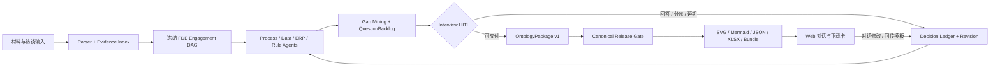

# OntoCopilot FDE 升级实施报告

**实施日期：** 2026-08-12  
**范围：** FDE 前线业务发现、持续访谈、流程与 Ontology 建模、对话修改、版本交付，以及 Harness / Agents / Skills / CodeAct / Agent Loop / DAG 运行底座  
**状态：** 核心升级已实现并接入 Web 前端；本文是升级后的实现与验收说明。升级前问题、Use Case 和论文依据保留在《OntoCopilot 面向 FDE 前线业务发现的 Use Case、现状审计与升级方案》中。

---

## 1. 交付结论

OntoCopilot 已从“材料抽取 + 静态模板”的建模工具，升级为一个可持续工作的 **FDE Engagement Workbench**：

1. FDE 可上传业务材料，直接从 XLSX、CSV、DOCX、PDF/图片、OpenAPI、DDL、PPTX 和 BPMN 2.0 中建立证据索引。
2. 系统以结构化图生成 As-Is 流程，BPMN 会保留 task、event、gateway、lane、sequenceFlow、condition 和 XML locator，不再由模型重新猜图。
3. 流程断点、材料问卷、结构缺口、ERP/API 映射缺口及冲突进入同一个 `QuestionBacklog`。
4. FDE 能按业务负责人、流程负责人、ERP 顾问、数据负责人、财务/法务等角色分派问题，记录选项或自由文本答案，延期、重开并持续获得下一批高价值问题。
5. 每个回答进入幂等 `DecisionLedger`，并生成可审计 `Revision`；重复或并发提交不会重复修改 Ontology。
6. `Process / Action / Event / DataObject / Rule / Role / System / Question / Decision / Evidence` 统一写入有版本的 `OntologyPackage v1`，并执行 schema、全局 ID 和引用完整性校验。
7. FDE 可在对话中结构化修改 OIR、Action、流程图和模板，支持撤销；完整重建会重放人工补丁，过期语义锚会显式报冲突。
8. 问题清单可下载为 XLSX、Markdown、JSON；流程可下载 SVG、Mermaid、JSON；Ontology 可下载 canonical JSON 及分视图；当前交付包可下载 ZIP Bundle。
9. 业务方填回模板后采用“预审差异 → FDE 确认 → 合并 → 校验 → 新 Revision → 重编译”的两阶段闭环，预审不会修改在线 OIR。
10. Web 前端已增加 FDE 问题工作台、冻结 Engagement DAG、产物版本与下载卡、业务回传入口。
11. build 与 chat 都使用带 owner、TTL、heartbeat 和取消栅栏的持久 lease；会话事件先持久化获得权威 seq，再对 SSE 可见。
12. 零配置模式使用持久 SQLite；兼容升级器可将早期数据库推进到 schema version 11，并为每条 SQLite 连接开启外键约束。
13. 材料上传/删除、模型选择、回传应用、问题回答、对话结构修改和会话转换共用
    durable Mutation lease；另一 worker 会在操作前刷新权威材料清单，不能用旧缓存覆盖新状态。
14. 正式 Bundle 受 Question Ledger 发布门禁约束：未解决 blocking 问题返回 409，
    单份工作产物仍可下载；非阻塞待答项只允许生成显式 `DRAFT` 包，manifest、README
    和内容寻址 `bundle_id` 都携带发布语义。

这次升级的重点不是堆更多 Agent，而是先把问题、决定、版本、产物和人工修改纳入一套可恢复的业务状态机，再让 Agent 在该边界内协作。

---

## 2. 升级后架构



### 2.1 权威状态与投影视图

| 领域 | 权威状态 | 投影视图 |
|---|---|---|
| 业务缺口 | `QuestionBacklog` | 问题 Tab、问题清单 XLSX/MD/JSON |
| 人工决定 | `DecisionLedger` | 已回答问题、Canonical Decision、审计历史 |
| 人工改动 | `Revision + PatchSet` | OIR/Flow/Template 当前版本及 diff |
| 统一语义 | `OntologyPackage v1` | `oir.json`、`flow.json`、五类 JSON 视图 |
| 运行过程 | Run + Recorder + Session Event | SSE、推理面板、恢复状态 |
| 原始依据 | Evidence + locator | 实体/流程/问题的点回原文 |

OIR 与 Flow 保留为兼容视图，但不再作为两份互不相干的最终业务真相。

### 2.2 冻结的 FDE Engagement DAG

```text
INTAKE → PROCESS → ┬→ DATA_OBJECTS ─┐
                   ├→ ERP_MAP ──────┼→ GAP → INTERVIEW(HITL)
                   └→ RULES ────────┘          ↓
                          EXPORT ← REVIEW ← CANONICALIZE
```

已内置六个最小权限角色。成熟的 `EXTRACT.* → MERGE` 子图负责唯一一次付费材料理解；
随后产品主链由 Scheduler 真实执行上述冻结 Engagement DAG。当前各专业节点通过
`skip_model` 将已有 OIR / Flow 确定性投影为各自的 schema 契约，不会对同一批证据再做一轮
LLM 抽取。`INTERVIEW` 遇到未解决问题会产生真实 HITL 挂起；恢复后继续执行
`CANONICALIZE → REVIEW → EXPORT`，其 checkpoint 与 Gate 由现有 Recorder/Scheduler 边界约束。
各角色与工具 scope 如下：

- `fde_interviewer`：材料盘点、访谈编排和缺口追问；
- `process_modeler`：Action/Event/Gateway/泳道和流程证据；
- `erp_mapper`：ERP/API/主数据与业务步骤映射；
- `rule_engineer`：条件、例外、阈值、角色和执行点；
- `data_steward`：DataObject、字段口径、键和 lineage；
- `delivery_reviewer`：引用完整性、证据覆盖与交付闸门。

配套七个 Skills 分别覆盖访谈盘点、问题路由、流程建模、ERP 映射、规则结构化、数据对象治理和交付审查。Agent 只能获得其角色所需的工具 scope。

---

## 3. FDE Use Case 实施矩阵

| Use Case | 升级后的行为 | 主要验收 |
|---|---|---|
| UC01 材料盘点 | 1 MiB 分块流式上传、文件/会话/数量限额、批次原子提交、内容哈希、解析 finding、证据定位；新增 PPTX/BPMN | 多格式 parser、上传失败回滚与 HTTP 测试 |
| UC02 梳理 As-Is 流程 | 结构化 Action/Event/Gateway/Stage；BPMN 确定性桥接 | 节点、边、条件、泳道和 provenance 测试 |
| UC03 找出流程/数据缺口 | 四路缺口统一进入 Backlog，并计算 priority、blast radius、information gain | >3 冲突与 >10 问题的渐进访谈测试 |
| UC04 按角色反问 | owner、audience role、answer schema、dependency、状态和版本完整保存 | GET/PATCH/answer/defer/reopen API 测试 |
| UC05 自由文本回答 | 回答写入 Decision，相关 OIR assertion 标为 USER/human | 自由文本与 provenance E2E |
| UC06 生成统一 Ontology JSON | Action/Event/DataObject/Rule 等同包、稳定 ID、无悬空引用 | Canonical schema/ref validator 测试 |
| UC07 对话式持续修改 | OIR/Action/Flow/Template 编辑、确认、撤销、重建后补丁重放 | Action edit、flow undo/rebuild、OIR replay 测试 |
| UC08 图与文档下载 | 流程 SVG/MMD/JSON、问题 XLSX/MD/JSON、Ontology views、Bundle | API 下载和真实前端 DOM 烟测 |
| UC09 业务方回传 | preview 不变更；confirm 后 merge、校验、Revision、重编译 | 两阶段回传单 Revision E2E |
| UC10 中断后继续 | 问题、答案、Revision、对话、补丁、OCR chunks、产物版本与 Engagement checkpoint 可恢复 | hydrate/restart continuity 与 Engagement suspend/resume 测试 |
| UC11 并发与幂等 | build/chat 持久 lease 与 owner fencing；回答先 claim；相同 idempotency key 只产生一次修改 | 跨 Repo 并发 lease、取消、过期接管与 split 重放测试 |
| UC12 安全执行 | 默认不向对话/抽取开放宿主 `code.exec`；生产 CodeAct 只允许 gVisor 且 fail closed | 工具 scope、MCP quarantine、sandbox 测试 |

---

## 4. Question → Decision → Revision 闭环

### 4.1 统一问题模型

所有问题采用同一字段契约：

```json
{
  "id": "q_conflict_amount_caliber",
  "text": "审批阈值使用含税还是不含税金额？",
  "status": "open",
  "priority": "blocking",
  "ownerUserId": "fde-wang",
  "audienceRole": "ERP顾问",
  "answerSchema": {"type": "string", "enum": ["含税", "不含税"]},
  "dependencies": [],
  "blockedArtifacts": ["br_amount_threshold"],
  "evidenceIds": ["采购制度.docx#p3"],
  "informationGain": 0.91,
  "blastRadius": 5,
  "version": 7
}
```

问题来源可以是材料原题、流程缺口、ERP/API 映射、规则冲突或 FDE 手工新增。`nextBatch` 按阻塞范围、信息价值、依赖和优先级选择下一批，而不是答完三张内部冲突卡就直接结束。

### 4.2 回答事务

回答执行顺序固定为：

1. 校验 Question version（CAS）；
2. 以 `session + idempotencyKey` 原子 claim Decision；
3. 只有新 claim 才应用到 OIR/Flow；
4. 验证引用和业务结构；
5. 创建 Revision；
6. Decision 标为 applied；异常标为 failed 且不进入 active 链；
7. 重算下一批问题和受影响产物。

旧 `/answer` 路径也复用同一事务，避免 UI 卡片与新问题 API 成为两套旁路。

### 4.3 API

| 方法 | 路径 | 用途 |
|---|---|---|
| GET | `/api/sessions/{sid}/questions` | 查询、统计和下一批问题 |
| PATCH | `/api/sessions/{sid}/questions/{qid}` | 分派 owner/role/priority/status |
| POST | `/api/sessions/{sid}/questions/{qid}/answer` | 选项或自由文本回答 |
| POST | `/api/sessions/{sid}/questions/{qid}/reopen` | 重开已答/延期问题 |
| GET | `/api/sessions/{sid}/questions/export?format=xlsx|md|json` | 下载访谈清单 |
| GET | `/api/sessions/{sid}/revisions` | 查看 Artifact Revision 历史 |

---

## 5. OntologyPackage v1

Canonical 包固定包含：

```text
$schema / schemaVersion / packageId / revision / baseRevision / generatedAt
processes / dataObjects / actions / events / rules / roles / systems
questions / decisions / evidence / validation
```

每次编译先同步 QuestionBacklog 与 DecisionLedger，再生成包。Release Gate 检查：

- schema version 与顶层 shape；
- 全局 ID 唯一性；
- Process node/edge 引用；
- Action → Event/DataObject；
- Event → producer/consumer/payload；
- Rule → scope；
- Question → dependencies/blockedArtifacts/evidence；
- Decision → question/affectedIds/supersedes。

只要存在 error 级 finding，编译会在任何新下载产物写盘前失败，发出 `artifact.validation_failed`，不会把错误包标为完成版本。

生成产物：

- `ontology.package.json`
- `ontology-package.schema.json`
- `data-objects.json`
- `actions.json`
- `events.json`
- `rules.json`
- `questions.json`

---

## 6. 对话修改与 Artifact Revision

FDE 可以在聊天中表达：

- “把采购审批动作的角色改成区域采购经理”；
- “50 万以上增加总监审批规则”；
- “刚才那个字段改为必填，并增加枚举”；
- “撤销上一版流程修改”；
- “按 ERP 顾问和业务负责人分别生成问题清单并给我下载”。

系统不会让模型直接改 JSON 文本，而是生成类型化 Command/Patch：

```text
proposed → approved → applied → verified → revision
```

每个 Revision 记录 parent、actor、reason、patch、changed IDs、invalidated artifacts、input snapshot hash 和 idempotency key。Undo 生成真实的逆向版本；Flow/OIR/Template 的补丁日志会一起推进或撤销。完整重跑按稳定语义锚重放人工修改，无法重放的 stale patch 交给 FDE 处理，不静默丢失或复活。

---

## 7. Harness 与安全升级

### 7.1 Critic / Gate

- Scheduler 在节点提交前执行 Gate；非 PASS 不写 WorkingSet、不放行下游。
- 支持 `PASS / REVISE / HITL / ABORT / ROUND_TRIP`。
- 最后一轮 refine 后强制终态复审。
- 未注册 critic、空 verdict、无法解析的 Gate 表达式全部 fail closed。
- Gate 可读取 critic 指标和结构化 output 指标，HITL 可挂起与恢复。

### 7.2 Tools / MCP

- 工具输入与输出使用 JSON Schema 双向校验，并限制结果大小。
- 调用经 `Recorder.effect` 留下 requested/completed/failed 与幂等指纹。
- 重复工具名拒绝注册；tool-call budget 被实际执行。
- MCP 首次工具进入 quarantine，不再自动批准；schema/描述指纹变化撤销信任。
- 对话工具按 scope 最小授权；默认不包含 `code.exec`。

### 7.3 CodeAct

- HTTP 生产主链默认关闭 CodeAct。
- 只有显式设置 `ONTOCOPILOT_ENABLE_CODEACT=1` 才启用。
- 生产模式只选择 gVisor；运行时不可用则失败，不回退宿主 `LocalSubprocessSandbox`。
- 外部系统写操作仍使用类型化工具与 HITL，不交给任意代码执行。

### 7.4 Recorder / Run

- Recorder 对同一 effect key 做 single-flight，恢复时复用已完成的 LLM/tool 结果。
- Run 输入指纹包含每个文件的 SHA-256，而不是文件名和字节数。
- 每次 build 使用独立 Repo Run；结束状态为 suspended/done/failed 并保存预算。
- 对话推理、确认重放、智能推荐、简短应答与聊天 OCR 也全部使用独立 Repo Run；
  每次调用的 Repo Run ID 唯一，Recorder ID 按语义输入稳定，可安全复用 journal。
- Run/Node 的 token、工具调用、wallclock 预算均为执行约束；节点超时、工具超额和
  全局预算超额会在提交前阻断，而不只是写入观测指标。
- 人工答案、Revision、补丁、对话与关键会话事件进入持久仓储；同一冷会话的并发
  首次恢复采用 single-flight，失败或取消不会留下半初始化 Session。
- build 启动使用带 owner、TTL 与 heartbeat 的仓储 lease：多个 worker 同时抢占同一
  会话时只允许一个进入 queued；只有过期 lease 才能被回收，`awaiting_answer` 不能
  被隐式重跑覆盖。
- chat 入口在确认重放和推理分支之前先抢占持久 lease；同一会话的第二个 worker
  会获得 409，只有原 owner 能续租/释放，过期后新 owner 可接管，远程取消会阻断旧 owner 续租。
- 会话事件先进入进程内 FIFO writer，只有仓储分配权威 seq 后才向 SSE 广播；SSE
  按 repo cursor 重放，因此跨 worker 与断线重连不会依赖某个进程的内存事件列表。
- `session_event.event_id` 提供落库重试幂等性；正常停机会 drain 待写事件。
- Question、Audit、材料、会话转换及工作模式对话的结构写入还会抢占独立 Mutation
  lease；它与 build/chat 双向互斥，projection 写入使用 state-version CAS 和 owner fencing。
- 业务方回传的 Revision 采用 `proposed → applied/rejected/rolled_back` 两阶段终态；
  编译中断后，同一内容哈希会续完原 Revision，而不是生成重复版本或把半成品标为成功。

---

## 8. 前端集成

### 8.1 问题工作台

“问题”Tab 已提供：

- open / high / answered / deferred / all 筛选；
- open、answered、deferred 统计；
- owner、应答角色、优先级分派；
- 参考选项与自由文本回答；
- defer、reopen、CAS 冲突提示；
- why、impact、blocked artifact、evidence；
- 下一批问题；
- XLSX、MD、JSON 与关联流程/Ontology/Bundle 下载。

### 8.2 FDE Engagement 可视化

“推理”Tab 显示冻结 DAG 的十个阶段、执行模式和 active/completed/pending 状态。它让 FDE 能明确看到当前在材料盘点、流程、ERP、规则、访谈还是规范化/交付审查阶段。

### 8.3 业务方回传

“问题”和“产物”页均提供“上传回传模板”。前端先调用 `audit?apply=false` 展示完成度、diff、damage 与 dropped items；FDE 明确确认后才调用 `apply=true`。成功后刷新问题、Ontology、Artifact Revision 和 Bundle 下载卡。

### 8.4 前端回归边界

单文件 UI 的回归测试会检查 Question API 路由、问题状态与交互入口、下一批问题、
XLSX/MD/JSON 下载、Engagement DAG 与两阶段回传的 HTML/JavaScript 契约。
此类静态/DOM 契约验证不等于特定项目数据下的真实浏览器人工验收；上线前仍应在目标部署上走完一次实际 FDE 旅程。

---

## 9. 回传模板两阶段语义

`POST /api/sessions/{sid}/audit?apply=false`：

- 在 OIR clone 上审计；
- 计算 auto repair、diff、damage、dropped；
- 不修改 live OIR、问题或 artifact revision。

`POST /api/sessions/{sid}/audit?apply=true`：

- 复核相同上传内容；
- 应用确认过的 auto repairs 和 merge；
- 运行 schema/provenance/reference consistency；
- 原子生成一个 Revision；
- 重编译问题、Canonical Package、模板和 Bundle；
- 相同幂等请求不产生第二个 Revision。

---

## 10. 数据库与部署

本次发布的 PostgreSQL 迁移目录连续且只追加，为 `0001`–`0011`：

- `0001_init.sql`：会话、状态、Run、Decision、Chat Turn、Session Event 与 Kernel Journal 基线；
- `0002_accounts.sql`：账号与登录会话；
- `0003_app_settings.sql`：应用设置；
- `0004_session_owner.sql`：会话 owner 与索引；
- `0005_question_decision_revision.sql`：统一 Question、Decision、Revision 领域表；
- `0006_session_status.sql`：补齐真实的 `queued` 与 `stopped` 会话状态；
- `0007_session_event_idempotency.sql`：Session Event 的幂等 `event_id` 与唯一约束；
- `0008_build_lease.sql`：跨 worker build owner、heartbeat、expiry 与取消意图；
- `0009_chat_lease.sql`：跨 worker chat single-flight、owner fencing、expiry 与协作取消。
- `0010_llm_usage.sql`：模型调用、token、重试、真实/估算成本来源与 owner 隔离的用量账本；
- `0011_mutation_lease.sql`：Question/Audit/材料/会话结构写入的跨 worker owner、heartbeat 与 expiry。

迁移发现器会验证全目录编号连续且不重复；新迁移只能 append，不重写已发布版本。

部署升级前必须先运行迁移。SQLite 本地模式通过 metadata 建表；PostgreSQL 使用版本化迁移，不在多副本应用启动时自动改 schema。

推荐生产配置：

```bash
export DATABASE_URL='postgresql+asyncpg://...'
# 可选上传配额；未设置时分别为 100 MiB / 500 MiB / 100 个文件
# export ONTOCOPILOT_MAX_UPLOAD_MB=100
# export ONTOCOPILOT_MAX_SESSION_MB=500
# export ONTOCOPILOT_MAX_FILES=100
# 默认关闭 CodeAct；只有部署并验证 gVisor 后再开启
# export ONTOCOPILOT_ENABLE_CODEACT=1
python -m uvicorn ontocopilot.server:app --host 0.0.0.0 --port 8000
```

基础安装已包含 SQLAlchemy 与 aiosqlite；未配置 `DATABASE_URL` 时采用零配置 SQLite。
已有 SQLite 文件不能靠 `metadata.create_all()` 自动改列或 CHECK 约束，因此启动路径包含窄化的
兼容升级器：补 owner、重建旧 session status 约束、补 event_id 索引，然后由 metadata
补齐 build/chat/mutation lease 与用量账本，并将 `PRAGMA user_version` 推进到 11。SQLite 的外键默认按连接关闭，
引擎现在为每条连接显式执行 `PRAGMA foreign_keys=ON`，会话删除才能按 metadata 约定级联清理所有从表。
持久仓储初始化失败会 fail closed，不再静默降级。`ONTOCOPILOT_NO_DB=1` 只适用于
显式选择的临时演示；界面会明确显示“内存模式，服务重启后会丢失”。构建 wheel 时
会把 `ui/index.html` 和 PostgreSQL 迁移目录一并打入 `ontocopilot/`，安装包无需依赖
源码目录中的前端或 SQL 文件。

---

## 11. 验收策略

核心 E2E 覆盖：

1. 超过三条问题时，答完首批仍继续返回下一批；
2. 自由文本答案写回 USER/human provenance；
3. 重复/并发回答只产生一次 Decision 与 Revision；
4. 重启后问题、答案、对话和待批准动作可恢复；
5. 同名同大小但内容不同的文件产生不同 Run 指纹；
6. OIR 人工修改重跑后仍在；
7. Flow undo 后重建不复活；
8. Canonical Action/Event/DataObject/Rule/Question/Decision 无悬空引用；
9. 问题三格式下载和前端两阶段回传契约；
10. 默认对话无 `code.exec`；
11. 并发 build 只有一个进入 queued/run；
12. BPMN 上传后直接产生结构化流程及下载产物；
13. Canonical Release Gate 失败时不写任何新下载版本；
14. Memory/SQLite 下并发首次 hydrate 只产生一个 Session 与一条 restored 事件；
15. 跨 worker build CAS 只允许一个请求成功抢占；
16. Session Event 在 commit 后才广播，支持跨 worker cursor、冷恢复与幂等重试；
17. 对话 Run 的成功、失败、取消、预算、backend close 与语义 journal 复用；
18. 流式上传超限或批次失败时不留下半批文件，也不覆盖已有版本；
19. build、mutation 和材料清单在 Memory/双 SQLite 连接下只能有一个 owner，旧 worker
    在进入操作前会刷新 repo 文件表；
20. 回传编译故障会留下 proposed Revision，同一文件重试只续完这一条；
21. 空工作区的纯聊天会话也能冷恢复，不要求目录或材料预先存在。

最终发布候选版执行了以下可复现命令：

```bash
python -m pytest -q -o addopts=''
ruff check .
git diff --check
# Node 解析 ui/index.html 的全部内嵌 script
uv build --wheel
# 在不可见源码 checkout 的解包目录里验证 import/UI/migrations/全新 SQLite lifespan
```

本次文档收口所实际执行的 targeted 结果见本节下方的“当前工作树验证”；
如果后续 agent 继续修改代码，发布负责人应以最终工作树上的重跑结果替换它。

### 11.1 当前工作树验证

2026-08-12 冻结工作树的实际结果：

- 全量 Python：**923 passed，0 failed，5 个第三方 PyMuPDF/SWIG deprecation warnings**；
- 全仓 `ruff check .`：**All checks passed（0 项）**；
- `git diff --check`：通过；
- 前端：Node 成功解析 `ui/index.html` 的 2 个内嵌 script；FDE 旅程、Question API、
  SSE、推荐问题和 UI 专项 76 项通过；Bundle/Question/UI 发布门禁专项 42 项通过；
  此前还以真实浏览器走过新建会话、问题 Tab、三格式下载、
  Bundle、回传入口与 Usage 页，控制台无错误；
- `uv build --wheel`：生成 `ontocopilot-0.1.0-py3-none-any.whl`，SHA-256
  `08e43d6ba2626d80e7778084cdb4e2fe2b63f16c4b1db51f151b5372accdcc2f`；
- 从 `/tmp` 解包且不依赖源码 checkout：`ontocopilot.server` 导入成功，包内 UI 为
  188,138 字节并与源码逐字一致，连续携带 11 个迁移（末项
  `0011_mutation_lease.sql`）；
- 解包 wheel + 全新 SQLite + 全新 workspace 的 lifespan 健康检查通过，数据库报告
  `schema_version=11`；可创建会话并冷读 `/state`。

---

## 12. 后续演进项

本次需求范围内的 FDE 访谈、建模、修改、回传、下载与可恢复运行闭环已经完成。
以下是面向更多 ERP 生态和更大规模部署的演进项，不影响当前能力验收：

- VSDX、DMN、传统 XLS、SAP IDoc/EDMX 等格式适配器；
- SAP、Oracle、Dynamics、用友、金蝶等真实连接器的租户级凭证与写入审批；
- 基于真实项目金标的流程 node/edge/gateway F1、问题采纳率和无依据断言率；
- 多 FDE 同屏协作、分支合并和正式 publish/release 权限；
- 外部副作用无法提供 provider idempotency key 时的 transactional outbox；
- 跨进程正在执行节点已有 worker lease、heartbeat 和过期回收；仍需大规模故障注入
  与更细粒度的 node-level 接管。Run、状态、事件与人工决定已持久化，但正在执行的
  LLM coroutine 不能跨进程迁移，lease 过期后由新 worker 按 Recorder
  effect/checkpoint 安全重跑或恢复，而不是原地续接调用栈；
- Session Event 已做到 commit 后可见、跨 worker cursor 和正常关停 drain；极端
  `SIGKILL`/断电下，尚未来得及提交的进程内遥测尾部不构成已向 UI 确认的业务事件。
  如果未来要求这类遥测也零丢，可换数据库 outbox 或外部 durable broker；
- 冻结 Engagement DAG 已由 Scheduler 真实执行，但专职 ERP Mapper、Rule Engineer、
  Data Steward 等目前是对成熟 `EXTRACT.* → MERGE` 结果的确定性 schema 投影，不是独立的
  第二轮材料理解模型。后续应以真实金标评估哪些节点需要替换为模型或连接器执行器，
  保持冻结拓扑、契约、HITL 与发布门禁不变。

这些边界不再是“核心访谈闭环缺失”，而是从可用 FDE 工作台走向大规模、多租户生产运营的下一层工程工作。

---

## 13. 主要实现入口

| 能力 | 文件 |
|---|---|
| Question/Decision/Revision | `src/ontocopilot/onto/questions.py` |
| Canonical OntologyPackage | `src/ontocopilot/onto/canonical.py` |
| FDE Engagement DAG | `src/ontocopilot/onto/engagement.py` |
| FDE Engagement 执行器 | `src/ontocopilot/onto/engagement_runtime.py` |
| BPMN Flow bridge | `src/ontocopilot/onto/flow_bpmn.py` |
| BPMN/PPTX parsers | `src/ontocopilot/onto/parse/bpmn.py`, `presentation.py` |
| Server APIs / compile / audit | `src/ontocopilot/server.py` |
| Durable Session Event / SSE | `src/ontocopilot/session_events.py` |
| SQLite 兼容升级 / FK | `src/ontocopilot/store/engine.py` |
| Repo 与 schema | `src/ontocopilot/store/repo.py`, `schema.py` |
| Harness Gate / Loop / Tools | `src/ontocopilot/kernel/scheduler.py`, `loop.py`, `tools.py` |
| Web 工作台 | `ui/index.html` |
| FDE 旅程验收 | `tests/test_fde_journey.py` |
