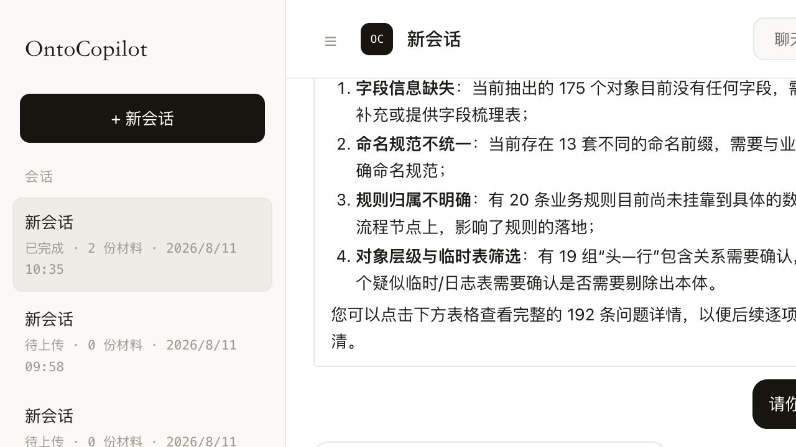
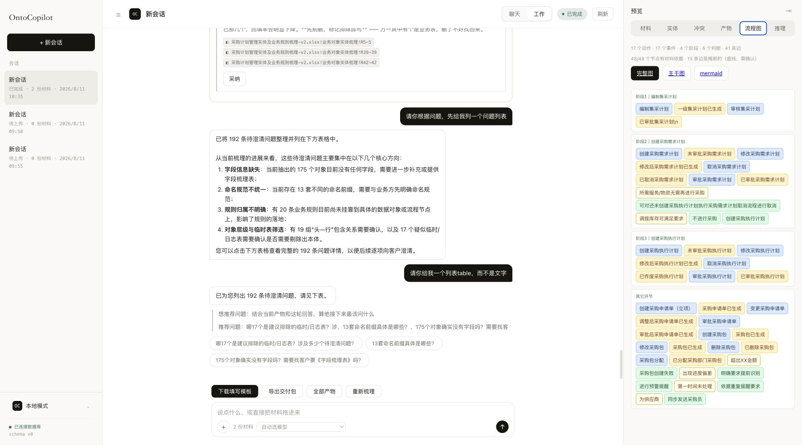
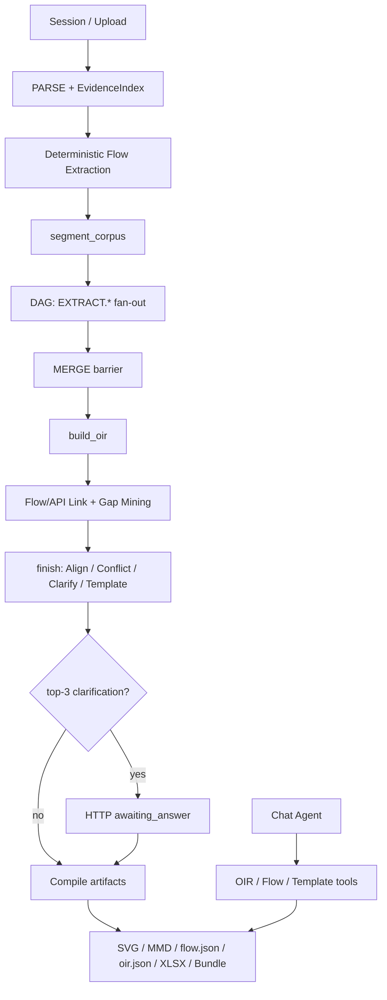
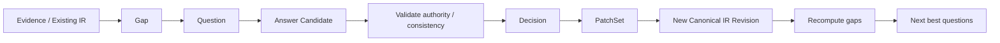
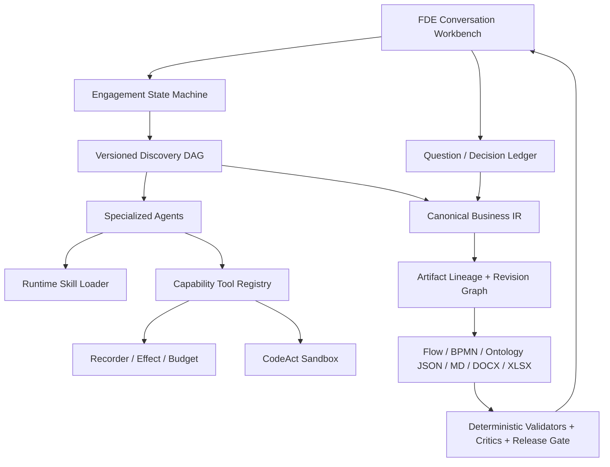
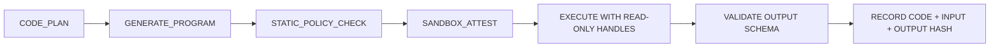

# OntoCopilot 面向 FDE 前线业务发现的 Use Case、现状审计与升级方案

> **实施状态更新（2026-08-12）：** 本文的现状与缺口表保留为升级前基线；核心方案已经实现并接入 Web 前端。升级后的架构、API、Use Case 验收与部署说明见 [OntoCopilot FDE 升级实施报告](./OntoCopilot-FDE-Upgrade-Implementation-2026-08.md)。

**审计日期：** 2026-08-12  
**代码基线：** `4b651df68d97`（工作区存在用户未提交修改，本报告未改业务代码）  
**审计对象：** OntoCopilot Web/API、业务语义模型、对话修改、产物交付，以及 Tools / Agents / Agent Workflow / Skills / CodeAct / Agent Loop / DAG  
**结论类型：** 代码审计 + 本地 UI/API/产物实测 + Use Case 验收设计  
**目标读者：** 产品负责人、架构师、FDE 负责人、Ontology/ERP 顾问、测试与交付团队

---

## 1. 执行摘要

### 1.1 一句话判断

当前 OntoCopilot 已经是一个**有实质能力、适合受控项目试点的 FDE 建模工作台**：可以解析多种材料、建立证据索引、并行抽取 OIR、生成结构化流程图、挖掘缺口、做带确认门的局部修改，并下载 JSON、SVG、Mermaid、XLSX 和 ZIP Bundle。当前工作区还新增了对聊天表格/回答/对话导出 XLSX、DOCX、PDF、MD、CSV 的实现；这部分是未提交在途能力，本报告会单独标注，不能等同于基线已发布能力。

但它还不是 FDE 可以在客户现场连续数天依赖的“**业务发现与 Ontology 交付操作系统**”。目标旅程中的核心闭环——

> 材料与访谈 → As-Is 流程 → 缺口图 → 按角色提问 → 回答后增量重算 → Action / Event / DataObject / Rule 同一语义包 → 对话修改 → 一致性校验 → 在当前聊天轮下载交付物

目前被四个结构性断点切开：

1. **问题系统没有闭环。** 完整 `OpenQuestion` 清单与 top-3 冲突卡是两套状态；现有 `/answer` 只处理冲突选项，不能持续回答业务问题、自由文本答案或自动推出下一批问题。
2. **流程与 Ontology 不是同一份业务真相。** `ActionType` 在 OIR，`Event` 在 Flow，DataObject 只是普通 `ObjectType`；缺少带版本、稳定 ID 和引用完整性约束的 `OntologyPackage`。
3. **人工修改和人在环状态不够耐久。** 等待答复前持久化时序有缺口；OIR patch 记录但没有生产重放路径且没有 undo；Flow undo 不撤销 patch；回传模板只审计不合并。
4. **Harness 只覆盖了抽取子图。** 生产 DAG 实际只有 `EXTRACT.* → MERGE`；访谈规划、流程/数据/规则建模、问题编排、HITL、产物编译和 Release Gate 仍散在 `server.py` 的过程式代码里。

因此，正确的升级顺序不是先增加更多 Agent，而是：

> **统一 Question/Decision Ledger → 建立 Canonical Business IR → 统一 Command/Revision/Artifact 状态机 → 再把专职 Agents、Skills 和完整 DAG 接上。**

### 1.2 产品成熟度判断

| 能力 | 当前成熟度 | 判断 |
|---|---:|---|
| 材料解析与证据定位 | 3.5 / 5 | 多格式、chunk、locator、provenance 基础扎实；企业常见格式和多文件 lineage 仍需补 |
| As-Is 流程草图 | 3 / 5 | 有 Action/Event/Gateway、稳定编号、SVG/Mermaid；对固定版式依赖较强 |
| 缺口发现 | 3 / 5 | 已融合流程、接口、结构、占位符等缺口；排序和状态没有进入访谈闭环 |
| 自适应访谈与反问 | 1.5 / 5 | 有问题清单、有冲突卡，但无法连续问答、按人分派、答案驱动重算 |
| Action/Event/DataObject/Rule 语义包 | 2 / 5 | 组件存在，但分散在 OIR/Flow，缺统一 schema、版本与引用校验 |
| 对话式修改 | 2.5 / 5 | OIR/Flow/Template 可结构化编辑；缺跨产物原子 patch、完整 undo、影响分析 |
| 文档与下载 | 3.5 / 5 | Bundle 和单产物下载可用；在途代码可从聊天导出表格/回答/对话，仍缺统一 Ontology JSON、Artifact lineage 与联动重生成 |
| Durable HITL / 多人协作 | 1.5 / 5 | 数据表有雏形，但主路径仍大量依赖内存态，重启与并发边界不完整 |
| Agent Harness | 2.5 / 5 | 内核抽象较好，但生产只使用小部分 Agent/DAG/Skill/Gate 能力 |
| FDE 端到端 Eval | 2 / 5 | 614 项单元/组件测试通过；缺真实多轮访谈、故障恢复和语义终态评测 |

### 1.3 本报告的最高优先级建议

- **P0-A：统一问题闭环。** 所有冲突、材料问卷、流程断点、ERP 映射缺口都进入同一个 `QuestionBacklog`，答案进入 `DecisionLedger`。
- **P0-B：定义 `OntologyPackage v1`。** Process、Action、Event、DataObject、Rule、Role、System、Question 共用 canonical ID；Flow/OIR 变成视图，不再各自为真。
- **P0-C：建立耐久 Command/Revision 状态机。** 所有 chat edit、answer、template return、undo 都产生可恢复、幂等、可审计的 revision。
- **P0-D：修复现有状态正确性。** 等待回答前先事务持久化；`/answer` 幂等；awaiting 状态禁止重复 build；OIR/Flow patch/undo/replay 一致；Run 指纹包含文件内容 hash。
- **P1：把完整 FDE 旅程纳入 DAG。** 从 Intake/DiscoveryPlan 到 Question/HITL、Artifact、Release Gate 都成为类型化节点。
- **P1：把现有聊天导出升级为一等 `ArtifactRef`。** 每次生成/重生成后显示版本、lineage、变更摘要、验证状态与下载按钮。

---

## 2. 审计方法、实测范围与证据边界

### 2.1 检查方法

本报告同时检查三层事实：

- **Implemented：** 代码中存在数据结构、函数或接口。
- **Wired：** 当前 Web/API 真实主链会调用它，并改变项目状态或产物。
- **Verified：** 有自动测试、HTTP 实测、UI 证据或产物终态断言支持。

执行过的主要验证：

1. 阅读 `server.py`、`onto/`、`kernel/`、`store/`、`ui/` 和测试用例的真实调用链。
2. `.venv/bin/python -m pytest -q` 全量执行成功；另用 collect-only 确认 **614 tests collected**。
3. 在本地服务上运行免费 HTTP Use Case：16 条中 **14 通过、2 失败**，另有 10 条收费模型用例未执行。
4. 在浏览器中检查真实完成会话的聊天、问题表、流程图与下载入口。
5. 下载并解包真实 Bundle，校验 manifest、文件清单、问题数和跨产物引用。

### 2.2 测试边界

本次没有：

- 执行 10 条会真实调用付费模型的 Use Case；
- 连接真实 SAP、Oracle、Dynamics、用友或金蝶环境；
- 做多租户、多 worker、进程 kill、容量或渗透测试；
- 对流程和 Ontology 内容做人工金标 F1 评测；
- 证明完整 WCAG 合规。UI 结论来自实际截图与 DOM 检查，键盘、读屏器和色彩对比仍需专项测试。

因此，报告会把“已验证问题”和“应新增验收”分开，不把建议方案写成现有能力。

---

## 3. 产品北极星：FDE 真正需要完成什么

OntoCopilot 的目标用户不是只想“上传文档得到一份 JSON”的分析师，而是站在客户现场、需要同时面对业务负责人、流程 Owner、ERP 顾问、数据团队和集成团队的 FDE。产品的基本工作单元应该是一个 **Engagement（项目发现任务）**，而不是一次模型 Run。

每个 Engagement 应持续维护六类项目事实：

1. **Evidence：** 原始材料、访谈记录、截图、表格、API、字段字典及准确定位。
2. **Process：** As-Is、To-Be、角色、系统、主路径、异常、补偿、决策点。
3. **Semantic Model：** DataObject、Action、Event、Rule、Role、System 及引用关系。
4. **Gap / Question：** 还不知道什么、为什么必须问、应该问谁、影响哪些产物。
5. **Decision：** 谁在什么权限下回答了什么，取代了哪个旧结论，证据是什么。
6. **Artifact：** 哪个 revision 生成了哪份流程图、问题清单、Ontology JSON 和交付文档。

一个可靠产品必须允许 FDE 在任意时刻回答四个问题：

- “这条结论是材料写的、业务人员说的，还是系统推断的？”
- “现在还有哪些信息缺失，应该找谁问，哪个最阻塞交付？”
- “我刚才改了审批阈值，哪些流程节点、规则和文档被一起更新？”
- “这份文件对应哪个版本，能否从当前聊天轮直接下载和回滚？”

---

## 4. 目标 Use Case 总览

### 4.1 参与者

| 参与者 | 关注点 | 系统应如何支持 |
|---|---|---|
| FDE 工程师 | 快速建立全局图、识别缺口、主持访谈、形成可交付模型 | 主工作台、问题议程、证据点回、patch 与下载 |
| 业务流程 Owner | 确认实际怎么做、例外和责任边界 | 用业务语言提问、选择/自由文本/表格答复、确认流程 |
| ERP 顾问 | 系统模块、单据、配置、事务/API、字段映射 | ERP 专属问题队列、系统映射视图、元数据只读工具 |
| 数据负责人 | DataObject、主数据、主键、状态、SoR、敏感性 | DataObject 工作表、字段画像、缺口分派 |
| 集成/开发人员 | Action/Event/API、幂等、错误和补偿 | Action/Event 契约、API mapping、可执行校验 |
| 项目负责人/审阅者 | 进度、风险、尚未关闭的问题、交付版本 | Coverage、Decision/Revision 日志、Release 状态 |

### 4.2 Use Case 清单

| ID | Use Case | 期望结果 | 当前状态 |
|---|---|---|---|
| UC-FDE-01 | 创建 Engagement 与 Stakeholder Map | 明确范围、目标、参与人、职责和交付标准 | 部分支持；会话有 title/project，缺 stakeholder/role 模型 |
| UC-FDE-02 | 材料盘点、解析与证据目录 | 所有材料可检索、可定位、可判断覆盖率 | 较强但不完整 |
| UC-FDE-03 | 生成并评审 As-Is 流程 | 结构化主路径、例外、角色、系统、证据和不确定项 | 部分支持 |
| UC-FDE-04 | 生成分角色问题清单与访谈 Agenda | 每个缺口变成可回答、可分派、可排序的问题 | 部分支持，未形成统一 backlog |
| UC-FDE-05 | 多轮回答与自适应反问 | answer → decision → 局部重算 → next questions | 核心缺失 |
| UC-FDE-06 | ERP/数据/接口对齐 | 流程步骤与 ERP 单据、DataObject、API、角色关联 | 部分支持 |
| UC-FDE-07 | 生成统一 OntologyPackage | Action/Event/DataObject/Rule 同包、可验证、可追溯 | 不满足目标契约 |
| UC-FDE-08 | 对话式修改与影响预览 | 自然语言转 PatchSet，预览 diff，确认后原子更新 | 部分支持 |
| UC-FDE-09 | 版本、撤销、重跑与多人协作 | 每个决定/产物有 revision，重启和补料不丢修改 | 明显不足 |
| UC-FDE-10 | 回传问卷/模板并合并 | 审计、预览差异、确认、合并、重新生成 | 底层 merge 有，服务闭环缺失 |
| UC-FDE-11 | 生成流程图、问题清单、文档与下载 | 当前聊天轮出现可下载 Artifact 卡片 | 部分支持；在途代码已有多格式聊天导出 |
| UC-FDE-12 | 交付前一致性审计与发布 | schema、引用、证据、问题、跨产物一致性全部过门 | 组件存在，缺统一 Release Gate |

### 4.3 详细 Use Case

#### UC-FDE-01：创建 Engagement 与 Stakeholder Map

**触发：** FDE 新建客户项目。  
**主流程：**

1. 输入项目目标、业务范围、目标系统、计划交付物和截止时间。
2. 登记业务 Owner、ERP 顾问、数据负责人、集成负责人、审批人及其 authority。
3. 系统生成 `DiscoveryPlan v1`：材料清单、访谈轮次、预期产物、风险和责任人。
4. 后续问题只能分派给已知角色；未知 owner 本身成为一个 gap。

**验收：** 项目状态不是简单的 `idle/extracting/done`，而是能看到 discovery coverage、参与人和下一步活动。

#### UC-FDE-02：材料盘点、解析与证据目录

**输入：** Excel/CSV、DOCX、PDF/截图、流程说明、DDL、OpenAPI、ERP 字段字典、会议纪要。  
**主流程：** 上传 → 文件 hash → MIME/安全检查 → 解析 → chunk/locator → 结构分类 → 覆盖率与异常提示。  
**输出：** `MaterialCatalog`、`EvidenceIndex`、缺失材料建议。  
**验收：** 任意抽取断言能点回原文件与位置；多文件 provenance 不得统一落到第一份文件。

#### UC-FDE-03：生成并评审 As-Is 流程

**主流程：**

1. Process Analyst 从材料和访谈中抽取 Stage、Action、Event、Gateway、Actor、System、Input/Output。
2. 系统区分 `EXTRACTED / USER / INFERRED`；推断边使用独立样式。
3. 检查 dangling、dead end、无条件分支、Action 无 Event、异常/补偿缺失。
4. FDE 可以点击节点查看证据，也可通过对话修正节点、边、角色和阶段。

**验收：** 图不是一次性图片，而是可重建、可 diff 的结构化 ProcessIR；流程节点引用 canonical DataObject/Action/Event ID。

#### UC-FDE-04：生成分角色问题清单与访谈 Agenda

**主流程：**

1. 从空字段、冲突、流程断点、API/流程错配、规则不可执行、SoR 不明、角色不明等产生 `Gap`。
2. Gap 转成 Question，附“为什么问、证据、影响对象、答案格式、候选项、推荐对象”。
3. 对相同根因去重；按 stakeholder、阻塞程度、信息增益和影响半径编排 agenda。
4. FDE 可下载 `question_list.md/xlsx/json`，也可直接在聊天中逐批发问。

**验收：** 每个 blocking gap 至少对应一个 active question；一个问题的答案可以关闭多个同源 gap。

#### UC-FDE-05：多轮回答与自适应反问

**主流程：**

1. 业务人员通过选项、自由文本、数字、日期、表格或附件回答。
2. 系统先校验“回答是否足够、是否与已有事实冲突、回答者是否有 authority”。
3. 答案写成 `Decision`，带 actor、role、source turn、scope、supersedes 和 revision。
4. 只使受影响节点失效并增量重算；更新流程、规则和问题状态。
5. Question Planner 给出下一批最值得问的问题；不是答完固定 3 条就直接完成。

**验收：** 连续 20 轮、服务重启、重复提交或乱序提交后，Decision 与产物终态一致；同一幂等键只应用一次。

#### UC-FDE-06：ERP/数据/接口对齐

**主流程：** 把每个流程 Action 映射到 ERP module/transaction/document/API，把输入输出映射到 DataObject，把 Event 映射到状态变化或集成消息；未知映射生成 ERP 顾问问题。  
**验收：** 自动化映射必须有元数据或人工确认；“业务动作”和“某个 API 名字相似”不足以自动确认。

#### UC-FDE-07：生成统一 OntologyPackage

**输出：** versioned JSON，至少包含 Process、Action、Event、DataObject、Rule、Role、System、Question、Evidence 和 revision metadata。  
**验收：** JSON Schema 通过率 100%；所有引用可解析；Flow/OIR/问题清单的同一概念使用同一 canonical ID；任何推断都有显式状态。

#### UC-FDE-08：对话式修改与影响预览

**示例：** “采购金额超过 50 万由采购总监审批；驳回后回到提交人，并重新释放预算占用。”  
**主流程：** resolve target/revision → propose PatchSet → dry-run → impact analysis → 展示 diff → 风险确认 → atomic apply → selective regenerate → validate → 当前消息附下载卡。  
**验收：** 同一次修改原子更新 Rule、Gateway 条件、Approval Action、approved/rejected Event、补偿 Action 和受影响文档；失败时全部不提交。

#### UC-FDE-09：版本、撤销、重跑与多人协作

**主流程：** 每次 answer/edit/import 产生不可变 revision；undo 是新的 inverse revision；补料后在新基线上重放语义 patch，失效锚点转为 stale conflict 交人处理。  
**验收：** 重启不丢待批准动作、对话或待回答问题；已撤销 patch 不会在重跑后复活；并发编辑使用 base revision/CAS 拒绝覆盖。

#### UC-FDE-10：回传问卷/模板并合并

**主流程：** 上传业务方回传 → audit → 显示 changed/dropped/conflict → FDE 确认 → merge_into_oir → provenance=USER → 新 revision → 重算 → 重新交付。  
**验收：** “已读到但没有写入路径”的单元格必须显式列出；不能只提高完成度却不改变 Ontology。

#### UC-FDE-11：生成文档并在聊天中下载

应支持：

- As-Is/To-Be 流程图：SVG、Mermaid、BPMN；
- 统一 OntologyPackage JSON 及按类型拆分的 JSON；
- 问题清单：MD、XLSX、JSON；
- 访谈 Agenda、会议纪要、Decision Log、Gap Report；
- ERP 映射表、数据对象字典、Action/Event catalog；
- 完整 ZIP Bundle。

**验收：** 生成完成的 assistant message 返回 typed `ArtifactRef[]`；用户无需切到右侧产物页即可点击下载，并可看到版本、验证状态和变更摘要。

**当前在途实现：** 工作区新增的 `export.file`、`GET /export`、`GET /exports/{name}` 及 `export.ready` UI，已经能把上一张表、某类 OIR 清单、上一段回答或对话导出为 XLSX/DOCX/PDF/MD/CSV，并在消息区域显示下载按钮。这显著缩小了 UC-FDE-11 的缺口。尚缺的是 JSON/OntologyPackage、与 canonical revision 的 lineage、跨产物重生成和标准 `ArtifactRef`；因此成熟度仍是“部分支持”，而非未实现。

#### UC-FDE-12：交付前一致性审计与发布

**主流程：** schema validator → referential validator → process graph critic → provenance critic → rule executability → cross-artifact critic → privacy check → release gate。  
**验收：** 未关闭的 blocking question、悬空引用、未标记推断或 HIGH finding 默认阻止“正式版”，但可以生成明确标记的 draft。

---

## 5. Golden Scenario：采购到订单的前线发现

建议把第一套端到端金标固定为“采购需求 → 采购计划 → 审批 → 采购包 → 订单 → 收货/发票”，因为它同时覆盖流程、ERP、规则、数据、异常和多角色问答。

### 5.1 输入材料

- 采购业务流程说明 DOCX；
- 访谈问卷 XLSX；
- ERP 单据与字段字典；
- 采购相关 OpenAPI；
- 审批制度 PDF；
- 一段业务负责人访谈纪要。

### 5.2 预期初始模型

**DataObject：** PurchaseRequisition、ProcurementPlan、PurchasePackage、PurchaseOrder、BudgetReservation、GoodsReceipt、Invoice。  
**Action：** submitRequest、checkBudget、createPlan、approvePlan、createPackage、issueOrder、receiveGoods、matchInvoice。  
**Event：** requestSubmitted、budgetReserved、planApproved、planRejected、packageCreated、orderIssued、goodsReceived、invoiceMatched。  
**Rule：** 金额审批矩阵、预算校验、集采适用条件、驳回/撤销补偿、三单匹配规则。  
**角色：** 需求人、采购计划员、采购经理、采购总监、财务、ERP 系统、供应商。

### 5.3 示例问题清单

| ID | 问题 | 对象 | 为什么必须问 | 期望答案 | 影响 |
|---|---|---|---|---|---|
| Q-001 | 什么条件下走集采，什么条件下走普通采购？ | 业务 Owner | 决定主路径与规则分支 | decision table | Process、Rule |
| Q-002 | 50 万以上由谁审批，金额口径含税还是不含税？ | 业务/财务 | 审批阈值不完整 | amount + role + caliber | Rule、Gateway、Action |
| Q-003 | 预算不足时终止、挂起还是允许超额审批？ | 财务 | 缺异常路径 | enum + explanation | Rule、Event、Flow |
| Q-004 | 驳回后回到提交人还是计划员？已占预算是否释放？ | 业务/ERP | 缺回退与补偿 | choice + boolean | Flow、Compensation |
| Q-005 | 采购计划的系统主键和 System of Record 是什么？ | ERP/数据 | DataObject identity 缺失 | field + system | DataObject、Mapping |
| Q-006 | `planApproved` 由哪一步产生，payload 有哪些字段？ | 集成团队 | Event 不可消费 | producer + schema | Action、Event |
| Q-007 | 一张采购计划能拆成多少个采购包？ | 业务/ERP | 基数冲突 | cardinality | DataObject、Link、Flow |
| Q-008 | 订单创建失败后的重试和人工处理是什么？ | ERP/集成 | 缺错误/补偿 | retry policy + owner | Action、Rule、Flow |

### 5.4 一轮自适应追问示例

业务负责人回答 Q-002：“含税 50 万以上由采购总监审批。”系统不应只把字符串写进备注，而应：

1. 生成 Decision：`amountBasis=gross`、`threshold=500000 CNY`、`approver=ProcurementDirector`；
2. 更新 Rule predicate 与审批 Gateway；
3. 检查材料里是否存在“100 万”或“不含税”的冲突；
4. 发现仍缺“等于 50 万如何处理”“币种换算时点”“代理审批”三个子缺口；
5. 计算其影响，只在确实阻塞时排入下一批；
6. 增量重出流程图、规则 JSON 和 Decision Log；
7. 在聊天中返回 diff 和下载卡。

这才是“根据已经梳理的流程反问缺失信息”的产品闭环。

---

## 6. 当前产品体验审计

### 6.1 真实界面证据

当前工作台已能在对话中概括缺口并展示问题表：



宽屏状态下，聊天、问题清单与右侧流程图可以同时查看：



这说明产品不是“只有后端 API”：FDE 已能看到问题概览、流程节点、材料和下载动作。问题主要在状态与交互闭环，而不是缺少所有 UI。

### 6.2 按旅程逐步检查

| 步骤 | 健康度 | 已经有效 | 主要问题 |
|---|---|---|---|
| 1. 新建会话/上传材料 | 🟡 | 会话、材料数、状态、删除与开始入口清楚 | Engagement 范围、stakeholder、目标产物未建模；“会话”不足以承载长期项目 |
| 2. 解析与证据浏览 | 🟡 | 材料、chunk、findings、source 定位存在 | 上传和解析语义曾发生变化，UC-01 已漂移；格式和多文件 provenance 有缺口 |
| 3. 运行梳理/查看轨迹 | 🟡 | 用户能看到阶段、节点、花费与 critic 轨迹 | 真实 DOM 中有 `kernel.*`、`undefined 段/份` 等内部信息；195 条轨迹对 FDE 过载 |
| 4. 查看流程图 | 🟡 | 17 Action、17 Event、Gateway、阶段、完整图/主干/Mermaid 均可访问 | 只读 chip 视图，不是流程编辑画布；节点密度高，证据/不确定性需更直观 |
| 5. 查看问题与安排访谈 | 🔴 | 可以在聊天输出 192 行问题表 | 状态同时显示“0 个决策”，完整问题没有正式 backlog、owner、状态和下载文档 |
| 6. 回答并继续追问 | 🔴 | top-3 冲突卡可应用 option | 不能回答一般 OpenQuestion；自由文本只让用户再点卡；没有 next-batch loop |
| 7. 对话修改产物 | 🟡 | OIR、Flow、Template 有结构化工具和确认门 | 修改跨产物不原子，OIR 无 undo，Flow undo/replay 不一致，缺影响预览 |
| 8. 下载交付 | 🟢/🟡 | 单产物与 Bundle 实测可下载；在途代码支持把表格、回答和对话多格式导出并显示下载按钮 | 缺统一 OntologyPackage、正式 ArtifactRef/version/lineage 和跨产物联动重生成 |
| 9. 回传填写结果 | 🔴 | 后端有 audit，底层有 merge_into_oir | UI 无回传入口；HTTP 只返回审计摘要，不合并、不出新 revision |

### 6.3 UI/可用性问题

1. **问题数量与决策状态冲突。** 实测会话有 192 个 open questions，但主轨迹显示“0 个决策”；两套状态让 FDE 不知道该先处理什么。
2. **推理轨迹暴露内部术语。** `kernel.node_entered`、`kernel.spend`、`undefined` 等应进入诊断模式；默认界面只显示业务阶段、当前工作和需要用户介入的原因。
3. **问题清单缺工作流属性。** 当前表主要是“问题/答复/编号”，没有 stakeholder、优先级、阻塞产物、证据、状态、owner、due date、answer type。
4. **流程图是密集的节点 chip。** 宽屏可见但扫描成本高；建议提供泳道画布、聚焦某阶段、隐藏已确认/低影响项，以及与问题联动高亮。
5. **聊天导出已有雏形，但还不是版本化 Artifact。** 在途代码的 `export.ready` 能在消息内显示下载；用户说“重新给我一版”时，仍需把这个文件绑定 canonical revision、验证结果与 change set，而不只是导出当前表格/文本快照。
6. **可访问性证据有限。** 当前按钮多有可见文字，但尚未验证全键盘路径、读屏语义、focus 顺序、右栏 resize handle、图中颜色依赖和 200% 缩放；应单独纳入测试。

---

## 7. 当前真实架构

### 7.1 主运行链



代码证据：

- 上传与 build：`src/ontocopilot/server.py:419–451, 763–776`；
- 解析、流程、抽取、下游：`server.py:791–1000`；
- 当前 DAG 只有 `EXTRACT.* → MERGE`：`src/ontocopilot/onto/pipeline.py:815–833`；
- `/answer`：`server.py:1434–1456`；
- chat：`server.py:2514+`；
- artifact/bundle：`server.py:3028–3120`。

### 7.2 值得保留的能力

1. **Assertion 级 provenance。** OIR 对 extracted、inferred、user、auto-repaired 有明确来源，适合前线交付的可辩护性。
2. **流程图是结构化图。** Action/Event/Gateway、边类型、稳定 code、dangling/dead-end 检查和推断边样式都已存在。
3. **缺口来源较丰富。** 空容器、占位符、枚举、结构缺口、流程缺口、接口错配能合流。
4. **确定性逻辑优先。** 解析、对齐、检查、模板和图渲染不是全部交给 LLM。
5. **对话修改是结构化操作。** OIR/Flow/Template 编辑不是让模型重写整份 JSON；高风险操作有确认门。
6. **交付包具有内容寻址。** Bundle manifest 有 schema、hash、provenance summary、open questions 和材料清单。
7. **工具 scope 已经有真实限制。** 当前 `code.exec` 使用 `_scopes_for()` 授权，`extract` scope 的测试明确验证不可调用 CodeAct；不应沿用旧审计中“EXTRACT 一定能执行代码”的结论。
8. **聊天多格式导出正在接入。** 当前工作区新增 `export.file` 和表格导出路由，可把问题表/OIR 清单、上一段回答或对话导成 XLSX、DOCX、PDF、MD、CSV，并通过 `export.ready` 显示下载按钮；需要继续收口到正式 Artifact/Revision 模型。

这些基础应演进而非推倒重做。

---

## 8. 当前最重要的产品与语义缺口

### P0-1：两套问题系统没有统一成持续访谈

当前：

- `mine_questions()` 生成 OIR `OpenQuestion`，来源包括材料问卷和系统发现的 gap；
- `ClarificationEngine` 只从 conflict 选 top-3 卡片；
- `state["questions"]` 保存的是 conflict clarification，而不是完整 `oir.questions`；
- `/answer` 只接受 `conflict_rid + option_id`；
- `_do_answer()` 解析到文字选项后仍让用户点击卡片，不真正应用；
- 回答完 top-3 就 `_compile()`，不会自动推出下一批。

真实样本中，OIR 有 **192 个 open questions**，交互层却显示 **0 个决策**。这不是文案问题，而是状态模型分裂。

**应升级为：** 单一 `QuestionBacklog + DecisionLedger`，所有问题都支持 owner、audience、answer schema、priority、dependencies、blocked artifacts、answer history 和 supersession。

### P0-2：Action/Event/DataObject/Rule 不是统一语义模型

- `OIR` 容器有 objects/properties/links/actions/rules/questions，没有 EventType，也没有显式 DataObjectType：`onto/oir.py:345–354`。
- Flow 的 Event 是 `FlowNode(kind=event)`：`onto/flow.py:45–95`。
- OIR ActionType 字段主要是 appliesTo/parameters/effects/sourceEndpoint：`onto/oir.py:241–260`。
- BusinessRule 主要是 statement/kind/appliesTo/actor：`onto/oir.py:278–300`。
- OIR/Flow `to_dict()` 都没有稳定的 `$schema`、`schemaVersion`、package revision。

真实产物进一步暴露了漂移：OIR 有 110 个 Action，Flow 有 17 个 Action/17 个 Event；Flow 的 `objects` 引用中出现 `"\\n"`、`"二级集采计划"`、`"自定义集采计划"`、`"预算占用"` 等非 OIR rid。

**应升级为：** canonical `OntologyPackage v1`，Flow 和旧 OIR 只作为该模型的投影视图。

### P0-3：等待回答的主路径不可可靠恢复

在 `_run_pipeline()` 中：

1. `finish()` 完成后先在 `server.py:961` 调 `_persist(s)`；
2. 新 OIR/conflicts/questions 真正写入 state 在 `966–974`；
3. 有问题时设 `awaiting_answer` 并直接 return（`983–986`），没有再次 persist。

因此进程在最需要 FDE 介入时重启，可能恢复到旧 OIR/旧状态；前几张 `/answer` 也不会持久化，只有最后一张触发 compile 才落盘。failed/cancelled 分支同样没有完整持久化。

此外：

- chat turn、session event、pending approval 主要在内存；数据库虽有表，Server 主链未完整接线；
- `awaiting_answer` 只被 build 的 `parsing/extracting` guard 排除在外，因此仍可再次 build；
- `/answer` 在检查 answered 之前就 apply，且没有使用数据库 decision 唯一索引，重复 POST 不是应用层幂等；
- session status constraint 不接受运行时使用的 `stopped`。

**应升级为：** 耐久 `EngagementRun / Command / QuestionAnswer / Approval / ArtifactRevision` 状态机；所有状态转换与事件同事务提交。

### P0-4：人工修改没有统一 Revision/Replay 语义

- OIR edit 写 `_oir_versions` 和 `_oir_patch_log`，但没有 `oir.undo`，也没有生产 OIR patch replay 调用；完整重跑可能覆盖人工修改。
- Flow undo 只 pop version，不同步 pop `_flow_patch_log`，重跑后撤销的节点可能复活。
- Template undo 正确同步 pop patch，说明三类产物语义不一致。
- `suggestion.apply`、`/answer` 和回传填写没有统一进入同一 revision service。
- flow/template edit 没有完整 busy guard，可能与 pipeline 并发写产物。

**应升级为：** 所有修改先表示为 `PatchSet(baseRevision, ops, affectedIds, idempotencyKey)`；undo 是 inverse patch；应用后通过 dependency graph 选择性重算。

### P0-5：回传模板是产品不可达的“审计黑洞”

`onto/audit.py:454+` 已有 `merge_into_oir()`，且可写回 answer、owner、effects、rules；但 `POST /audit` 在 `server.py:3164–3179` 只执行 `ReturnAuditor().audit()` 并返回 summary，不 merge、不创建 revision、不重编译。UI 只有 audit event 标签，没有回传操作入口。

**应升级为：** `return.import → audit → diff preview → confirm → merge → validate → new revision → regenerate` 的完整命令。

### P0-6：Run 和 provenance 指纹不够安全

- `_run_id_for()` 只使用文件名和 size：`server.py:228–242`。同名同大小但内容不同的材料可能复用旧 journal effect。
- 多文件流程把所有 steps 汇总后，统一使用 `docs[0].file_name` 构造流程 provenance：`server.py:1298–1379`。节点的 cite 虽可能指向其它文件，但 file_name 会错配。

**应升级为：** Run input manifest 包含每个文件 SHA-256、parser/model/prompt/schema/skill/tool 版本；每个 ProcessStep/Gateway 自带完整 file_id/file_name/locator。

### P1-1：流程发现依赖固定版式

当前流程抽取偏向含编号步骤、触发/输入/输出字段的结构化说明。自然语言访谈纪要、SIPOC、BPMN 截图、PPT 流程、ERP 配置表不一定进入同一通道；每步多个输出目前也没有完整建成独立 Event。

**应升级为：** 多视图 process extraction：版式规则优先，模型只处理规则无法解析的散文/图像；最后统一到 ProcessIR，并用人标 golden set 评估 node/edge/gateway F1。

### P1-2：对话上下文与“刚才那个”不可靠

DialogueMemory 存在 `_dialogue`，但 `_reason()` 的核心 context 主要是状态摘要、材料、规则 hint；`_ai_recommend()` 尝试读取公开 `state["dialogue"]`，而真实 turn 存在私有对象中，常拿不到最近轮次。

**应升级为：** durable turn store + entity mention/target resolver + revision-aware context。近轮全文不是无限累积，而是按当前对象、问题和 patch 召回。

### P1-3：问题清单有数量，没有信息价值治理

`mine_questions(limit=60)` 会先无条件加入 `extra`，真实项目最终达到 192 条。注释已经指出 200 行问题表难以回收，但实际算法仍可能超过 limit。

**应升级为：** 根因去重、依赖折叠、stakeholder 分批、EIG/impact 排序、blocking 与 backlog 分层。问题数量不是 KPI，**关闭高影响不确定性的速度**才是。

---

## 9. 目标领域模型：Canonical Business IR

### 9.1 原则

1. **Single source of truth：** Process、Ontology、Question、Artifact 都引用同一 canonical ID。
2. **Evidence first：** 每个重要字段都能表达 evidence、origin、confidence、status。
3. **事实、决定、推断分离：** 业务方回答是 Decision，不应伪装成材料证据；系统推断不会因多次生成自动变成事实。
4. **版本化：** package、schema、对象和 artifact 都有 revision/hash；支持 migration。
5. **可执行但不过度承诺：** Rule 能表达 predicate/decision table；Action/Event 能表达 IO/state transition；无法编译的内容保留原文并标记 `compileStatus`。

### 9.2 OntologyPackage v1

```json
{
  "$schema": "https://example.internal/ontocopilot/ontology-package/v1.schema.json",
  "schemaVersion": "1.0.0",
  "packageId": "pkg_procurement",
  "revision": 12,
  "baseRevision": 11,
  "generatedAt": "2026-08-12T10:00:00+08:00",
  "processes": [],
  "dataObjects": [],
  "actions": [],
  "events": [],
  "rules": [],
  "roles": [],
  "systems": [],
  "questions": [],
  "decisions": [],
  "evidence": [],
  "validation": {
    "status": "passed",
    "validators": [],
    "findings": []
  }
}
```

### 9.3 DataObject

```json
{
  "id": "do.purchase_order",
  "kind": "transaction",
  "apiName": "PurchaseOrder",
  "displayName": "采购订单",
  "identity": {"keys": ["purchaseOrderId"]},
  "systemOfRecord": "sys.sap_s4",
  "ownerRole": "role.procurement_ops",
  "lifecycleStates": ["DRAFT", "ISSUED", "CANCELLED", "CLOSED"],
  "attributes": [],
  "relations": [],
  "sensitivity": "internal",
  "assertion": {"origin": "EXTRACTED", "evidenceIds": ["ev.103"]}
}
```

必须显式区分 master / transaction / reference / document / message；DataObject 不是任意名词实体的同义词。

### 9.4 Action

```json
{
  "id": "act.approve_plan",
  "name": "审批采购计划",
  "actorRole": "role.procurement_director",
  "system": "sys.sap_s4",
  "inputs": ["do.procurement_plan"],
  "outputs": ["do.procurement_plan"],
  "preconditions": ["rule.plan_needs_director_approval"],
  "effects": [
    {"object": "do.procurement_plan", "from": "SUBMITTED", "to": "APPROVED"}
  ],
  "emits": ["evt.plan_approved"],
  "compensationAction": null,
  "idempotency": {"key": "planId+revision"},
  "sourceProcessNodes": ["pn.approve_plan"]
}
```

### 9.5 Event

```json
{
  "id": "evt.plan_approved",
  "name": "采购计划已审批",
  "producerAction": "act.approve_plan",
  "producerSystem": "sys.sap_s4",
  "payload": {"dataObject": "do.procurement_plan", "schemaRef": "#/schemas/PlanApproved"},
  "resultingState": "APPROVED",
  "consumers": ["act.create_package"],
  "delivery": {"semantics": "at-least-once", "dedupeKey": "planId+revision"}
}
```

事件必须是可观测事实，不是“审批计划”这种动作的另一种写法。

### 9.6 Rule

```json
{
  "id": "rule.plan_needs_director_approval",
  "rawStatement": "含税金额达到50万元由采购总监审批",
  "ruleKind": "DECISION",
  "scope": ["do.procurement_plan", "act.approve_plan"],
  "trigger": "evt.plan_submitted",
  "normalizedExpression": {
    "language": "cel",
    "expression": "plan.currency == 'CNY' && plan.grossAmount >= 500000"
  },
  "outcome": {"requiredRole": "role.procurement_director"},
  "exceptions": [],
  "effectivePeriod": {"from": null, "to": null},
  "compileStatus": "compiled",
  "assertion": {"origin": "USER", "decisionId": "dec.42"}
}
```

原始中文不可丢；正规化表达式是派生视图，编译失败时保留 `rawStatement` 并生成问题，而不是猜一个 predicate。

### 9.7 Question 与 Decision

```json
{
  "id": "q.approval_equal_threshold",
  "gapId": "gap.rule.boundary.7",
  "text": "金额正好等于50万元时是否需要采购总监审批？",
  "audienceRole": "business_owner",
  "ownerUserId": null,
  "answerSchema": {"type": "boolean"},
  "why": "规则只写了‘50万以上’，边界不明确",
  "evidenceIds": ["ev.221"],
  "blockedArtifacts": ["rule.plan_needs_director_approval", "pn.approval_gateway"],
  "dependencies": ["q.amount_basis"],
  "informationGain": 0.76,
  "blastRadius": 5,
  "priority": "blocking",
  "status": "open"
}
```

```json
{
  "id": "dec.43",
  "questionId": "q.approval_equal_threshold",
  "answer": true,
  "actor": "user.chen",
  "actorRole": "business_owner",
  "authority": "process_owner",
  "sourceTurn": "turn.108",
  "effectiveAt": "2026-08-12T10:12:00+08:00",
  "supersedes": null,
  "affectedIds": ["rule.plan_needs_director_approval"],
  "revision": 13
}
```

### 9.8 Gap、Question、Decision 的关系



一个 Gap 可以由多个证据支持；一个 Question 可以覆盖多个同根 Gap；一个 Decision 可以 supersede 旧 Decision。不要直接把 `OpenQuestion.answer` 当成完整决策历史。

---

## 10. 目标产品流程与完整 DAG

### 10.1 目标架构



### 10.2 完整 Discovery DAG

```mermaid
flowchart LR
    A["INTAKE_VALIDATE"] --> B["PARSE / OCR.*"]
    B --> C["NORMALIZE_EVIDENCE"]
    C --> D["CLASSIFY_MATERIAL"]
    D --> E["DISCOVERY_PLAN"]
    E --> F1["PROCESS_EXTRACT.*"]
    E --> F2["DATAOBJECT_EXTRACT.*"]
    E --> F3["RULE_EXTRACT.*"]
    E --> F4["API_ERP_EXTRACT.*"]
    F1 --> G["MERGE_CANONICAL_IR"]
    F2 --> G
    F3 --> G
    F4 --> G
    G --> H["ENTITY_ALIGN"]
    H --> I["PROCESS_ONTOLOGY_LINK"]
    I --> J["CONSISTENCY_SCAN"]
    J --> K["GAP_MINE"]
    K --> L["QUESTION_PLAN"]
    L --> M["HITL_INTERVIEW_GATE"]
    M --> N["APPLY_DECISIONS"]
    N --> O["SELECTIVE_INVALIDATE"]
    O --> F1
    O --> P1["FLOW / BPMN RENDER"]
    O --> P2["ONTOLOGY PACKAGE"]
    O --> P3["QUESTION / WORKSHOP DOC"]
    O --> P4["ERP / DATA CATALOG"]
    P1 --> Q["ARTIFACT_VALIDATE"]
    P2 --> Q
    P3 --> Q
    P4 --> Q
    Q --> R["RELEASE_GATE"]
    R --> S["PUBLISH / CHAT DOWNLOAD"]
```



### 10.3 对话修改子 DAG


### 10.4 停止条件

一次访谈/建模循环只能在下列条件下结束：

- blocking gaps 已回答、明确 defer 或分派 owner；
- required artifacts 全部通过 schema 与 referential validation；
- 无未豁免 HIGH finding；
- inferred 项都有明确标签；
- 本轮继续提问的信息增益低于阈值，或 FDE 主动结束；
- 若预算不足，只能生成 `draft/degraded`，不能伪装成正式版。

---

## 11. Agents：从“抽取 Agent”升级为 FDE 虚拟交付团队

Agent 不应自由群聊，而应通过类型化 artifact、blackboard facts 和 DAG 边交接。多 Agent 的价值来自职责与验证边界，不来自人数。

| Agent | 主要职责 | 输入 | 输出 | 必须 Gate |
|---|---|---|---|---|
| DiscoveryPlanner | 规划材料、访谈轮次、覆盖范围 | Engagement、MaterialCatalog | DiscoveryPlan、CoverageMap | 范围/角色/交付物完整 |
| ProcessAnalyst | 建 As-Is/To-Be、异常、补偿、角色、系统 | EvidenceSlice、Decision | ProcessIR | 节点/边 evidence 或 inferred 明确 |
| ERPMapper | 映射模块、单据、配置、事务/API | ProcessIR、ERP metadata | SystemMapping | 自动映射有来源 |
| DataModeler | 建 DataObject、属性、状态、SoR | Evidence、ProcessIR | DataObjectIR | identity/引用完整 |
| ActionEventModeler | 规范化 Action、Event、IO、状态变化 | ProcessIR、DataObjectIR | ActionEventIR | Action/Event/DataObject coherence |
| RuleEngineer | 规则原文、predicate、decision table、例外 | Evidence、IR | RuleIR | 原文可追溯、编译状态清楚 |
| GapAnalyst | 发现证据、流程、语义、ERP 缺口 | Canonical IR | GapSet | 去重、目标、影响范围完整 |
| QuestionPlanner | 按角色和价值编排访谈 | GapSet、Stakeholders | QuestionBatch、Agenda | blocking coverage、重复率 |
| ConversationEditor | 把自然语言变成 PatchSet | Turn、Revision | PatchSet、Impact | base revision、预期 diff |
| ArtifactComposer | 生成图、JSON、文档、Bundle | Canonical IR | ArtifactRef[] | schema/引用/lineage |
| ConsistencyCritic | 独立检查跨产物和业务一致性 | Candidate Artifacts | VerdictSet | Release fail-closed |

### 11.1 现有 Agent 如何演进

- `extractor` → Process/Data 基础抽取能力，不再承担所有语义；
- `rule_miner` → RuleEngineer 的一个 evidence extraction handler；
- `aligner` → 真正成为 `ENTITY_ALIGN` 节点；
- `conflict_hunter` → GapAnalyst/ConsistencyCritic 子能力；
- `clarifier` → QuestionPlanner，但不能继续固定为只问 3 个 conflict；
- `action_drafter` → ActionEventModeler 的 API-derived draft handler；
- `auditor` → ReturnedTemplate/Artifact Critic。

### 11.2 Agent 交接契约

每个 Agent 必须声明：

- 输入 artifact kind/schema/version；
- 输出 artifact kind/schema/version；
- tool scope 与数据访问范围；
- runtime skills；
- deterministic validators；
- critic/gate；
- budget、timeout、retry、resume policy；
- 允许产生的 origin；
- cache/invalidation key。

不能只声明 role 和 prompt。

---

## 12. Tools：围绕业务发现与安全提交重新分层

### 12.1 只读发现工具

- `engagement.get_state`
- `material.catalog / material.parse / material.rows`
- `evidence.search / evidence.locate`
- `profile.column / profile.join`
- `process.query`
- `ontology.query`
- `question.query`
- `decision.history`
- `artifact.list / artifact.get / artifact.diff`
- `erp.metadata.query`
- `rule.evaluate`

### 12.2 原子命令工具

- `question.answer / question.assign / question.defer / question.reopen`
- `decision.record / decision.supersede`
- `process.patch`
- `ontology.patch`
- `artifact.undo`
- `returned_template.import`
- `artifact.regenerate`

所有写工具返回 `CommandResult`，而不是随意 dict；必须包含 commandId、revision、changedIds、invalidatedNodes、artifactRefs 和 findings。

### 12.3 生成与验证工具

- `process.render`：Mermaid/SVG/BPMN；
- `ontology.export`：统一 package 或类型拆分；
- `questionnaire.export`：MD/XLSX/JSON；
- `document.generate`：访谈 Agenda、Decision Log、Gap Report、交付说明；
- `artifact.validate`；
- `bundle.build`；
- `artifact.publish`。

### 12.4 ToolSpec v2

当前 ToolSpec 只有 name/description/input schema/danger/origin，工具调用最终直接 `tool.run()`。建议至少增加：

```json
{
  "name": "ontology.patch",
  "version": "2.0.0",
  "inputSchema": {},
  "outputSchema": {},
  "sideEffect": "local_revision",
  "capabilities": ["ontology:write"],
  "approvalPolicy": "semantic_risk_based",
  "idempotency": {"required": true, "keyFields": ["baseRevision", "patchHash"]},
  "timeoutSeconds": 30,
  "retryPolicy": {"maxAttempts": 1},
  "dataAccess": {"read": ["canonical_ir"], "write": ["revision_store"]},
  "artifactOutputs": ["ontology_package", "change_report"]
}
```

调用协议固定为：

```text
capability check
→ validate input
→ risk/approval
→ spend tool budget
→ Recorder.effect(idempotency key)
→ execute with timeout
→ validate output
→ commit revision/artifact
→ emit audit event
```

外部 ERP 第一阶段只开放 metadata/只读查询。任何写入 ERP 的操作需要独立 capability、外部审批、prepare/commit 和补偿策略，不与本地 OIR 编辑共用一个 danger 枚举。

---

## 13. Skills：从 Prompt 片段升级为可验证的业务规程

当前 Skill 有 description、procedure、checklist、tools，也有 `select()`；但生产 build 直接预加载 extractor 的全部 skill 正文，动态 select 主要出现在测试中。Skill 的 checklist 也没有形成运行时 Gate。

### 13.1 建议的 FDE Skills

1. Engagement intake 与 stakeholder mapping；
2. FDE 访谈规划、agenda 和追问设计；
3. SIPOC、泳道、As-Is/To-Be 梳理；
4. 主路径、异常、补偿和边界场景挖掘；
5. ERP 流程—单据—模块—事务/API 映射；
6. DataObject 主数据/事务数据识别；
7. Action—Event 反推与状态机建模；
8. Rule 正规化、决策表和审批矩阵；
9. Gap 去重、问题分派和信息价值排序；
10. 证据引用、冲突和 authority 判断；
11. 对话 Patch、影响分析和回滚；
12. 回传模板审核与合并；
13. Artifact 交付验收；
14. ERP/行业专门包；
15. 隐私、敏感字段和客户材料发布前清理。

### 13.2 Runtime 协议

```text
Skill catalog
→ deterministic/semantic selector
→ prerequisite and tool check
→ load exact version/hash
→ execute procedure
→ emit checklist result
→ critic verifies checklist
→ record in ContextManifest
```

每个 Skill 需要：版本、适用/不适用条件、输入/输出 schema、所需工具、示例、反例、完成 checklist 和评测集。Skill 不能因为被拼进 system prompt 就算“已使用”。

---

## 14. CodeAct：只用于可验证的数据工作，不用于拍板业务真相

当前 `NodeMode.CODEACT` 与 REACT/PLAN_EXECUTE 共用 `_iterate()`；没有专属的代码生成、静态检查、输入挂载、输出 schema 验证和 code artifact 记录协议。生产 server 虽创建 sandbox，但当前 Action drafter 也没有进入主 DAG。

### 14.1 适合 CodeAct 的任务

- 大表字段/枚举/缺失率画像；
- join/key 候选验证；
- Excel/CSV/DDL/OpenAPI 的转换与比对；
- Decision table 编译和边界测试；
- JSON Schema/referential validation；
- 图连通性、状态机、规则执行测试；
- 文档表格生成前的数据整形。

### 14.2 不适合 CodeAct 的任务

- 自动决定哪个业务口径是真的；
- 代替业务 Owner 确认审批权限；
- 自由修改真实 ERP；
- 通过本地代码绕过有审计的外部工具；
- 将模型生成的推断静默提升为已确认事实。

### 14.3 专属协议



生产要求：无网络、只读输入 handle、临时输出目录、CPU/内存/时间/PID 配额、依赖 allowlist、代码与结果 hash、容器/gVisor/microVM attestation；若隔离运行时不可用则 fail closed，不静默退回宿主本地子进程。

---

## 15. Agent Loop、DAG、Memory 与 Gates 的具体升级

### 15.1 Agent Loop

当前 PLAN_EXECUTE 的 plan 只是每轮附在 prompt 中，steps 没有耐久游标；三种循环共用相同 action protocol。目标 Loop 应维护：

- plan step id、status、attempt、input/output artifact；
- allowed actions 与 stop conditions；
- tool/wallclock/token/USD 的 node-local budget；
- checkpoint 和 resume cursor；
- final structured output 与 validators；
- `PASS / REVISE / ASK_USER / ABORT` 明确终态。

### 15.2 DAG NodeContract

```json
{
  "id": "QUESTION_PLAN",
  "agent": "question_planner@1.2.0",
  "inputs": ["gap_set@1", "stakeholder_map@1", "decision_ledger@1"],
  "outputs": ["question_batch@1", "interview_agenda@1"],
  "tools": ["question.query", "evidence.locate"],
  "skills": ["fde-interview-planning@1"],
  "cacheKey": ["gapSetHash", "decisionRevision", "stakeholderRevision"],
  "invalidates": ["HITL_INTERVIEW_GATE", "QUESTION_DOC"],
  "sideEffect": "none",
  "budget": {"tokens": 20000, "toolCalls": 20, "wallclockSeconds": 120},
  "validators": ["question_schema", "question_dedup"],
  "critics": ["question_quality"],
  "gate": "blocking_gap_coverage"
}
```

### 15.3 Gate 类型必须收口

当前 `NodeSpec.gate` 类型是只有字符串字段的 `GateSpec`，但 Loop 调用 `.evaluate()` 和 `.name`，真正有这些方法的是另一个 `critic.Gate`。这是一处实际契约错位；主 DAG 一旦设置 Gate，可能运行时报错。

应只保留一个可注册、可序列化、freeze-time 可验证的 `GateContract`。未知 critic 目前会静默跳过；生产应 fail closed，或明确把 artifact 标记为 `unreviewed/degraded`。

### 15.4 Budget 必须覆盖工具和 wallclock

当前全仓主要在 LLM 层 `spend(tokens, usd)`；NodeBudget 的 tool calls/wallclock 没有完整 enforcement。应：

- ToolRegistry 每次调用累计 tool call；
- Scheduler 对 node 加 wallclock timeout；
- global budget 派生 node reservation；
- 预算降级写入 Artifact validation metadata；
- 关键 critic 因预算跳过时不得发布正式版。

### 15.5 Memory / Context

保留 System/Working/Evidence/Reflection/Long-term 分层，但补齐：

- project-scoped Decision Ledger；
- durable recent turns；
- artifact/revision context；
- graph-aware retrieval；
- authority/persona filtering；
- conflict-aware recall；
- `ContextManifest`：chunk、decision、skill、prompt、model、截断和 hash；
- long-term memory 的 valid_from/to、supersedes、source artifact、confidence 和撤销。

不是所有对话都要进长期记忆；只有确认的术语、口径、映射和决策可以 promotion。

### 15.6 Critics 与 Release Gate

建议建立：

- ProvenanceCritic；
- JSONSchemaCritic；
- ProcessGraphCritic；
- ActionEventCritic；
- DataObjectLifecycleCritic；
- RuleExecutabilityCritic；
- ReferentialIntegrityCritic；
- ERPFeasibilityCritic；
- QuestionQualityCritic；
- CrossArtifactConsistencyCritic；
- Privacy/SecurityCritic。

Release Gate 的硬规则：

- schema validity = 100%；
- canonical reference integrity = 100%；
- 无未豁免 HIGH finding；
- inferred 项显式标记率 = 100%；
- blocking question 全部 answered/assigned/deferred；
- Action 的 IO 引用 DataObject；
- Action 有 Event，或显式 `noEventReason`；
- Rule target/trigger 存在；
- Artifact hash 与 source revision 一致；
- 关键 critic 被跳过时禁止 `released`。

---

## 16. Artifact 与聊天下载设计

### 16.1 从当前 ExportDoc 走向 ArtifactRef

当前在途 `ExportDoc` 适合“把看到的内容渲染为某种文件”，而 `ArtifactRef` 解决的是另一层问题：这个文件来自哪个业务 revision、通过了哪些检查、修改了什么、能否稳定回滚。建议保留现有 renderer，把其输出纳入 Artifact service，而不是另写一套文档生成器。

```json
{
  "artifactId": "art.ontology.17",
  "kind": "ontology_package",
  "version": 17,
  "schemaVersion": "ontology-package/1.0",
  "contentHash": "sha256:...",
  "mimeType": "application/json",
  "generatedBy": {"runId": "run.31", "nodeId": "ONTOLOGY_PACKAGE"},
  "sourceRevisions": ["canonical-ir:13", "decision-ledger:43"],
  "validationStatus": "passed",
  "changeSummary": "更新审批阈值、审批角色及驳回补偿路径",
  "downloadUrl": "/api/engagements/e1/artifacts/art.ontology.17/download"
}
```

### 16.2 Assistant 消息协议

```json
{
  "text": "已按你的修改重新生成流程图和 Ontology；本次影响 1 条规则、2 个流程节点和 2 个事件。",
  "patchPreview": {"added": 2, "changed": 5, "removed": 0},
  "artifacts": [
    {"artifactId": "art.flow.22", "label": "流程图 v22", "downloadUrl": "..."},
    {"artifactId": "art.ontology.17", "label": "Ontology JSON v17", "downloadUrl": "..."},
    {"artifactId": "art.change.17", "label": "变更说明", "downloadUrl": "..."}
  ]
}
```

前端应渲染：类型图标、版本、验证状态、文件大小、变更摘要、下载、查看 diff、回滚。下载 URL 应经当前用户授权验证，不把本地路径作为产品协议。

### 16.3 建议的默认交付包

```text
交付包/
├── 01_业务流程_AsIs.svg
├── 02_业务流程_ToBe.svg
├── 03_业务流程.bpmn
├── 04_OntologyPackage.json
├── 05_DataObject_Catalog.xlsx
├── 06_Action_Event_Catalog.xlsx
├── 07_Rule_Decision_Table.xlsx
├── 08_问题清单.xlsx
├── 09_Decision_Log.md
├── 10_Gap_and_Risk_Report.md
├── manifest.json
└── materials/
```

材料是否默认包含应由项目策略控制；含敏感数据时先走发布检查。

---

## 17. 实测结果

### 17.1 自动测试

| 验证 | 结果 | 解释 |
|---|---|---|
| 全量 pytest | **通过** | 进度输出达到 100%；collect-only 确认 614 tests |
| FDE 相关 10 组组件测试 | 208/208 通过 | 解析、gap、flow、conversation、edit、bundle、roundtrip 组件基础较好 |
| 免费 HTTP Use Case | 14/16 通过 | 两项失败见下；10 条付费用例未执行 |

免费 HTTP 失败项：

- **UC-01 上传即可提问：** 测试仍期待 upload response 直接返回 `corpus`，而当前产品语义是上传只登记、解析由后续动作触发。这属于测试与产品契约漂移，需先确定期望再修测试或接口，不能直接判成解析功能坏了。
- **UC-15 前端函数静态扫描：** 扫描器把 CSS `calc()`、`rgba()` 等当成 JavaScript 顶层函数，产生假阳性。真正风险是单文件前端缺构建/lint；应改用 JS parser，而非继续堆正则白名单。该结论对应运行 Use Case 时的 UI 快照；审计期间工作区又出现了未提交 UI/export 修改，合并前应在最终工作树上重跑此用例。

收费模型用例 UC-07/10/11/12/17/18/19/20/22/25 未在本轮执行，因此“证据回答质量、模型改产物、运行中插话、付费模板主链、AI follow-up”等不能据此宣称端到端通过。

### 17.2 真实会话产物

检查的完成会话：2 份材料，Bundle 下载 HTTP 200。包中 11 个成员，其中 7 个生成产物：

- `flow.json`
- `oir.json`
- `template.spec.json`
- `模板_v1.xlsx`
- `流程图.mmd`
- `流程图.svg`
- `流程图_主干.svg`

另含 2 份原材料、`manifest.json`、交付说明；manifest schema 为 `ontocopilot.bundle/1`，open questions 为 192。说明当前下载与内容寻址不是纸面设计。

### 17.3 跨产物终态审计

| 指标 | 实测值 | 含义 |
|---|---:|---|
| OIR objects | 175 | 对象候选多 |
| OIR properties / links | 0 / 0 | 对象没有字段与关系，模型仍是孤立名词表 |
| OIR actions / rules | 110 / 28 | Action 和 Rule 有较多候选 |
| OIR questions / open | 192 / 192 | 所有问题都未关闭 |
| OIR orphans / confirmed | 175 / 0 | 所有对象孤立且无确认项 |
| Flow stages / workflows | 4 / 0 | 有阶段但无 workflow 容器 |
| Flow actions / events | 17 / 17 | 与 OIR 110 Action 不同构 |
| Flow gateways / edges | 6 / 41 | 有分支结构 |
| inferred edges | 13 | 约三分之一边缺直接证据 |
| dangling / dead ends | 2 / 3 | 图仍存在结构缺口 |
| Flow object refs | 35 | 其中至少 4 个唯一值不是 OIR rid |

这一样本不能代表所有项目质量，但足以证明：当前“组件都能生成”不等于“跨产物语义一致”。交付 Gate 必须检查最终状态，而不只检查文件是否存在。

---

## 18. 目标验收测试矩阵

### 18.1 P0 端到端测试

| ID | 测试 | 当前预期 | 目标断言 |
|---|---|---|---|
| E2E-FDE-01 | progressive interview | 失败/缺失 | >3 conflict + >10 open question，答三张后不得 done；出现下一批 |
| E2E-FDE-02 | free-text answer | 失败/缺失 | “Q-17：50万以上集采”写 Decision，更新 Rule/Flow，保留 USER provenance |
| E2E-FDE-03 | answer idempotency | 未覆盖 | 重复/并发/乱序 POST 只生成一次 revision |
| E2E-FDE-04 | restart awaiting_answer | 预计失败 | 清空内存/hydrate 后 OIR、问题、答案、pending approval 全部恢复 |
| E2E-FDE-05 | canonical package | 缺失 | JSON Schema 100% 通过；Event/Action/DataObject/Rule refs 全部有效 |
| E2E-FDE-06 | OIR replay | 预计失败 | 人工增补后 full rebuild，patch 存活或显式 stale |
| E2E-FDE-07 | flow undo/rebuild | 预计失败 | add → undo → rebuild，节点不得复活 |
| E2E-FDE-08 | returned template | 失败/缺失 | audit → preview → confirm → merge → new revision → regenerate |
| E2E-FDE-09 | content resume safety | 预计失败 | 同名同 size 不同内容必须不同 run/effect key |
| E2E-FDE-10 | multi-file provenance | 预计失败 | 每个流程节点点回真实来源文件，不统一到 docs[0] |
| E2E-FDE-11 | edit during run | 未覆盖 | flow/template edit 不得与 build last-writer-wins；应排队或 CAS 拒绝 |
| E2E-FDE-12 | chat download | 部分支持、待复测 | 现有 MD/XLSX 等导出可点下载；再补 JSON、ArtifactRef/version/lineage，并做真实浏览器下载验收 |

### 18.2 业务质量金标

对 Golden Procurement Scenario 建议标注：

- Process node/edge/gateway precision、recall、F1；
- DataObject/Action/Event/Rule exact/semantic match；
- evidence locator accuracy；
- unsupported assertion rate；
- blocking gap recall；
- question duplicate rate；
- question answerability；
- answer → affected artifact precision/recall；
- cross-artifact reference integrity；
- human acceptance/edit/undo rate。

不要只用 LLM-as-judge。结构、引用、终态、证据和副作用优先用确定性断言；语义质量使用双人标注与校准后的 judge。

### 18.3 可靠性和安全测试

- Run/node/LLM/tool/commit 前后随机 kill；
- 4 worker 同 session 并发 build/answer/edit；
- tool effect single-flight 与 idempotency；
- prompt injection、恶意材料、工具描述投毒、memory poisoning；
- CodeAct filesystem/network/resource 边界；
- 100 次相同输入 `pass^1/pass^3/pass^5`、成本与延迟；
- collateral damage：非目标对象、规则和文档不得被意外修改。

### 18.4 发布 SLO 建议

| 指标 | P0 MVP | 正式发布目标 |
|---|---:|---:|
| Artifact schema validity | 100% | 100% |
| Canonical reference integrity | 100% | 100% |
| blocking question 可追踪率 | 100% | 100% |
| answer/command 幂等 | 100% | 100% |
| restart 后 HITL 恢复 | ≥99% | ≥99.9% |
| evidence locator accuracy | ≥95% | ≥99% |
| unsupported assertion rate | <5% | <1% |
| 人工修改重跑保留率 | ≥99% | ≥99.9% |
| 跨产物一致性 critical finding | 0 | 0 |
| P0 工具越权 | 0 | 0 |

---

## 19. 分阶段实施路线

### Phase 0：0–2 周，关闭状态正确性断点

1. 修正 awaiting_answer 前的事务持久化时序；failed/cancelled/answer 同样落盘。
2. `/answer` 接 `Decision` repo、idempotency key 与 revision；重复提交安全。
3. awaiting_answer 禁止隐式 build；只允许 answer/defer/export/resume/new-run-with-confirmation。
4. Run manifest 使用文件 SHA-256 与模型/prompt/schema/skill/tool 版本。
5. 修 Flow undo patch pop、增加 OIR undo/replay、补 flow/template busy/CAS。
6. 修多文件 flow provenance。
7. 把 UC-01/UC-15 测试契约漂移修清楚；CI 固定 614+ 测试计数不作为质量 KPI，但防丢测试。

**退出条件：** P0 状态/幂等/undo/replay 的 12 条 E2E 中，除 canonical package/chat download 外全部绿。

### Phase 1：3–6 周，Question/Decision 与 Canonical IR MVP

1. 建 `Gap / Question / Answer / Decision` 表与 API；迁移现有 conflict/OIR questions。
2. 实现 answer schema、stakeholder route、next-batch、free-text 和附件回答。
3. 定义 `OntologyPackage v1` JSON Schema、migration 和 referential validator。
4. Process/Action/Event/DataObject/Rule 统一 ID；旧 OIR/Flow 作为兼容视图。
5. ArtifactRef、Revision、PatchSet、dependency graph。
6. 独立问题清单 MD/XLSX/JSON 和聊天下载卡。

**退出条件：** Golden Scenario 可完成 10+ 轮访谈；统一 package 与四类拆分 JSON 均通过 Gate。

### Phase 2：7–12 周，完整 FDE DAG 与回传闭环

1. 将 Intake、DiscoveryPlan、Process/Data/Rule/API extraction、Gap、Question、HITL、Artifact 纳入 DAG。
2. 接入专职 Agent 和 runtime Skill selector/checklist。
3. 回传模板 audit/diff/confirm/merge/revision/regenerate。
4. 结构化对话 edit 子 DAG 与跨产物原子 patch。
5. Process canvas、Question backlog、Stakeholder/Decision/Revision UI。

**退出条件：** UC-FDE-01 至 12 在本地端到端环境全部可跑；恢复、重放和跨产物一致性测试成为 PR 阻断。

### Phase 3：3–6 个月，ERP/行业规模化与 EvalOps

1. SAP/Oracle/Dynamics/用友/金蝶 metadata adapter；BPMN 2.0/DMN。
2. PPTX/VSDX/BPMN、born-digital PDF、会议转写等 ingestion。
3. 行业/ERP Skill packs、受治理长期记忆。
4. 多人实时协作、authority、tenant/RBAC、发布审批。
5. 离线 golden + 在线 acceptance/undo/defect/cost 指标；A/B 与 prompt/model/skill 版本回归。
6. 只在 Eval Gate 后试点自动 workflow/skill 优化。

---

## 20. 学术技术依据与落地映射

以下优先列同行评审论文；它们支持设计方向，不等于直接证明 OntoCopilot 上线后会获得同样数字。

| 论文 | 核心结论 | 对 OntoCopilot 的落地 |
|---|---|---|
| [StateFlow, COLM 2024](https://arxiv.org/abs/2403.11322) | 将 Agent 工作表示为显式状态机，分离流程控制与状态内求解 | Engagement/HITL/Question 使用显式状态与 guard，而不是散落 if/return |
| [An LLM Compiler for Parallel Function Calling, ICML 2024](https://proceedings.mlr.press/v235/kim24y.html) | 把工具计划编译为依赖 DAG，并行无依赖调用 | 强类型计划 DAG；只有纯函数/幂等工具可并行 |
| [CodeAct, ICML 2024](https://proceedings.mlr.press/v235/wang24h.html) | 可执行代码动作有利于组合复杂数据操作 | 用于画像、转换和验证；不外推为所有工具或业务决策都代码化 |
| [GPTSwarm, ICML 2024](https://openreview.net/pdf?id=uTC9AFXIhg) | Agent/工具/通信可建模为可优化图 | 保留显式 DAG 和受限通信；图优化只离线生成候选 |
| [LongMemEval, ICLR 2025](https://proceedings.iclr.cc/paper_files/paper/2025/hash/d813d324dbf0598bbdc9c8e79740ed01-Abstract-Conference.html) | 长期记忆涉及跨会话、时间、更新与应拒答 | Decision/Memory 加时间、supersedes、来源；分别评 retrieval/use |
| [τ-bench, ICLR 2025](https://proceedings.iclr.cc/paper_files/paper/2025/hash/1b126cc38b8638e07bef37e7b2bb72bf-Abstract-Conference.html) | 工具 Agent 应按最终状态和 pass^k 评估 | OIR/Artifact/Question 终态断言，报告 pass^1/3/5 与成本 |
| [ToolSandbox, NAACL Findings 2025](https://aclanthology.org/2025.findings-naacl.65/) | 评测应覆盖隐藏状态、顺序、参数、信息不足和互动 | 增加缺信息必须澄清、用户拒绝、工具失败、schema 漂移测试 |
| [AgentDojo, NeurIPS 2024](https://proceedings.neurips.cc/paper_files/paper/2024/hash/97091a5177d8dc64b1da8bf3e1f6fb54-Abstract-Datasets_and_Benchmarks_Track.html) | 动态评估 prompt injection 与防御 | 上传材料、检索、MCP/tool output 一律视为不可信数据 |
| [CRITIC, ICLR 2024](https://proceedings.iclr.cc/paper_files/paper/2024/hash/fef126561bbf9d4467dbb8d27334b8fe-Abstract-Conference.html) | 借助搜索/代码/API 等外部工具核验可帮助修正 | Critic 依赖 schema、图算法、证据和执行器，不只靠“另一个 LLM” |
| [Large Language Models Cannot Self-Correct Reasoning Yet, ICLR 2024](https://proceedings.iclr.cc/paper_files/paper/2024/hash/8b4add8b0aa8749d80a34ca5d941c355-Abstract-Conference.html) | 无外部反馈的内生自纠可能无效或退化 | 纯 Reflexion 不能作为 Release Gate |
| [AppWorld, ACL 2024](https://aclanthology.org/2024.acl-long.850/) | 复杂工具任务应检查数据库终态与附带损害 | 验证目标修改和非目标对象未变，测试跨应用/跨 artifact 终态 |

最新但证据强度较弱的 Harness/Context 自演化工作可用于探索，不应直接变成生产承诺。任何 AFlow/ACE/Agent graph 自动优化都必须离线、用独立留出集评估、受成本约束并可回滚。

---

## 21. 关键架构决策（建议形成 ADR）

### ADR-1：Engagement 是产品主状态，Run 只是一次执行

一个客户项目可以有多次材料上传、访谈、生成和发布。Run 完成不等于 Engagement 完成。

### ADR-2：Canonical IR 是唯一业务真相

Flow、OIR、模板、问题和文档都是 canonical revision 的投影；不再允许 Flow Event 与 OIR Action 各自独立演进。

### ADR-3：Question/Decision 是一等领域对象

冲突、缺口、问卷和对话答案走同一生命周期；固定 top-3 只是每批展示策略，不是数据模型。

### ADR-4：所有修改都是 Command + Patch + Revision

按钮、聊天、回传模板和 API 不得旁路 revision service。

### ADR-5：Agent 只提出候选，确定性验证和 authority 决定能否提交

业务真相由证据和有权限的人确认；LLM 不能凭自信分数自动取代它。

### ADR-6：CodeAct 只处理可验证的数据任务

复杂组合不等于无限权限；所有外部副作用仍通过类型化工具、审批和 effect 记录。

### ADR-7：Artifact 是聊天中的一等返回值

消息、revision、artifact 和下载权限绑定；“去右边找文件”只作为补充导航。

---

## 22. 最终建议

OntoCopilot 已经有一批值得保留的硬能力：证据优先 OIR、结构化流程、确定性缺口检查、结构化编辑、回传审计函数和可复现 Bundle。现阶段最大的风险，是把“能生成很多对象、问题和文件”误认为“FDE 旅程已经闭环”。真实样本里的 175 个孤立对象、192 个未答问题、0 个 confirmed 对象，以及 OIR/Flow Action 数量和引用漂移，说明下一阶段必须从**文件生成**转向**项目状态与语义一致性**。

建议按以下顺序投入：

1. 先修 durable HITL、幂等、patch/revision 和输入指纹；
2. 再统一 Question/Decision 与 Canonical Business IR；
3. 再把专职 Agents、Skills、CodeAct、完整 DAG 接入；
4. 最后扩展 ERP adapter、画布、多协作和自动优化。

如果顺序反过来，更多 Agent 只会更快地产生更多互相不一致的 JSON；如果先把状态、语义和验证地基做好，现有 Agent/Tool/Harness 原语就能自然扩展成真正的 FDE Engagement Operating System。

---

## 附录 A：关键代码证据索引

| 结论 | 代码位置 |
|---|---|
| build 只防 parsing/extracting | `src/ontocopilot/server.py:748–758` |
| 真实 pipeline 与 persist 时序 | `server.py:791–1000` |
| 当前 DAG 只有 EXTRACT/MERGE | `src/ontocopilot/onto/pipeline.py:815–833` |
| 完整问题挖掘及 limit 行为 | `src/ontocopilot/onto/gaps.py:334–374` |
| `/answer` 仅 conflict option | `server.py:1434–1456` |
| 文本 answer 不直接应用 | `server.py:2976–3000` |
| OIR 类型及缺 EventType | `src/ontocopilot/onto/oir.py:196–354` |
| OIR to_dict 无 schema/version | `onto/oir.py:450–459` |
| Flow Action/Event 与 object refs | `src/ontocopilot/onto/flow.py:45–118` |
| Flow 结构体检 | `onto/flow.py:324–382` |
| OIR edit patch 只记录、未生产重放 | `server.py:2062–2090` |
| Flow undo 未 pop patch | `server.py:2192–2233` |
| Template undo 正确 pop patch | `server.py:2301–2318` |
| 多文件流程统一 docs[0] | `server.py:1278–1379` |
| Return merge 底层已存在 | `src/ontocopilot/onto/audit.py:454–525` |
| `/audit` 只审计不 merge | `server.py:3164–3179` |
| ToolSpec/Tool call 契约 | `src/ontocopilot/kernel/tools.py:39–57, 241–273` |
| code.exec 已按 scope 限制 | `kernel/tools.py:287–300, 303–436`; `kernel/agents.py:303–312` |
| GateSpec 与 Gate 实现错位 | `kernel/dag.py:65–99`; `kernel/loop.py:246–258`; `kernel/critic.py:298–327` |
| CodeAct 共用 Loop | `kernel/loop.py:303–365` |
| Skill runtime 未动态接线 | `kernel/skills.py:27–124`; `server.py:884–886` |
| Bundle manifest | `src/ontocopilot/onto/bundle.py:139–173` |
| DB 已有 run/decision/chat/event 表 | `src/ontocopilot/store/schema.py:81–197` |

> 行号说明：审计过程中工作区出现了未提交的 export 改动，导致 `server.py` 后半段行号后移。表中部分行号对应开始审计时的快照；关键符号名与文件路径稳定，可用下列命令重新定位。

## 附录 B：复核命令

```bash
.venv/bin/python -m pytest -q
.venv/bin/python -m pytest --collect-only
.venv/bin/python usecases/run.py --free
rg -n "def _run_id_for|def build|def answer|def chat|def audit|def _do_oir_edit|def _flow_undo" src/ontocopilot/server.py
```

注意：当前 `.venv/bin/pytest` shebang 指向旧目录，直接执行可能失败；使用 `.venv/bin/python -m pytest` 可正常运行。

## 附录 C：名词约定

- **Engagement：** 一个持续的客户业务发现/交付项目。
- **Run：** Engagement 中一次可恢复的机器执行。
- **Gap：** 已知模型与交付要求之间的未知、冲突或不完整处。
- **Question：** 为关闭 Gap 而向特定角色发出的可回答请求。
- **Decision：** 经 authority 与一致性校验后生效的回答。
- **Canonical Business IR：** Process/Action/Event/DataObject/Rule 等唯一语义事实源。
- **PatchSet：** 针对 base revision 的结构化变更候选。
- **ArtifactRef：** 带版本、hash、lineage、验证状态和下载地址的产物引用。
