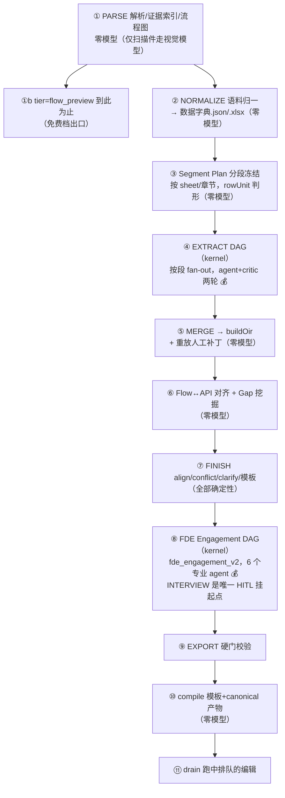

# OntoCopilot「开始梳理」：迭代式 Ontology 生成、数据字典与材料映射

**日期：** 2026-08-25
**性质：** 现状分析 + 方案设计（本轮只出文档，不改代码）
**三个诉求：**
1. Ontology 生成复杂且必须迭代——数据对象的梳理要能列出**数据字典表格**；
2. 右侧 sidebar 各功能模块**动态展示**，且**每个模块都能全屏查看**；
3. 业务材料的梳理与 Ontology 之间的 **mapping 与生成**，如何用 AI 完成——深度思考 + 业界方法调研。

**本轮方法：** 三路并行盘点（后端全链路 118 次工具调用、UI 现状 42 次、外部方法调研），对照 `docs/` 下三份前期文档（08-17 管线设计、08-17 右栏重设计、08-19 完备度审计）逐条核实落地状态。文中 file:line 均来自本轮代码盘点；真实库数字（527 对象 / 26 属性等）沿用 08-19 审计对 `workspace/ontocopilot.db` 的实测口径。

---

## 0. 执行结论

**三句话：**

1. **「开始梳理」的第一轮生成链路是成熟的**（直线代码 + 两个付费 DAG，证据链贯穿始终），但**字段层是全链路最薄的一环**：数据字典已经存在（`数据字典.xlsx`，零模型产出），却是个「孤儿产物」——没有口径列、出处不可点、不进交付包、UI 只能当文件下载。而口径恰好在另外两份产物里各有一份（OIR 的 `PropertyType.definition`、模板 `02_属性明细`）。**三份字段级信息互补但互不相识，把它们编织成一张「对象级数据字典视图」是投入产出比最高的一步，且几乎零模型成本。**

2. **右栏「动态展示」已通约 80%**（SSE 推送驱动，产物就绪自动上屏），缺的是**过程**而非结果：没有阶段进度、内核推理轨迹被一个旧 tab 守卫挡住上不了新界面、跑完一轮不说「本轮变了什么」。**「全屏」只有流程画布 1/6**，但所有产物类型的渲染出口已收敛到唯一的 `ContextViewer`——在它的 header 加一个全屏按钮，一处改动覆盖表格/Markdown/文档/图片/PDF/画布六种。

3. **材料 ↔ Ontology 的 mapping 不是一个待发明的新功能，而是四个已有半成品的接线问题**：正向证据链已有（`Assertion.evidence`）、列画像已有（`ColumnProfile`）、来源列字段已进抽取 schema（08-19 A1）、字段归一已有（`normalize.ts`）。缺的是：字段级对齐的**键打通**（`表名.列名` ↔ property rid）、**未映射证据**队列（材料里读到了但没进模型的部分）、以及把 mapping 本身升格为**可审阅、可迭代的一等产物**。业界方法（§6）印证了这个方向：LLM 负责提候选和起草口径，确定性代码负责合并与校验，人负责拍板——OntoCopilot 已经是这个架构，要补的是字段层和第二轮。

---

## 1. 「开始梳理」现状全链路

### 1.1 入口

UI「开始梳理 N 份材料」按钮（跑过一轮后变「重新梳理」，同一入口）调：

```
POST /api/sessions/{sid}/build?tier=full|flow_preview
```

- 按钮源码 [upload.ts:19-27](../ts/src/ui/upload.ts)，路由 [routes.ts:100-104](../ts/src/server/pipeline/routes.ts)；
- 材料不在请求里——已提前经 `POST /files` 落到 `session_file` 表和 `workspace/{sid}/materials/`；
- 三个入口共用同一个 `claimAndStartBuild`（HTTP 按钮 / 对话工具 `build.start` / 免费档 `flow.preview`），租约防重复启动；
- `awaiting_answer` 时 409 拒启，但**只有 blocking 问题才扣状态**（[questions.ts:31-37](../ts/src/server/glue/questions.ts)）——4044 条普通 open 问题不阻塞重跑；
- 顺带发现：UI 发的 `{lang}` 请求体被路由层丢弃（[routes.ts:103](../ts/src/server/pipeline/routes.ts) 只读 query），是死参数。

### 1.2 管线：直线代码 + 两个付费 DAG

主实现 [run.ts:246-1012](../ts/src/server/pipeline/run.ts)（`runPipeline`）。**不是一张大 DAG**，而是直线确定性代码中间嵌两个 kernel Scheduler DAG：



要点：

- **付费只有两段**：④ EXTRACT（按段 fan-out）和 ⑧ Engagement（`INTAKE→PROCESS→ERP_MAP/RULES/DATA_OBJECTS→GAP→INTERVIEW→CANONICALIZE→REVIEW→EXPORT`，首轮 `modelAnalysis: true` 真跑 agent，[harness.ts:157-160](../ts/src/server/glue/harness.ts)）。其余全是确定性代码——流程图、数据字典、对齐、冲突、模板编译、canonical 编译都零模型。
- **journal resume 按材料指纹**：`runId = run_{sid}_{语料 sha256 前 8}`（[session.ts:554-575](../ts/src/server/session.ts)），语料没变的节点从日志读回不重付费；决策参与指纹，所以 fork 改了决策自然全量重算。
- **08-17 管线设计文档的流水线图漏了 ② NORMALIZE 这一站**——而它恰恰是唯一的字段级产物（见 §3）。

### 1.3 产物与存储

一次完整跑产出（实测 `workspace/fc58b72e91bd/`）：`流程图.svg/.mmd/flow.json`、**`数据字典.json/.xlsx`**、`oir.json`、`模板_v1.xlsx`、`ontology.package.json` + 5 个视图 JSON、`问题清单.xlsx/.md/.json`、journal。

存储三层单位（别混）：**session**（工作台，跨多次梳理）→ **run 行**（一次调用，`kind='build:full'`）→ **runId**（材料内容指纹，resume 复用单位）。产物投影全在 `session_state` 键值表；版本机制三套并行各司其职：`artifact_revision` 整数（交付包版本）、undo 栈（深 20，配补丁日志供重跑重放）、`revision_record` 台账（append-only，问答与对话编辑都记行）。

### 1.4 迭代面现状：编辑能力很宽，缺的是「往哪看、改什么」

第二轮入口盘点（详见 [tools.ts](../ts/src/server/dialogue/tools.ts)，41 个对话工具）：

| 入口 | 能力 |
|---|---|
| 整体重跑 | 人工补丁重放 + journal resume 不重付费；对不上的显式报 `stale_edits` |
| 免费档 | `tier=flow_preview` 只重出流程图 |
| 问答闭环 | `question.next`（分诊后 4044→161 条可问）→ `question.answer` → 零模型 recompile |
| 对话编辑 | `oir.edit` 21 个 op（含 `merge_objects`/`set_status_batch`）、`flow.edit` 20+ op（含 `apply_patch` 原子批量、`bind_auto`） |
| 跑中编辑 | durable mutation queue，run 收尾统一应用，可 undo 可重放 |
| 分叉 | `POST /fork` 按决策 ordinal 分叉，产物由重跑重建 |
| 走查/对比 | `flow.walk`、`sketch.diff`、`revision.diff`、`readiness.report` 全零模型 |

**结论：第二轮的「动词」在 08-24 之后已经基本补齐了。现在卡迭代的不是编辑能力，是三个「看不见」：**

1. **字段层信息断裂**（§2、§3）——FDE 看不到一张完整的数据字典表，也就无从逐字段核对与拍板；
2. **过程不可见**（§4）——跑几分钟的梳理没有阶段进度，内核轨迹被挡，跑完不说变了什么；
3. **mapping 缺口没有队列化**（§5）——「材料里读到了但没进模型的证据」「模型里挂不上来源的字段」没有成为可分派的工作清单。

---

## 2. 为什么 Ontology 生成必须迭代——以及卡点的结构性原因

### 2.1 迭代的必然性（三条硬理由）

1. **材料是底层业务现实的异构、局部、互相矛盾的投影。** 制度文档是规范视角，Excel 台账是实例视角，API/DDL 是实现视角，访谈是口述视角。任何单轮抽取只能得到「各视角候选的并集」，一致性（同一对象的粒度、同一阈值的两种写法、同名异义）必须靠后续对齐与人工裁决。真实案例：同一条「5 万元审批阈值」在规则里写「50,000」、在流程边上写「5万」，机器只有在两者都结构化之后才能发现矛盾（08-19 审计 §1.3）。

2. **口径、主键、SoR 是业务决策，不是文本事实。** 材料里往往根本没写「采购申请的业务主键是什么」——这不是抽取能力问题，是信息不存在，必须由数据 Owner 拍板。所以管线的正确形态是「AI 提候选 + 证据展示 + 人确认」，而确认本身就是迭代。

3. **静默失效是最大的敌人**（「不许硬编码」纪律的由来）。任何按上一份材料形状写死的判据换一份材料就整体静默失效。防线只有一条：**每条产出带真实 locator，推不出出处就不产出**——这决定了生成必须是「证据驱动的增量收敛」而不是「一次生成到位」。

### 2.2 现状离「可迭代」还差什么：字段层信息断裂的解剖

真实库的病灶（08-19 实测）：527 个对象、26 个属性（0.05 属性/对象）；三个真跑材料的会话属性产出 0/0/3。08-19 之后 A1（抽取 schema 补齐 `value_domain/semantic_type/precision/example/source_column` + actions/events/rules 三个新桶）已落地，抽取侧的天花板抬起来了。但**字段级信息现在散落在三个互不相识的地方**：

| 载体 | 有什么 | 缺什么 | 产出成本 |
|---|---|---|---|
| **`数据字典.xlsx`**（[normalize.ts:154-260](../ts/src/onto/normalize.ts)） | 归一字段名、各处叫法、类型票数、出现位置（文件｜表｜列）、逐条冲突 | **口径**（归一层「只登记不判断」）；出现位置是人读字符串**不是 locator**；样例值/空值率/唯一性在 JSON 里但 **xlsx 没导出**（[normalize.ts:276-290](../ts/src/onto/normalize.ts)）；**不进交付包**、无专属路由，UI 只能下载 | 零模型 |
| **OIR `PropertyType`**（[oir.ts:401-417](../ts/src/onto/oir.ts)） | `definition`（口径，一等字段）、`baseType/unit/required/valueDomain/semanticType`、证据 `Provenance[]`（可点回原文）、状态机 | 样例值、来源列、画像；且 UI 上属性只是 6 行截断的行列表，**看不全** | EXTRACT 段付费产出 |
| **模板 `02_属性明细`**（[template.ts:579-583](../ts/src/onto/template.ts)） | `parent/apiName/baseType/definition/unit/required`，definition 是 REQUIRED 必填列，回传有锚点对号机制 | 来源、样例值、约束、各处叫法 | 零模型（从 OIR 投影） |

**这三份表互补但不相交，也没有任何代码把它们连起来。** 更具体的断点：列画像的键是 `表名.列名`（[parse/index.ts:229-258](../ts/src/onto/parse/index.ts)），而消费方按 property rid 查——数据承载链路是死的（08-19 A14，至今未接）。A1 给抽取 schema 补的 `source_column` 字段正是打通这个键的桥，但落库后还没有任何消费方。

这就是「数据对象的梳理需要数据字典表格」这个诉求在代码层的真实含义：**不是新做一个抽取能力，而是把三份已有的字段级信息按 property 为主键编织起来，投影成一张可审阅的表。**

---

## 3. 数据字典表格：从「字段登记表」到一等产物

### 3.1 设计原则

沿用两条既有纪律：

1. **不建第四个 store，做投影。** 08-19 审计发现「三套 context read-model 并存，最厚的那套在装配点被丢弃」的教训在前——数据字典视图必须是 OIR × NormalizedCorpus × ColumnProfile 之上的**只读投影**，字段的唯一真相仍在 OIR（口径、状态、证据），归一层的唯一真相仍在 `normalized`（叫法、画像、出现位置）。
2. **列算出来，不硬编码。** 有内容才出列：没有任何枚举值就不出「值域」列；没有画像就不出「样例值」列。每个单元格能追溯——口径来自 OIR 就带 origin 徽标，出现位置从字符串升级为真 locator（`{kind:"range", sheet, rows}` 已在 row 切片里，[tabular.ts:1344-1349](../ts/src/onto/parse/tabular.ts)，只是归一层没带出来）。

### 3.2 目标形态：对象级数据字典视图

以「对象」为单位的字段级表格（这正是 FDE 和业务方核对数据对象时的工作面）：

| 列 | 来源 | 出现条件 |
|---|---|---|
| 字段（displayName / apiName） | OIR PropertyType | 恒出 |
| 类型 | OIR `baseType`；括注归一层类型票数（如 `DECIMAL（3 处一致)`） | 恒出 |
| **口径** | OIR `definition`；空则显式「未定义——待业务确认」并可一键生成问题 | 恒出（空值即缺口信号） |
| 必填 / 单位 / 值域 | OIR `required/unit/valueDomain` | 有值才出列 |
| 主键 | ObjectType `primaryKey` 命中标记 | 对象声明了主键才出 |
| **来源** | 归一层 occurrences（文件｜表｜列），升级为**可点 locator** 回原文 | 有出现记录才出 |
| 各处叫法 | 归一层 `names[]`（≥2 种叫法才出） | 条件出 |
| 样例值 | ColumnProfile `samples[5]`（经 `source_column` 键打通） | 画像命中才出 |
| 画像 | `null_rate / unique / distinct_ratio`（空值率高、疑似唯一列等直接是主键/必填的证据） | 画像命中才出 |
| 证据 | Assertion origin 徽标（材料 / 通识 / 已确认）+ confidence | 恒出 |
| 状态 | Status（candidate/proposed/confirmed/rejected） | 恒出 |
| 未决 | 关联的 open question 数，点击进审阅 | 有才出 |

这张表同时是四样东西：**FDE 的审阅面**（逐字段核对口径）、**业务方的回传件**（模板 `02_属性明细` 的超集，锚点机制现成）、**将来 hydration mapping 的雏形**（物理列 ↔ 逻辑属性，见 §5）、**代码生成的输入**（DDL/表单所需的类型、约束、主键都在这一张表上）。

### 3.3 实现路径（按接线量从小到大）

**P0-a｜键打通（后端，零模型）：**
- `buildOir` 落库 `source_column` 时同步把 `表名.列名` → property rid 的映射写进一张投影表（或直接挂在 PropertyType 的扩展槽）；
- 归一层 occurrences 带上 row/schema 切片的 locator（数据已在 `_chunks` 里，補一次 join）；
- 效果：ColumnProfile 第一次能按 property rid 查到——A14 复活。

**P0-b｜投影接口（后端）：**
- 在 `/api/sessions/{sid}/context` 聚合里加 `dictionary` 段，或新开 `GET /api/sessions/{sid}/dictionary?object=`：输入 object rid，输出上表结构的 JSON（列名数组 + 行数组 + 每格的 locator/origin 附注）；
- `数据字典.xlsx` 导出升级：补「口径」列（从 OIR 反灌）、补样例值/约束列（JSON 里已有的数据导出来）、进 bundle 的 manifest 分类。

**P0-c｜UI 表格视图（前端）：**
- `ModelDetail` 的 `AttributeTable`（现状 6 行截断行列表，[context-sidebar.tsx:2303-2351](../ts/src/ui/react/context-sidebar.tsx)）加「以表格查看」入口，把字典 JSON 适配成 `ViewerSheet{name, columns, rows}`（接口只有三个字段，[context-sidebar.tsx:121-125](../ts/src/ui/react/context-sidebar.tsx)），复用现成 `ViewerTable`——白拿 sticky 表头、双向滚动、以及 §4 做完之后的全屏；
- 行内动作沿用既有范式：点缺口格 `prefillComposer` 预填补齐指令（R1 已落地的同款交互）。

**P1｜口径起草（唯一需要模型的一步，也可延后）：**
- 对 `definition` 为空的字段，用一次批量 LLM 调用起草口径**候选**：输入=字段名+各处叫法+样例值+所在表上下文，输出=草稿口径，origin 标 `inferred`、status 保持 candidate，绝不自动 confirmed——和现有信任规则完全一致；
- 业界对应做法见 §6（column description generation / semantic annotation），这是文献里成熟度最高、风险最低的 LLM 用法之一。

---

## 4. 右栏动态展示与全屏

### 4.1 现状（本轮 UI 盘点结论）

- 右栏已是 **SSE 推送驱动**的 React 应用：19 种事件命中即重拉 `/state` 重渲染（[sse.ts:95-99](../ts/src/ui/sse.ts)），五域导航「项目/文件/模型/审阅/交付」已落地（08-17 右栏重设计的 P0 骨架基本完成）；
- **所有产物类型的渲染出口已收敛到唯一的 `ContextViewer`**（[context-sidebar.tsx:2036-2060](../ts/src/ui/react/context-sidebar.tsx)）：画布/图片/PDF/表格/Markdown/文档正文/JSON 七路分发；
- **全屏只有流程画布有**（`.ctx-graph-full`，fixed+inset+Esc 范式已跑通，还留了 container query 踩坑注释，[index.template.html:664-669](../ui/index.template.html)）；
- 过程可见性三个洞：无阶段进度指示；内核推理轨迹已在采集（`kernel.thought/plan/observation` → `G.TRACE`）却被 `if (G.TAB === "think")` 守卫挡住（[sse.ts:76](../ts/src/ui/sse.ts)），而新导航里根本没有 think——**梳理跑几分钟，AI 在想什么一个字都看不到**；跑完一轮不说「本轮变了什么」（08-19 backlog R6，至今未修；R3 影响范围/证据对照常驻也未修）。

⚠️ 改动纪律：`ui/index.html` 是构建产物。CSS/骨架改 `ui/index.template.html`，组件改 `ts/src/ui/react/*`，然后 `cd ts && npm run build:ui`（同步 `ts/dist`）。

### 4.2 方案：三个改动层次（全部长在现有 `.ctx-*` 体系里）

**第一层｜产物级全屏（一处改动覆盖六种产物）：**
- 把 `.ctx-graph-full` 泛化成 `.ctx-full`，在 `ContextViewer` header 的 `.ctx-viewer-actions`（现有「返回/新开/下载」旁）加「全屏」按钮，样式复用 `.ctx-head-action`；
- Esc 退出、`z-index` 与既有 overlay 体系错开；
- **必须处理的坑**（画布全屏已示范）：fixed 层跳出 `container:preview` 后 `cqh` 单位和 `@container` 断点失效——给全屏层自套 `container-type:inline-size` 或复制断点，不能只加 `position:fixed`；
- 效果：数据字典表格、宽表、Markdown 报告、PDF、大图全部可全屏——**440px 栏宽里横滚宽表的痛点直接消失**。

**第二层｜面板级全屏（每个功能模块整页放大）：**
- 在 `ContextSidebar` 层（body 分发在 [context-sidebar.tsx:3284-3295](../ts/src/ui/react/context-sidebar.tsx)）为「模型/审阅/交付/文件」提供整面板全屏——本质是把当前 section 渲染进 `.ctx-full` 容器，≥680px 的 split 视图（目录+详情并排）在全屏态天然可用；
- 这是 08-17 设计里「720-900px 展开式审阅工作台」的低成本等价物：不动中间聊天区，先给全屏遮罩层，将来再演进「在主画布打开」。

**第三层｜过程可见性（动态展示的「过程」半场）：**
1. **阶段进度**：`engagement.stage / node.entered / node.completed / plan.frozen` 事件已经在发（[run.ts:314-902](../ts/src/server/pipeline/run.ts) 多处），`engagementView` 已把 DAG 投影成阶段状态（[sessions.ts:363-382](../ts/src/server/routes/sessions.ts)）——项目页的 Engagement 步骤列表升级为「当前阶段高亮 + 已完成计数 + 阶段产出摘要」，纯前端接线；（顺带修一个真 bug：`engagementView` 硬编码返回 `fde_engagement_v1`，实际 DAG 已是 v2。）
2. **推理轨迹接进新导航**：去掉 `G.TAB === "think"` 守卫，把 `G.TRACE` 挂到「项目 → 活动」区（08-17 设计本来就规划推理迁入活动），跑梳理时右栏实时滚动「读了哪段材料、抽出了几个对象」；
3. **「本轮变了什么」（R6）**：数据源现成——revision 台账 + `export.file source=changelog`（会议简报）已能算出「第 N 版之后的变更」；在梳理完成事件后，项目页顶部压一张可展开的回执卡（S8 范式）：`本轮新增对象 12 · 属性 +87 · 3 处与上轮冲突`，点击进 `revision.diff`。

---

## 5. 业务材料 ↔ Ontology 的 mapping 与生成：方法论

### 5.1 先把「mapping」拆开：它是四个不同的东西

讨论「材料和 Ontology 之间的 mapping」容易含混。按方向和粒度拆开，四个面各自有不同的机制与成熟度：

| # | 面 | 问题 | OntoCopilot 现状 |
|---|---|---|---|
| M1 | **正向生成**（材料→模型） | 从材料产出候选断言 | ✅ 成熟：parse→segment→extract→merge，按段 fan-out + critic |
| M2 | **反向溯源**（模型→材料） | 每条断言的证据在哪 | ✅ 成熟：`Assertion.evidence: Provenance[]`，`cite()` 可点回原文，交付包去重成 `evidenceIds` |
| M3 | **覆盖与缺口**（双向对账） | 材料哪些部分**没**进模型？模型哪些部分**没有**材料支撑？ | ⚠️ 半：后者有（origin=inferred / generic_assumption 标记 + gap 挖掘）；前者「未映射证据」只存在于 08-17 设计文档，未实现 |
| M4 | **字段级对齐**（物理列↔逻辑属性） | 哪张表哪一列承载哪个属性 | ⚠️ 最弱：`source_column` 已进抽取 schema 但无消费方；画像键 `表名.列名` 与 property rid 对不上（§2.2） |

**M4 就是数据字典（§3），M3 是第二轮迭代的工作队列（§5.4），这两个面是本轮方案的主攻方向。** M4 同时是将来对接实现层的地基——Palantir Foundry 把「数据集列 → ontology 属性」的绑定称为 hydration，是 FDE 工作流的核心一步；dbt/Cube 等 semantic layer 维护的也是同一类「业务概念 ↔ 物理字段」映射（业界对照见 §6）。

### 5.2 生成的分层策略：确定性优先，LLM 只做确定性做不了的事

OntoCopilot 已经隐式采用了这个分层，明确写出来作为后续投入的判据——**每一层只在下一层失效时才升级**：

```
L1 结构直映射（零模型）   DDL/OpenAPI/BPMN/表头 → 对象/字段/端点/流程骨架
L2 统计画像（零模型）     ColumnProfile：类型推断、唯一性→主键候选、枚举检测、空值率→必填候选
L3 语义候选（LLM）        命名归一、表→对象判定（rowUnit）、列→属性挂载、口径起草、跨表同名对齐
L4 一致性验证（零模型）    结构校验、冲突检测（TYPE_MISMATCH 等 8 类）、critic（coverage/provenance）
L5 人工裁决（HITL）       问题分诊 → 业务方回答 → Decision → 局部重算
```

这个分层的推论直接指导「如何用 AI」：

- **L2 是被低估的一层**：`unique=true` 的列是主键候选的硬证据，`null_rate` 是必填的硬证据，`distinct_ratio` 低是枚举的硬证据——这些不需要 LLM，但现在因为键断裂没有回灌到 OIR（§2.2）。先接线再谈模型。
- **L3 的正确用法是「批量、带证据输入、只产候选」**：口径起草（§3.3 P1）、同名异义判定、别名聚类。输入必须带样例值和上下文（否则 LLM 只能看名字猜），输出一律 origin=inferred + candidate，升级走 L5。
- **L4 是防静默失效的唯一防线**：换一份材料，L3 的候选质量会波动，但 L4 的校验和 L5 的拍板不变——这就是「不许硬编码」在架构上的兑现。

### 5.3 为什么 LLM 不能一步生成 Ontology（深度思考的核心论点）

三个结构性原因，决定了「大模型直出完整本体」在企业场景不成立：

1. **全局一致性 vs 局部抽取**。Ontology 的价值在全局约束（同一对象只有一个粒度、主键全局唯一、关系两端存在），而 LLM 抽取天然是局部的（按段、按文档）。一致性只能靠确定性 merge + 校验层收敛——这正是 OntoCopilot「按段 fan-out + 零模型 MERGE」的架构理由。业界同构：GraphRAG 与各类 Text2KG 管线全都把「抽取」与「去重归一/对齐」拆成独立阶段（§6）。

2. **信息不在材料里**。口径、主键、SoR、权限往往材料里根本没写。LLM 补出来的是「行业通识」，必须显式标记（generic_assumption 机制），否则通识伪装成客户事实是最危险的静默错误。所以「生成」的上限是「候选 + 好问题」，闭环必须过人。

3. **本体是决策的累积，不是文本的函数**。同样的材料，做资产管理和做流程再造会建出不同的本体（范围、粒度、To-Be 取舍不同）。这决定了迭代不是「修 bug」而是本体工程的常态——对应机制就是 Decision Ledger + fork（决策参与 runId 指纹，改了决策自动全量重算）。

**推论：衡量「AI 梳理能力」的正确指标不是一轮产出多少实体，而是：① 每条产出可追溯率（locator 命中）；② 候选→confirmed 的转化率（人拍板效率）；③ 每轮迭代的信息增益（分诊已在算 informationGain）；④ 新材料进来时的增量重算比例。**

### 5.4 第二轮迭代的工作队列：把 M3 做成产物

现有分诊漏斗（4044→161 条可问）解决了「问题太多」的问题；还缺「问题从哪来」的另一半——**mapping 缺口本身要成为队列**：

1. **未映射证据队列**：解析产出的 chunks 里，没有被任何 Assertion 引用的 row/schema/段落切片，按文件×表聚合成「这份材料还有 N 张表 / M 段没进模型」。数据全在 `_chunks` 与 evidence 索引里，是一次零模型的反向 join。这直接回答 FDE 的经典问题：「材料我都传了，你都看了吗？」
2. **无源字段队列**：OIR 里 origin=inferred 且没有 occurrences 命中的属性——「模型里有、材料里找不到」的存疑清单。
3. **字段冲突队列**：归一层已逐条记录的类型票冲突（`FieldEntry.conflicts`）升级为 question，走既有分诊。

这三个队列 + 数据字典表格 = 第二轮迭代的完整工作面：FDE 打开一个对象，看到字段表、每个字段的来源与样例、缺口徽标，逐个拍板或转问业务方；回答落 Decision，零模型 recompile 更新视图。

### 5.5 业界方法综述

来源两路：用户定向文献梳理（截至 2026-08，范围综述）+ 本轮并行网络调研。先给文献总图景，再逐条对照 OntoCopilot。

#### 5.5.1 文献总结论：稳健路线不是「一次生成」，而是分层收敛

文献中表现最稳健的路线：

```
业务资料 → 术语表 → 用户故事/能力问题(CQ) → 分模块建模 → OWL/KG/BPMN → 自动校验 → 专家确认
```

AI 已适合做「建模副驾驶」（术语抽取、概念分类、关系发现、需求整理、草稿生成、一致性检查），但**不适合在缺乏业务专家复核的情况下全自动产出企业级本体**。

**Ontology 自动生成与知识工程：**

| 文献 | 关键结论 |
|---|---|
| Asim et al. 2018（Ontology Learning 综述） | 传统方法精度可控但依赖领域语料/种子本体/人工规则；非分类关系与复杂约束处理弱 |
| **LLMs4OL**（Giglou et al., ISWC 2023） | LLM 可参与术语类型识别、Taxonomy 发现、非分类关系抽取——但解决的是「本体原语发现」，≠ 自动生成完整逻辑正确的 OWL |
| Mateiu & Groza 2023 | 微调模型把自然语言转 OWL Functional Syntax，适合局部公理（继承/domain/range/基数），本质是受控语句翻译器 |
| Shimizu & Hitzler 2025 | **模块化 Ontology**：先定位业务模块再在模块内建模，比整体塞给模型稳定 |
| **Ontogenia / Memoryless CQbyCQ**（Lippolis et al., ESWC 2025） | 从用户故事和 CQ 直接生成 OWL 草稿；配推理模型优于新手建模者，但频繁出现错误 domain/range、重复概念——**必须多维校验** |
| Aggarwal et al. 2026 | 关系分类（broader/narrower/same-as）最佳 F1 近 0.97；小模型+好提示可接近商业大模型——但只覆盖关系分类 |
| Li et al. 2025（系统综述，30 篇/41 实验） | 61% 集中在本体实现、24% 在需求、**维护仅 2.4%**；缺统一任务定义与评价标准，人工参与仍是主流 |

**AI 辅助业务梳理、需求与流程建模：**

| 文献 | 关键结论 |
|---|---|
| Umar & Lano 2024（85 篇需求工程自动化回顾） | 59% 是半自动工具——**「AI 辅助 + 人工决策」在 LLM 之前就是结论** |
| Zadenoori et al. 2025（74 项 LLM+RE 研究） | 76% 是实验室研究，真实现场研究仅约 7%；RAG 应用还少 |
| **Kourani et al. 2025**（16 个 LLM 评测流程建模） | 通过 **POWL 中间表示**保证流程 soundness；**模型「自评」不可靠，按明确规则迭代修改输出有效** |
| Li et al., Findings 2025 | 微调整体准确率最高；few-shot CoT 对嵌套网关/并行分支/不完整描述更有优势 |
| Nast et al. 2025（企业建模案例） | LLM 能发现遗漏项、生成初稿，但不能替代熟悉企业现状的专家；越依赖企业内部事实，越需要资料检索 + 人工确认 |
| Hörner et al. 2026（BPMNGen） | 自然语言→BPMN 2.0 + 对话式修改；简单/中等流程可用，复杂多参与方流程仍遗漏语义 |
| **BREX**（Yang et al., ACL 2026；409 份真实业务文档、2,855 条专家标注规则） | 业务规则**先转伪代码等可执行中间表示**再处理，明显优于普通提示——尤其条件分支、例外、并行规则 |

注意一个术语陷阱：很多论文说的「Ontology Generation」实际只做了术语/层级/三元组抽取；完整 Ontology 还需要约束、公理、逻辑一致性、CQ 覆盖和可维护的模块边界。

#### 5.5.2 文献五条一致认识 × OntoCopilot 现状对照

这是本节的核心：**文献的每一条主流结论，要么验证了 OntoCopilot 的既有架构，要么精确指出了缺的半场。**

| # | 文献一致认识 | OntoCopilot 现状 | 判定 |
|---|---|---|---|
| 1 | **需求驱动优于自由生成**：先有用户故事/CQ（「哪些合同由供应商签署？」），再生成本体 | 问题清单是**缺口驱动**（自下而上：conflict/gap/lint→question），没有自上而下的 CQ 输入；BuildRequest（08-17 设计 §1.3）仍未实现 | ⚠️ **缺的半场**——见 §5.6-1 |
| 2 | **模块化优于全量生成**：按客户/合同/订单/流程等业务域分别建模再对齐 | 分段抽取按**材料结构**（sheet/章节）切，不按业务域；跨段同域信息靠 MERGE 收敛 | ⚠️ 部分等价——材料结构常与业务域重合，但登记表类材料会把多个域混在一段（§5.6-2） |
| 3 | **中间表示非常重要**：受约束 JSON/DSL/POWL/伪代码，再由确定性程序转换，不让模型直接维护 OWL/BPMN XML | **OIR 正是受约束 JSON IR**，FlowGraph 而非直出 BPMN，strictify 强制 schema——架构完全一致。BREX 的「规则→可执行中间表示」对应 rule_engineer 已在算的 `condition/effect/test_cases`——**但交付契约把它丢了**（08-19 A3，未落地） | ✅ 已验证 + 🎯 A3 优先级被文献直接抬高 |
| 4 | **业务资料必须作为证据源**：每个概念/关系/规则保留来源文档记录 | `Assertion{origin, evidence: Provenance[]}` 贯穿全链，generic_assumption 显式标记通识 | ✅ 已验证；且「真实现场研究仅 7%」反衬本项目「新工具必须拿真实会话验证」的纪律在文献前面 |
| 5 | **评估要多维**：语法 / 逻辑 / 需求覆盖 / 结构 / 业务语义 / 可追溯 六格 | 语法=`schema_valid`✅；逻辑=structureDefects/conflict 八类✅；结构=lint✅；业务语义=HITL+Decision✅；可追溯=locator✅；**需求覆盖（CQ 能否被回答）= 缺** | 六格有五格，缺的正好又是 CQ |
| 补 | **模型自评不可靠，按规则迭代修改有效**（Kourani） | critic 正是规则档 findings 驱动重试（coverage/provenance 两轮），且降级最低保 1 轮规则档评审 | ✅ 已验证 |

**结论：OntoCopilot 的架构方向被文献整体印证（中间表示、证据 grounding、确定性校验、HITL），真正缺的是「CQ 需求驱动」这半场——它同时补齐评估六格里缺的那一格。**

#### 5.5.3 三层产物框架的对照

文献建议的落地形态分三层，与 OntoCopilot 一一对应：

| 文献三层 | OntoCopilot 对应 | 完整度 |
|---|---|---|
| 业务语义层（术语/概念层级/对象关系/约束） | OIR → OntologyPackage（dataObjects/links/rules） | 结构全、**字段层薄**（本文 §2-§3 的主题） |
| 业务运行层（角色/活动/事件/网关/输入输出） | FlowGraph（action/event/gateway/stage）+ Engagement | 骨架全，Workflow 容器/节点绑定弱（08-19 §3.6） |
| 需求与证据层（用户故事/CQ/规则/来源段落/确认记录） | Evidence + Question + Decision Ledger + revision | 证据/确认强，**CQ 缺位** |

分工同样一致：AI 负责归纳/候选/冲突发现/初稿转换；专家负责歧义裁决；规则引擎与一致性检查负责质量门禁。

#### 5.5.4 业界工程实践（本轮网络调研）

文献之外，四类工程实践直接对应本文的 M4（字段级对齐）与迭代机制。

**(a) Palantir Foundry 官方建模方法论——最重要的一条纠偏**

Foundry 把 Ontology 定义为「组织的数字孪生」，通过把数据集与模型映射到 object type / property / link type / action type 来整合数字资产；「property 之于 Ontology，类比于 column 之于 dataset」。但其[建模最佳实践](https://www.palantir.com/docs/foundry/ontology/ontology-best-practices)给出了一条**明确的反模式警告**：

> 「Ontology 建模的是真实世界，不是源数据。」对象应代表语义上有意义的真实概念（Patient、WorkOrder、Vessel），**不是数据库表、API 响应或电子表格页签**；链接应代表真实关系（「这位患者去过这家机构」），**不是 join key 或外键产物**。被要求「把一个数据集 ontologize」时，要**抵制把列 1:1 映射成属性就算完事的冲动**。

其余要点：**先与业务干系人识别真实概念，再看源 schema**（一份 CSV 可能描述三个实体而不是一个）；命名要业务语义（`equipment.lastInspectionDate` 而非 `equipment.dtLastInspMod`）；演进遵循**开闭原则**——已投产的核心类型保持稳定，通过新增链接类型/接口扩展而非修改核心；**「rule of three」**——同一结构在三个团队出现三次就该合并为规范表示；跨部门协作建模，孤岛是重复建模的首要原因。

**这对本文方案意味着什么（重要）：** 数据字典（M4）的定位必须**收窄为「可追溯性产物」而非「建模方法」**——它记录「这个属性的值由哪张表哪一列承载」，用于验证覆盖、发现缺口、支撑 hydration；它**不能反过来变成建模驱动力**（把源表的列清单换个名字当成对象的属性表）。OntoCopilot 现状恰好是这条警告的**反面极端**（0.05 属性/对象，列根本没接上），所以补 M4 是对的；但补的时候要守住两条：① 对象边界由业务概念决定（rowUnit 判形 + 业务方确认），不由表结构决定；② 字典表格里「来源列」是一列**溯源信息**，不是属性的定义来源——口径永远来自 OIR 的 `definition` 与业务确认。这与 §3.1 的「投影而非第四个 store」是同一条纪律的两面。

**(b) LLM schema matching（对应 K-401 列↔属性对齐）**

近两年该问题被系统研究，共识形态是**多阶段管线而非单次 LLM 判断**：[Magneto (VLDB 2025)](https://www.vldb.org/pvldb/vol18/p2681-freire.pdf) 组合小模型与大模型（小模型做候选召回、大模型做重排精判，兼顾成本与精度）；[Schemora](https://arxiv.org/pdf/2507.14376) 强调**多阶段推荐 + 元数据增强**（用列画像、样例值等元数据丰富待匹配项）；Matchmaker 用合成示例自我改进。工程动机很实在：把一个数据集映射到 OMOP 这类标准，人工往往需要 40–80 小时加领域专家复核。

→ 对 K-401 的直接指导：**先零模型召回（名称精确/归一名/结构命中），再让 LLM 只裁剪余量**；输入必须带列画像和样例值（元数据增强），而不是只给列名。这正是 §5.2 的 L1→L2→L3 分层在字段对齐上的具体形态。

**(c) 语义表格解释（SemTab / CTA / CEA / CPA）**

[SemTab 挑战赛](https://sem-tab-challenge.github.io/2025/)自 2019 年起提供年度基准，三个子任务分别是列类型标注（CTA）、单元格实体标注（CEA）、列属性标注（CPA）；2025 年主题即 LLM 与表格数据匹配。方法演进为传统管线 → 嵌入模型 → LLM 系统 → 检索增强框架，关键能力是**在缺少显式实体链接或 schema 对齐时，靠上下文推断列的潜在语义**。

→ 对我们的意义：把表格列**挂到既有对象的属性上**（而非新造属性）本质就是 CTA/CPA 任务；OntoCopilot 已有的 `semanticType`（金额/日期/编号/状态）槽位正是 CTA 的产物形态，A1 已开坑但还没有填充路径——K-401/K-402 落地时可一并产出。

**(d) 文档→KG 管线的阶段划分（EDC）**

[Extract-Define-Canonicalize (EMNLP 2024)](https://aclanthology.org/2024.emnlp-main.548/) 把构建拆成三段：**Extract**（开放抽取三元组，不预设 schema）→ **Define**（为每个发现的关系/实体类型生成自然语言定义，作为语义锚点）→ **Canonicalize**（把语义相近的 schema 成分归并为单一表示）；有目标 schema 时对齐之，没有时自建并自归一；再加一个检索组件把相关 schema 成分喂回抽取（RAG 式），显著提升效果。

→ 这与 OntoCopilot 的 `EXTRACT →（零模型）MERGE → 对齐/冲突` 是同构的，但有两点值得吸收：① **Define 阶段独立成段**——EDC 用「先给定义再归并」提升归并质量，对应我们的 K-402 口径起草应当**排在 K-403 别名聚类之前**（有口径才好判同义），这是本轮调研给出的顺序性结论；② 检索增强抽取——把已建立的 schema 成分回喂给下一段抽取，对应我们「跨段一致性」的潜在改进（当前段间靠 MERGE 事后收敛，不互相知情）。

**(e) 人机协同验证的量化结论**

[Tsaneva et al., IP&M 2025](https://www.sciencedirect.com/science/article/pii/S030645732500086X) 对 KG 验证的实验给出了少见的量化对照：LLM 单独做验证器**表现不佳**；引入 LLM 使精确率 +12% 但整体 F1 −5%；而 **LLM + human-in-the-loop 混合最佳，F1 +5% 且人工投入极小**。工程实现上，只对「LLM 置信度低于分歧阈值」的边触发人工复核，配 web 审核队列——某案例只人工验证了 0.4% 的边即维持了精确率。

→ 强力背书 OntoCopilot 的分诊漏斗（4044→161，约 4%）与「模型自评不可靠、规则档 critic 驱动重试」的设计；也给出改进方向：**分诊排序里应显式纳入置信度分歧信号**（现有 informationGain/blastRadius 之外），把人力集中在模型自己也拿不准的地方。

### 5.6 借鉴落点（文献 → OntoCopilot 的具体改动）

1. **CQ 机制（补需求驱动半场）**：
   - INTAKE 阶段接受可选的 CQ 清单（FDE 或业务方口述「梳理完之后要能回答哪些问题」），存进 BuildRequest/engagement 投影；
   - 没有人给 CQ 时，从材料+目标**生成 CQ 草稿**让 FDE 勾选（Lippolis 的 CQbyCQ 思路反着用：先定问题再建模）；
   - 验收侧：`readiness.report` 增加「CQ 覆盖」段——每条 CQ 能否被当前 OIR/Flow 回答（对象在不在、关系通不通、规则有没有），答不了的 CQ 自动变成 blocking question。这一格补上，评估六格齐了。

2. **模块化二次聚合（轻量方向，不重构分段）**：保留按材料结构分段的第一遍（它保证 locator 精确），对「一段混多域」的登记表类材料，用已抽出的对象聚类做**按业务域的第二遍定向扫描**——这正是 08-19 提出的 A2（登记表第二遍属性扫描）的文献版依据，实现上已被 sample_kit 方案吸收。

3. **A3 立即兑现（文献直接背书）**：`OntologyRuleV1` 接住 rule_engineer 已算出的 `condition/effect/exceptions/testCases`——BREX 证明可执行中间表示是规则处理的正确形态，而这份数据已经在付费产出后被白白丢弃。

4. **口径起草用「带证据的批量提示」**（§3.3 P1 的文献依据）：column/description generation 是文献里成熟度最高的 LLM 用法之一；输入必须带样例值与上下文，输出永远是 candidate——对应 Nast 的结论「越依赖企业内部事实，越需要检索+确认」。

5. **流程生成守住 FlowGraph 中间表示**：不接受「直出 BPMN XML」的诱惑（Kourani：正式中间表示比直接生成 XML 稳健）；BPMN 是导入源（确定性直映射已有）和将来的导出目标，不是模型的工作格式。

6. **维护阶段是文献空白、也是产品机会**：系统综述里维护只占 2.4%——而 OntoCopilot 的 revision 台账、补丁重放、fork、stale_edits 显式化恰恰全在维护侧。这是差异化能力，路线上应继续加注（三队列、变更回执、增量重算），而不是回头卷「一次生成质量」。

7. **数据字典的定位纠偏（Foundry 反模式警告，§5.5.4a）**：字典是**可追溯性产物**，不是建模方法。对象边界由业务概念定（rowUnit 判形 + 业务确认），不由表结构定；「来源列」是溯源列，口径永远来自 OIR `definition` 与业务拍板。落地上加一条守则：字典视图里**属性行的主键是 property rid，不是源列**——一个属性可以有多个来源列（多表承载），一个源列也可能不对应任何属性（未映射，进闭环 D 队列）。**一对一是特例，不是默认。**

8. **K-401 用「零模型召回 + LLM 裁剪余量」的多阶段形态**（§5.5.4b Magneto/Schemora）：候选召回走确定性（精确名/归一名/结构命中），LLM 只判余量且输入必须带列画像与样例值（元数据增强），不是只给列名。

9. **口径起草排在别名聚类之前**（§5.5.4d EDC 的 Define→Canonicalize 顺序）：有了定义再判同义，归并质量更高。这修正了 §1-⑥′ 里四件事的执行顺序——键打通 → 画像回灌 → **口径起草 → 别名聚类**。

10. **分诊排序纳入置信度分歧信号**（§5.5.4e）：混合方案最优且人工投入极小（0.4%~4% 量级），但前提是**把人力投在模型自己也拿不准的地方**；现有 informationGain/blastRadius 之外补一个分歧度信号。

---

## 6. 分期路线

> 编号顺延既有路线（第 0-3 层已在 08-24 前后落地至第 3 层部分），本节按「接线量从小到大、先看见再生成」排序。

### P0（接线周：几乎零模型成本）

1. **数据字典键打通**：`source_column` → property rid 映射落库；归一层 occurrences 带 locator（§3.3 P0-a）；
2. **字典投影接口 + xlsx 升级**：`/context` 加 `dictionary` 段；`数据字典.xlsx` 补口径/样例值/约束列，进 bundle manifest（P0-b）；
3. **UI 表格视图**：AttributeTable 加「以表格查看」，适配 ViewerSheet 复用 ViewerTable（P0-c）；
4. **产物级全屏**：ContextViewer header 加全屏按钮，`.ctx-graph-full` 泛化成 `.ctx-full`（§4.2 第一层）；
5. **过程可见性接线**：think 轨迹进「项目→活动」；阶段进度用现成 engagement 事件；顺修 `fde_engagement_v1` 版本串与 `{lang}` 死参数。

### P1（一个迭代：少量模型成本）

1. **面板级全屏**（§4.2 第二层）；
2. **「本轮变了什么」回执卡**（R6，数据源用 revision 台账 + changelog）；
3. **三个 mapping 队列**（§5.4：未映射证据 / 无源字段 / 字段冲突→question）；
4. **口径批量起草**（§3.3 P1，唯一的模型步，origin=inferred 纪律）；
5. **A3 兑现**：交付契约接住 rule_engineer 已算出的 condition/effect/testCases（§5.6-3，文献背书，数据白丢中）；
6. 补 08-19 遗留的 R3（影响范围/证据对照常驻）。

### P2（后续）

1. **CQ 机制**（§5.6-1）：INTAKE 收 CQ 清单（可从材料生成草稿供勾选）；`readiness.report` 增加 CQ 覆盖段，答不了的 CQ 自动升 blocking question——补齐评估六格的最后一格；
2. 数据字典回传闭环：业务方在 xlsx 上改口径/类型 → audit 落账（`mergeIntoOir` 需补 baseType/unit/required 的回写路径，08-19 已点名）；
3. hydration mapping 导出：字段级对齐成熟后，`列↔属性` 绑定作为独立交付件（对接 Foundry/ERP 实现层的地基）；
4. 「在主画布打开」：全屏遮罩演进为中间区画布协同（08-17 设计 P2）；
5. 三轴版本（Evidence Snapshot / Model Revision / Release）上头部。

---

## 附：与前期文档的关系

| 文档 | 关系 |
|---|---|
| 08-17 管线设计 | 阶段语义显式化（Stage Manifest）方向不变；本文把其中「字段阶段」具象成数据字典产物。两处需更新：engagement 已是 v2 且首轮真跑模型（不再是纯确定性投影）；流水线图漏了 NORMALIZE 站 |
| 08-17 右栏重设计 | P0 骨架已落地；本文的全屏方案是其「主画布」愿景的低成本第一步，不冲突 |
| 08-19 完备度审计 | A1 已落地是本文的前提；A14（数据承载）在本文 P0-1 复活；S1/S2/S3 已落地是字典视图的交互基础；R3/R6 纳入本文 P1 |
| 记忆纪律 | 不硬编码（列算出来、有证据才出）、不推倒 UI 风格（全部 `.ctx-*` 体系内）、改 ts/src 后 `npx tsc` + `build:ui` 双跑 |
