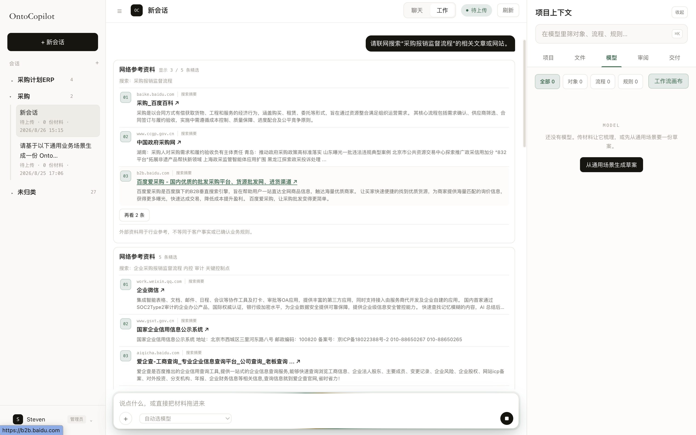
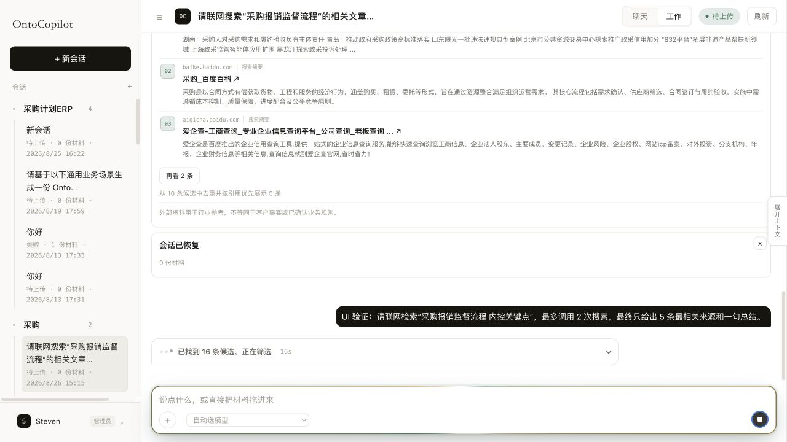
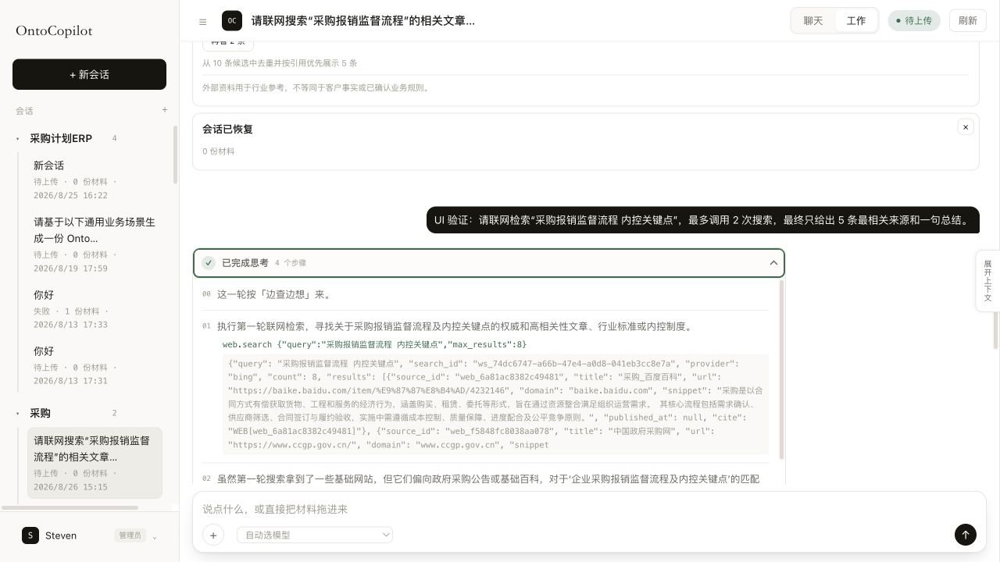
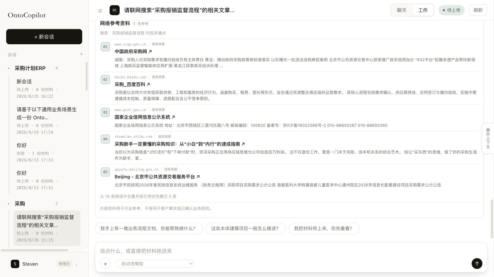

# OntoCopilot 聊天运行态 UX 审计与改进

日期：2026-08-26  
范围：联网检索运行态、Harness 思考与工具详情、最终网络来源卡、聊天主线与可访问性。

## 结论

本轮已解决两个阻断体验的 P0 问题：

1. 联网任务运行时不再把每一批搜索、正文读取候选画成完整文章卡；候选仍通过 SSE 持久化，聊天中只显示一行进度。
2. Harness 的思考、工具参数与结果默认隐藏；用户主动展开后才按需渲染，结束后仍可在对应回答附近复查。

最终回答落地后，同一轮的所有 `web.sources` 会按正文 `WEB[id]` 引用顺序优先、规范化 URL 去重、以正文读取结果升级摘要，合并为一张最多 5 条的参考卡。没有正式服务端选择信号时，UI 使用“参考”而不是“精选”，避免把到达顺序包装成算法结论。

## 证据

### 改造前：运行过程被中间候选卡占满

### 改造后：16 条候选仍只占一行运行进度

### 用户展开后：可查看 Harness 步骤、工具调用与结果

### 回答完成后：只展示一张、5 条参考来源

## 核心流程健康度

1. **发送联网检索 — 良好。** 用户消息乐观上屏，“思考中”立即出现，发送按钮切换为停止。
2. **运行中检索 — 良好。** 新候选只更新“正在搜索 / 已找到 N 条候选，正在筛选”，中间文章不进入聊天主线。
3. **查看运行细节 — 良好。** 原生 `details` 支持点击与键盘；折叠时步骤 DOM 不存在，展开后才加载。
4. **回答与来源落地 — 良好。** 同轮来源只生成一张卡，最多 5 个唯一 URL；失败或停止且无回答时仍有一张聚合兜底卡。
5. **刷新与重连 — 良好。** 推理步骤与来源都来自耐久事件，刷新后可恢复；旧 SSE 连接不会再清掉已出现卡片。
6. **长会话与移动端 — 待优化。** 当前会保护用户上翻位置，但缺少“新进展”提示；项目上下文在窄屏仍会挤压聊天。

## 本轮实现

### 运行时来源投影

- `web.sources` 继续实时进入事件状态，审计、断线续传和最终聚合能力不变。
- 当前轮存在 `THINKING/CHAT_ABORT` 且尚无助手回答时，不渲染新来源卡。
- 助手回答落地后，同轮 search/read 事件聚合为一张卡。
- 按引用顺序优先，其余按检索顺序补足；相同 ID/URL 去重，`fetched` 正文覆盖 `snippet_only` 摘要。
- 停止、失败或服务异常且没有回答时，按前一用户轮生成一张兜底卡，避免证据永久隐藏。

### 思考与工具披露

- 运行中默认仅显示业务进度，不在摘要里暴露 `web.search` 等内部工具名。
- 回答结束后显示“已完成思考 · N 个步骤”，默认折叠并与对应回答关联。
- 折叠时不挂载步骤或全局 Trace 明细；展开后才渲染，降低长会话 DOM 压力。
- 密码、Token、API Key、Authorization、Cookie、Secret、Credential 等字段递归脱敏。
- 单字段上限 12,000 字，单个披露区总上限 48,000 字；循环或超深对象不会冻结页面。
- 只保留聊天区一个 `aria-live`，秒数对读屏隐藏，避免重复和高频播报。
- 展开动画使用现有设计 token，并遵循 `prefers-reduced-motion`。

## 真实验收记录

验证提示：`请联网检索“采购报销监督流程 内控关键点”，最多调用 2 次搜索，最终只给出 5 条最相关来源和一句总结。`

- 运行中检索到 16 条候选，聊天底部只有一行折叠状态，没有新增文章卡。
- 展开后看到 4 个步骤、2 次 `web.search` 调用及各自结果。
- 完成后新增且仅新增 1 张来源卡，卡内正好 5 个来源。
- 第二轮开始时没有短暂沿用上一轮候选数。
- 刷新后历史“已完成思考”仍可展开，最终来源仍存在。

## 后续优化优先级

### P1：应进入下一轮

1. **把“最终选择”变成服务端契约。** 服务端应在回答完成时发出 `selected_ids` 与 `phase: finalized`；UI 严格按它排序。没有该字段时继续使用“参考”，不能称“精选”。
2. **补“有 N 条新进展 / 回到底部”。** 用户上翻时不抢滚动位置，同时明确提示新结果；切换会话时重置当前会话的底部状态。
3. **窄屏改为单栏。** 375px/768px 下聊天默认全宽，会话栏和项目上下文都改为抽屉；禁止页面级横向滚动。
4. **可读性与触控目标。** 普通文字对比度达到 4.5:1；元信息不小于 12px；附件、发送、停止、展开等主要目标至少 44×44px。
5. **明确运行中排队。** 输入框有文字且上一轮仍在运行时，提前显示“将在本轮完成后发送”，并保留独立停止入口。

### P2：体验收紧

- 多次搜索聚合后，卡头显示“本轮 N 次检索 · 5 条参考”；具体查询词放入折叠详情。
- 顶部状态点、composer 光环和思考三点只保留一个主动画，减少注意力竞争。
- 来源卡头汇总“正文已读取 / 仅摘要 / 受限”的数量，减少每行重复状态。
- 全局运行详情移到可见“活动”入口，并在展开时分页或只加载最近 50 条。

## 验证与限制

- 目标回归：7 个文件，156/156 通过。
- 全部 UI 回归：37 个文件，721/721 通过。
- TypeScript `tsc --noEmit`、UI build、port verifier、shell verifier 与 scoped diff check 通过。
- 全仓测试：6,879/6,893 通过；14 个失败集中在正在演进的 FDE v3 catalog/golden 与既有排序期望，并非本轮聊天 UI 改动。
- 服务健康检查为 200，SQLite schema version 13，常驻进程已重启。

截图与 DOM/键盘回归不能证明完整 WCAG 合规；仍需用真实读屏器、200% 缩放及 375/768px 设备做专项验收。
